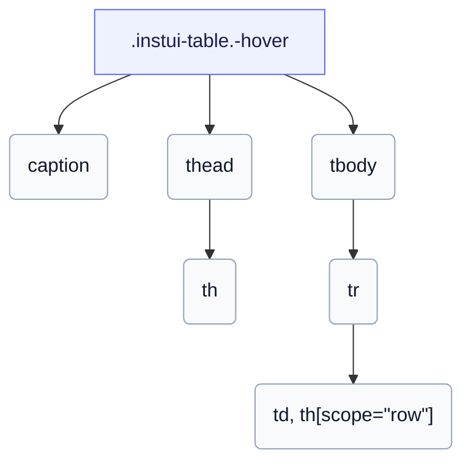

# CSS: table

`.instui-table` — Una taula de dades amb estil per a `th` i `td` més un títol opcional, amb disposicions de vol del ratolí, fixes i d'apilament de targetes.

Per a `-layout-stacked`, CSS pur no pot portar el text de cada capçalera de columna a la seva cel·la, per tant, dóna a cada cel·la un `data-label` i la targeta apilada la mostra via `::before`. Consulta els membres `table.head`, `table.body`, `table.row`, `table.cell`, `table.col-header` i `table.row-header` per a les parts individuals.

**Font:** [body.css](https://github.com/thedannywahl/pantoken/blob/main/formats/components/src/components/table/members/body/body.css)

## Accessibilitat

Etiqueta la taula amb un `&lt;caption&gt;`, marca les capçaleres de columna `<th scope="col">` i les capçaleres de fila `<th scope="row">`, i a `-layout-stacked` dóna a cada cel·la un `data-label` ja que la fila de capçalera està visualment oculta.

## Ús

```css
@import "@pantoken/components/components.css";
@import "@pantoken/components/table.css";
```

## Exemples

```html
<table class="instui-table -hover">
  <caption>Top-rated films</caption>
  <thead>
    <tr>
      <th scope="col">Rank</th>
      <th scope="col">Title</th>
      <th scope="col">Year</th>
      <th scope="col">Rating</th>
    </tr>
  </thead>
  <tbody>
    <tr>
      <th scope="row">1</th>
      <td>The Shawshank Redemption</td>
      <td>1994</td>
      <td>9.3</td>
    </tr>
    <tr>
      <th scope="row">2</th>
      <td>The Godfather</td>
      <td>1972</td>
      <td>9.2</td>
    </tr>
    <tr>
      <th scope="row">3</th>
      <td>The Godfather: Part II</td>
      <td>1974</td>
      <td>9.0</td>
    </tr>
  </tbody>
</table>
```

## Estructura

```text
.instui-table.-hover
  caption
  thead
    th
  tbody
    tr
      td, th[scope="row"]
```



## Modificadors

| Modificador | Descripció |
| --- | --- |
| `.-hover` | Destaca les files en passar el ratolí per sobre. @affects table.row — Reserva i coloreja el límit de vol del ratolí de la fila. |
| `.-layout-fixed` | Disposició de taula fixa (columnes d'igual amplada). |
| `.-layout-stacked` | Apila cada fila com a targeta, via un `data-label` per cel·la. @affects table.head @affects table.body @affects table.row @affects table.cell @affects table.col-header @affects table.row-header — Apila cada part com a bloc i amaga/etiqueta la capçalera en conseqüència. |

## Parts

| Part | Descripció |
| --- | --- |
| `.caption` | Un títol de taula opcional. |

## Tokens consumits

| Token | Tipus | Valor |
| --- | --- | --- |
| `--instui-component-table-background` | `<color>` | `light-dark(#ffffff, #10141A)` |
| `--instui-component-table-cell-padding-horizontal` | `<length>` | `0.75rem` |
| `--instui-component-table-cell-padding-vertical` | `<length>` | `0.5rem` |
| `--instui-component-table-col-header-color` | `<color>` | `light-dark(#273540, #F2F4F5)` |
| `--instui-component-table-color` | `<color>` | `light-dark(#273540, #ffffff)` |
| `--instui-component-table-font-family` | `[ <font-family-name> \| <generic-font-family> ]#` | `Atkinson Hyperlegible Next, "Helvetica Neue", Helvetica, Arial, sans-serif` |
| `--instui-component-table-font-size` | `<length>` | `1rem` |
| `--instui-component-table-head-font-weight` | `<integer>` | `600` |

## Subcomponents

- [table.body](/ca/api/css/table.body.md)
- [table.cell](/ca/api/css/table.cell.md)
- [table.col-header](/ca/api/css/table.col-header.md)
- [table.head](/ca/api/css/table.head.md)
- [table.row](/ca/api/css/table.row.md)
- [table.row-header](/ca/api/css/table.row-header.md)

