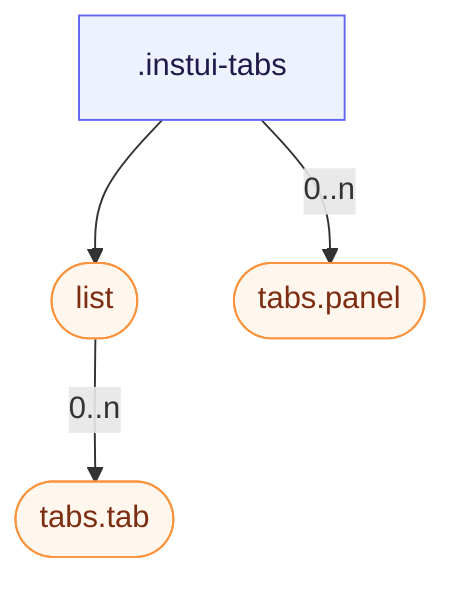

# CSS: tabs

`.instui-tabs` — Un conjunt de panells amb pestanyes: una llista de pestanyes, pestanyes seleccionables i els seus panells.

Consulta els membres `tabs.tab` i `tabs.panel` per als botons de pestanya individuals i els seus panells de contingut.

**Font:** [panel.css](https://github.com/thedannywahl/pantoken/blob/main/formats/components/src/components/tabs/members/panel/panel.css)

## Accessibilitat

Connecta la llista de pestanyes amb role="tablist", cada pestanya amb role="tab" i aria-selected, i cada panell amb role="tabpanel".

## Ús

```css
@import "@pantoken/components/components.css";
@import "@pantoken/components/tabs.css";
```

## Exemples

```html
<div class="instui-tabs">
  <div class="list" role="tablist" aria-label="Default tabs">
    <button class="tab -selected" role="tab" aria-selected="true">Overview</button>
    <button class="tab" role="tab" aria-selected="false">Details</button>
    <button class="tab -disabled" role="tab" aria-disabled="true" disabled>Disabled</button>
    <button class="tab" role="tab" aria-selected="false">History</button>
  </div>
  <div class="panel" role="tabpanel">The Overview tab's content shows here.</div>
</div>
```

## Estructura

```text
.instui-tabs
  list (component)
    tabs.tab (component, 0..n)
  tabs.panel (component, 0..n)
```



## Modificadors

| Modificador | Descripció |
| --- | --- |
| `.-overflow-scroll` | Manté la llista de pestanyes en una línia i deixa que es desplaci horitzontalment en comptes de doblegar-se, ocultant la barra de desplaçament. |
| `.-variant-secondary` | Pestanyes "carpeta" arrodonides amb una pestanya seleccionada que es connecta visualment al panell inferior. @affects tabs.tab — Reformata els botons de pestanya en l'aspecte "carpeta" arrodonida. |

## Parts

| Part | Descripció |
| --- | --- |
| `.list` | La fila de pestanyes. |

## Tokens consumits

| Token | Tipus | Valor |
| --- | --- | --- |
| `--instui-component-tabs-default-background` | `<color>` | `#00000000` |

## Subcomponents

- [list](/ca/api/css/list.md)
- [tabs.panel](/ca/api/css/tabs.panel.md)
- [tabs.tab](/ca/api/css/tabs.tab.md)

