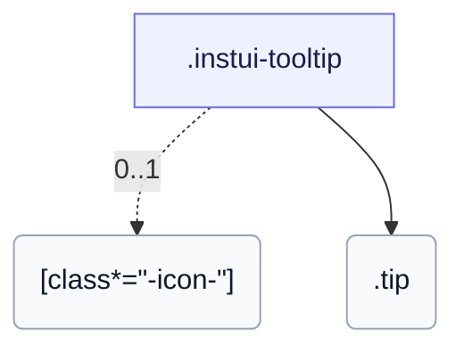

# CSS: tooltip

`.instui-tooltip` — Una bombolla de tooltip de CSS amb hover i focus, posicionable a qualsevol costat.

El canvi és CSS pur (`:hover`/`:focus-within`), per tant la bombolla només arriba als usuaris de teclat a través d'un activador enfocable; a diferència de `popover`, no és desestable ni activat per clics.

**Font:** [tooltip.css](https://github.com/thedannywahl/pantoken/blob/main/formats/components/src/components/tooltip/tooltip.css)

<!-- js-requirement -->
> [!TIP]
> **Millora JS** — El CSS d'aquest component es representa i funciona per si sol; emparella'l amb `@pantoken/interactions` per afegir el comportament interactiu. Mira la [taula de modificadors a continuació](#modifiers).


## Accessibilitat

Apunta el disparador a la bombolla amb aria-describedby i dóna a la bombolla role="tooltip".

## Ús

```css
@import "@pantoken/components/components.css";
@import "@pantoken/components/tooltip.css";
```

## Exemples

```html
<span class="instui-tooltip" aria-describedby="tt-1">
  <span class="instui-icon -icon-info"></span>
  <span class="tip" id="tt-1" role="tooltip">Default placement is top</span>
</span>
```

## Estructura

```text
.instui-tooltip
  [class*="-icon-"] (0..1)
  .tip
```



## Modificadors

| Modificador | Descripció |
| --- | --- |
| `.-icon-*` | Representa una icona de glifo disparador al costat de la bombolla de tooltip. |

## Parts

| Part | Descripció |
| --- | --- |
| `.tip` | La bombolla; `-placement-*` estableix el seu costat. |

## Tokens consumits

| Token | Tipus | Valor |
| --- | --- | --- |
| `--instui-border-radius-sm` | `<length>` | `0.25rem` |
| `--instui-color-background-inverse` | `<color>` | `light-dark(#334450, #F2F4F5)` |
| `--instui-color-text-inverse` | `<color>` | `light-dark(#ffffff, #1C222B)` |
| `--instui-component-tooltip-font-family` | `[ <font-family-name> \| <generic-font-family> ]#` | `Atkinson Hyperlegible Next, "Helvetica Neue", Helvetica, Arial, sans-serif` |
| `--instui-component-tooltip-font-size` | `<length>` | `0.875rem` |
| `--instui-component-tooltip-font-weight` | `<integer>` | `400` |
| `--instui-component-tooltip-padding` | `<length>` | `0.75rem` |
| `--instui-spacing-space-xs` | `<length>` | `0.25rem` |

## Relacionat

- [popover](/ca/api/css/popover.md) — La superfície ancorada més gran, activada per clic.
- [context-view](/ca/api/css/context-view.md) — Una superfície ancorada relacionada amb un punter.

