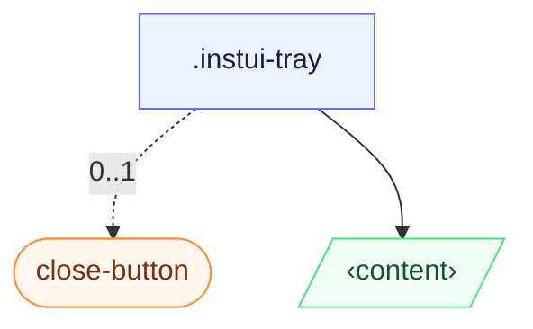

# CSS: tray

`.instui-tray` — Un panell fixat a la vora que es llisca des de qualsevol costat; un `[popover]` o `&lt;dialog&gt;` natiu.

Les ubicacions d'inici/final es resolen contra `inset-inline` (lògic, sensible a la direcció); la transformació de lliscament es reflecteix automàticament sota un ancestral `[dir="rtl"]`, per tant no es necessita marques addicionals per als dissenys de dreta a esquerra.

**Font:** [tray.css](https://github.com/thedannywahl/pantoken/blob/main/formats/components/src/components/tray/tray.css)

## Accessibilitat

La safata és una superfície de diàleg o popover, per tant la nomena amb `aria-label` o `aria-labelledby`, i el seu control de tancament porta un `aria-label` (el `.instui-close-button` a l'exemple utilitza `aria-label="Close"`).

## Ús

```css
@import "@pantoken/components/components.css";
@import "@pantoken/components/tray.css";
```

## Exemples

```html
<div class="instui-tray -placement-end -size-sm">
  <span class="instui-heading -level-h3">Filters</span>
  <p class="-size-sm">A tray slides in from the start edge and fills the viewport height.</p>
</div>
<button class="instui-button -toggle">toggle tray</button>
```

## Estructura

```text
.instui-tray
  close-button (component, 0..1)
  ‹content›
```



## Modificadors

| Modificador | Descripció |
| --- | --- |
| `.-placement-bottom` | Fixa a la vora inferior. |
| `.-placement-end` | Fixa a la vora final (inline-end). |
| `.-placement-start` | (per defecte) Fixa a la vora inicial (inline-start). |
| `.-placement-top` | Fixa a la vora superior. |
| `.-size-large` | Gran. Àlias de forma llarga de `-size-lg`. |
| `.-size-lg` | Gran. |
| `.-size-md` | (per defecte) Mitjà. |
| `.-size-medium` | (per defecte) Mitjà. Àlies de forma llarga de `-size-md`. |
| `.-size-regular` | <span class="instui-pill -color-danger pantoken-doc-tag">Deprecat</span> — use `.-size-md`. |
| `.-size-sm` | Petit. |
| `.-size-small` | Petit. Àlias de forma llarga de `-size-sm`. |
| `.-size-x-large` | Molt gran. Àlias de forma llarga de `-size-xl`. |
| `.-size-x-small` | Molt petit. Àlias de forma llarga de `-size-xs`. |
| `.-size-xl` | Molt gran. |
| `.-size-xs` | Molt petit. |

## Condicions

| Tipus | Consulta | Descripció |
| --- | --- | --- |
| supports | `(transition-behavior: allow-discrete)` | — |

## Tokens consumits

| Token | Tipus | Valor |
| --- | --- | --- |
| `--instui-component-tray-background-color` | `<color>` | `light-dark(#ffffff, #1C222B)` |
| `--instui-component-tray-border-color` | `<color>` | `light-dark(#E8EAEC, #334450)` |
| `--instui-component-tray-border-width` | `<length>` | `0.0625rem` |
| `--instui-component-tray-padding` | `<length>` | `1.5rem` |
| `--instui-component-tray-width-lg` | `<length>` | `48em` |
| `--instui-component-tray-width-md` | `<length>` | `30em` |
| `--instui-component-tray-width-sm` | `<length>` | `20em` |
| `--instui-component-tray-width-xl` | `<length>` | `62em` |
| `--instui-component-tray-width-xs` | `<length>` | `16em` |
| `--instui-component-tray-z-index` | `<integer>` | `9999` |
| `--instui-elevation-topmost` | `none \| <shadow>#` | — |
| `--tray-slide-x` | — | `-100%` |
| `--tray-slide-y` | — | `0%` |

## Suport del navegador

- S'obri amb la nativa `[popover]` API i `@starting-style`; el lliscament es col·loca darrere d'una protecció `@supports (transition-behavior: allow-discrete)`, perquè els navegadors sense ella segueixen obrint la safata, només sense el lliscament.

## Subcomponents

- [close-button](/ca/api/css/close-button.md)

## Relacionat

- [modal](/ca/api/css/modal.md) — El mateix patró de superposició desestable, centrat en lloc de fixat a la vora.
- [popover](/ca/api/css/popover.md) — La superfície genèrica de capa superior sobre la qual es construeix.

