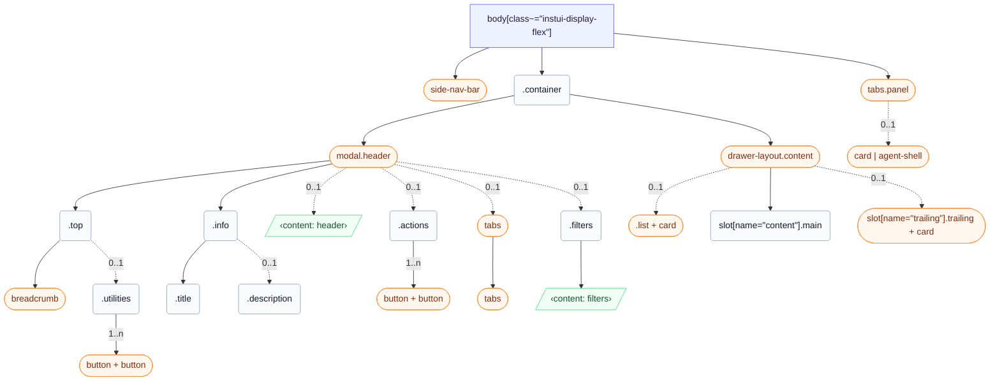

# CSS: wrapper

`body[class~="instui-display-flex"]` — Fila de l'envolupant d'aplicació: navegació lateral, contenidor amb capçalera i panell opcional.

✅ Utilitzeu Wrapper quan:

- Construcció d'una pàgina de producte Canvas completa que necessita una capa de disseny consistent
- La pàgina utilitza GlobalNav com a l'àncora de navegació principal
- La pàgina necessita panells laterals: ContentTabList, TrailingContentArea, o UtilityPanel
- Necessiteu farciment de contenidor consistent i max-width de contingut a tota la pàgina
  🚫 No utilitzeu Wrapper quan:

- Construcció d'un Modal, Tray, o Drawer — aquests tenen els seus propis contenidors de disseny
- Embolcall d'una subsecció d'una pàgina — Wrapper conté la pàgina completa, no una regió

## Accessibility

- Assigneu l'àrea de contingut principal a un punt de referència &lt;main&gt; amb un enllaç skip-nav perquè els usuaris de teclat puguin evitar GlobalNav
- Doneu a ContentTabList role="navigation" amb una aria-label distinta com ara "Page navigation" — separada del punt de referència de GlobalNav
- Doneu a TrailingContentArea role="complementary" amb una aria-label descriptiva que reflecteixi el seu contingut, com ara "Student details"
- Doneu a cada UtilityPanel una aria-label distinta: "AI assistant", "Notifications", o "Filters"
- Quan s'obri un UtilityPanel, moveu el focus al panell; quan es tanqui, retorneu el focus al botó que l'ha obert

## Usage

```css
@import "@pantoken/plugin-layouts/layouts.css";
```

## Structure

```text
body[class~="instui-display-flex"]
  side-nav-bar (component)
  .container
    modal.header (component)
      .top
        breadcrumb (component)
        .utilities (0..1)
          button + button (component, 1..n)
      .info
        .title
        .description (0..1)
      ‹content: header› (0..1)
      .actions (0..1)
        button + button (component, 1..n)
      tabs (component, 0..1)
        tabs (component)
      .filters (0..1)
        ‹content: filters›
    drawer-layout.content (component)
      list + card (component, 0..1)
      slot[name="content"].main
      slot[name="trailing"].trailing + card (component, 0..1)
  tabs.panel (component)
    card | agent-shell (component, 0..1)
```



## Slots

| Slot       | Description                                                   |
| ---------- | ------------------------------------------------------------- |
| `content`  | Contingut de pàgina principal.                                |
| `filters`  | Contingut de filtres opcional dins de la capçalera.           |
| `header`   | Ranura de capçalera opcional sota la descripció de la pàgina. |
| `panel`    | Contingut del panell d'utilitat.                              |
| `trailing` | Contingut complementari al final.                             |

## Parts

| Part           | Description                                                           |
| -------------- | --------------------------------------------------------------------- |
| `.actions`     | Botons de capçalera opcionals al final de la fila superior.           |
| `.container`   | Columna de pàgina principal que conté la capçalera i el contingut.    |
| `.content`     | Regió de contingut principal dins de la columna contenidora.          |
| `.description` | Descripció de pàgina opcional sota el títol.                          |
| `.filters`     | Regió de filtres opcional dins de la capçalera.                       |
| `.header`      | Regió de capçalera dins de la columna contenidora.                    |
| `.info`        | Contenidor per al títol de la pàgina i descripció opcional.           |
| `.list`        | Columna de navegació opcional dins del contingut.                     |
| `.main`        | Columna de contingut principal dins del contingut.                    |
| `.panel`       | Regió de panell d'utilitat que s'obri al costat dret de la pàgina.    |
| `.tabs`        | Pestanyes de navegació opcionals al principi de la fila de contingut. |
| `.title`       | Títol de la pàgina sota la fila superior.                             |
| `.top`         | Fila de graella que conté migues de pa i utilitats.                   |
| `.trailing`    | Columna complementaria opcional dins del contingut.                   |
| `.utilities`   | Accions d'utilitat al final de la fila superior.                      |

## States

| State       | Description |
| ----------- | ----------- |
| `:optional` | —           |

## Tokens consumed

| Token                            | Type | Value |
| -------------------------------- | ---- | ----- |
| `--instui-background-color-page` | —    | —     |

## Subcomponents

- [agent-shell](/ca/api/css/agent-shell.md)
- [breadcrumb](/ca/api/css/breadcrumb.md)
- [button](/ca/api/css/button.md)
- [card](/ca/api/css/card.md)
- [drawer-layout.content](/ca/api/css/drawer-layout.content.md)
- [list](/ca/api/css/list.md)
- [modal.header](/ca/api/css/modal.header.md)
- [side-nav-bar](/ca/api/css/side-nav-bar.md)
- [tabs](/ca/api/css/tabs.md)
- [tabs.panel](/ca/api/css/tabs.panel.md)

## Related

- [card](/ca/api/css/card.md)
- [agent-shell](/ca/api/css/agent-shell.md)
- [breadcrumb](/ca/api/css/breadcrumb.md)
- [tabs](/ca/api/css/tabs.md)
- [button](/ca/api/css/button.md)
- [heading](/ca/api/css/heading.md)
