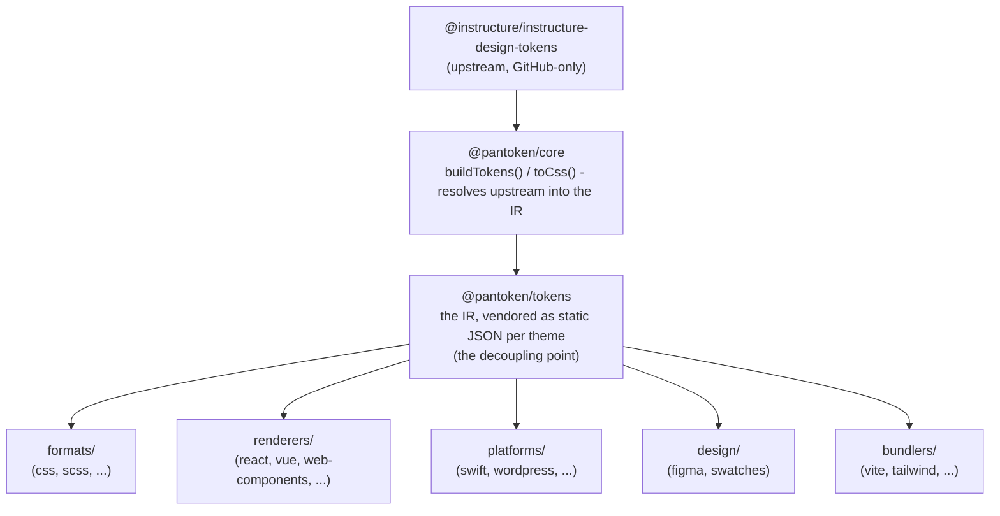

# Arquitectura

pantoken té una sola feina: resoldre els design tokens i les icones d'Instructure una vegada, i després remodelar aquest model per a cada destí. Les capes següents mantenen aquesta remodelació honesta i mantenen els paquets publicats lliures de qualsevol upstream exclusiu de GitHub.

## Les capes

- **`@pantoken/model`** conté els contractes de tipus, i res més. És la font de veritat per a la forma de `Token` i pel contracte de plugins, amb zero dependències, així que qualsevol paquet pot dependre'n lliurement.
- **`@pantoken/core`** és l'únic paquet que toca la font upstream. Resol els tokens i les icones en l'IR canònic i genera CSS.
- **`@pantoken/tokens`** distribueix aquell IR com a JSON estàtic en temps de compilació. Aquest és el punt de desacoblament: els paquets downstream llegeixen `@pantoken/tokens`, mai `@pantoken/core`, de manera que `npm i pantoken` mai no arriba a l'upstream exclusiu de GitHub.
- **`@pantoken/utils`** porta els helpers compartits — el resolvedor `var(--x)`, les expressions regulars de referència, la conversió de majúscules/minúscules i colors, i les comprovacions de deriva que mantenen la sortida generada fidel a l'IR.

## Per què els tokens es distribueixen (vendedor)

El paquet upstream de tokens viu a GitHub, no a npm. Si cada paquet downstream hi depengués, `npm i pantoken` fallaria per a qualsevol que no tingués accés. En comptes d'això, `@pantoken/tokens` resol l'upstream una vegada en temps de compilació i escriu el resultat a JSON estàtic. Els paquets publicats inclouen aquest JSON, així s'instal·len netament des de npm, es fixen a semver i funcionen sense connexió.

## Cubetes

Cada cubeta downstream és una manera de consumir l'IR:

- **formats/** — converteix els tokens en un fitxer (CSS, SCSS, Less, Stylus, DTCG).
- **renderers/** — integracions amb frameworks i eines (React, Vue, Svelte, MUI, Pendo, i més).
- **bundlers/** — plugins i presets per a eines de build (Vite, Next, Tailwind, Panda, PostCSS, webpack).
- **platforms/** — destinacions natives i per a generadors de llocs (Swift, Kotlin, Rust, WordPress, Drupal).
- **design/** — càrregues per a eines de disseny (Figma, mostres de color).
- **plugins/** — transformacions opcionals que amplien l'output de tokens o CSS. Vegeu [Plugins](/guide/plugins).

## Sortida generada

Cada paquet que emet un fitxer l'escriu a un directori `generated/` per paquet que una build reprodueix, de manera que res generat no es compromet. Una tasca del workspace valida tot això. Vegeu [Generated output](/guide/generated-output).
