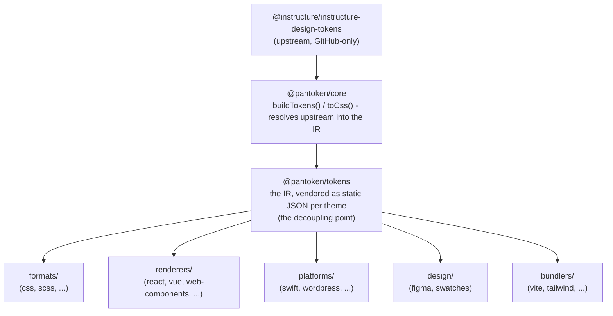

# Pensaernïaeth

Mae gan pantoken un swydd: datrys tokenau a eiconau dylunio Instructure unwaith, yna ail-lunio’r model hwnnw ar gyfer pob targed. Mae’r haenau isod yn cadw’r ail-lunio hwnnw’n onest ac yn sicrhau nad yw’r pecynnau cyhoeddedig yn ddibynnol ar unrhyw ffynhonnell GitHub-yn-unig.

## Y haenau

- **`@pantoken/model`** yn dal y cytundebau math, dim byd arall. Dyma ffynhonnell y gwir ar gyfer siâp `Token` a’r cytundeb plugin, heb ddibyniaethau, felly gall unrhyw becyn ddibynnu arni’n rhydd.
- **`@pantoken/core`** yw’r unig becyn sy’n eich cysylltu â’r ffynhonnell upstream. Mae’n datrys tokenau ac eiconau i’r IR canonig ac yn rendro CSS.
- **`@pantoken/tokens`** yn vendorio’r IR hwnnw fel JSON statig yn ystod y broses adeiladu. Dyma bwynt datgysylltu: mae pecynnau lawr afon yn darllen `@pantoken/tokens`, nid `@pantoken/core`, felly `npm i pantoken` byth
  yn cyrraedd am y ffynhonnell GitHub-yn-unig.
- **`@pantoken/utils`** yn cario’r cymorth rhannol — yr `var(--x)` resolver, y regexau cyfeiriad, trosi achos a lliw,
  a’r gwiriadau drifft sy’n cadw’r allbwn a gynhyrchir yn ffyddlon i’r IR.

## Pam mae tokenau yn cael eu vendorio

Mae’r pecyn tokenau upstream yn byw ar GitHub, nid yn npm. Pe bai pob pecyn lawr afon yn ddibynnol arno,
byddai `npm i pantoken` yn methu i unrhyw un heb y mynediad hwnnw. Yn hytrach mae `@pantoken/tokens` yn datrys y
ffynhonnell unwaith yn ystod y broses adeiladu ac yn ysgrifennu’r canlyniad i JSON statig. Mae’r pecynnau cyhoeddedig yn cario’r
JSON hwnnw, felly maent yn gosod yn lan o npm, yn cloi ar semver, ac yn gweithio i ffwrdd o’r rhyngrwyd.

## Adrannau

Mae pob blwch lawr afon yn ffordd o ddefnyddio’r IR:

- **formats/** — troi’r tokenau yn ffeil (CSS, SCSS, Less, Stylus, DTCG).
- **renderers/** — integreiddiadau fframwaith a offer (React, Vue, Svelte, MUI, Pendo, a mwy).
- **bundlers/** — ategion a rhagsetiau offer adeiladu (Vite, Next, Tailwind, Panda, PostCSS, webpack).
- **platforms/** — targedau hynafiol a gweithwyr-safle (Swift, Kotlin, Rust, WordPress, Drupal).
- **design/** — pecynnau ar gyfer offer dylunio (Figma, paletiau lliw).
- **plugins/** — trawsnewidiadau dewisol sy’n estyn y allbwn token neu CSS. Gweler [Plugins](/guide/plugins).

## Allbwn a gynhyrchwyd

Mae pob pecyn sy’n allyrru ffeil yn ei ysgrifennu i gyfeiriadur `generated/` y pecyn penodol a mae proses adeiladu
yn ei adlewyrchu, felly nid oes dim a gynhyrchir yn cael ei gofrestru. Mae tasg gweithle yn dilysu popeth. Gweler
[Allbwn a gynhyrchwyd](/guide/generated-output).
