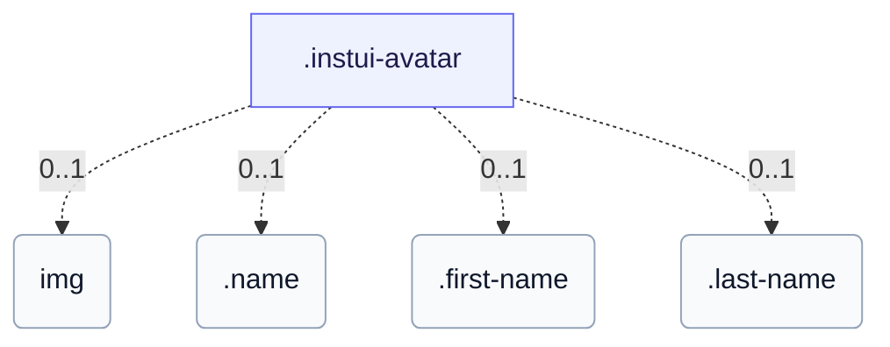

# CSS: avatar

`.instui-avatar` · <span class="instui-pill -color-success pantoken-doc-tag">stable</span> — En bruger-avatar, der viser initialer eller et billede, cirkulært som standard.

Som standard farver paletfarven initialerne på en transparent overflade; `-has-inverse-color` fylder overfladen med farven og sætter initialerne på farven. Varianten `-color-ai` fyldes altid med violet→sea-gradienten. For et fuldt visningsnavn skal du placere det i indholdet (så det forbliver i tilgængelighedstræet) og tilføje `data-initials="XX"` til det kompakte visuelle — den reelle tekst er det, som en skærmlæser annoncerer. Uden `data-initials` bliver overflødigt indhold bare hårdt klippet (ingen ellipsis); wrap det i `.name` for i stedet at få et præcist enkelt-ledende-bogstav-klip, eller del det op i `.first-name`/`.last-name` for to klippede bogstaver (begge halvdele kan udelades og den anden forbliver centreret).

**Kilde:** [avatar.css](https://github.com/thedannywahl/pantoken/blob/main/formats/components/src/components/avatar/avatar.css)

<!-- js-requirement -->

> [!TIP]
> **JS Enhancement** — Denne components CSS gengives og fungerer på sin egen; parrer den med `@pantoken/interactions` for at tilføje den interaktive opførsel. Se [modifikator-tabel nedenfor](#modifiers).

## Accessibility

Giv en billedavatar en meningsfuld `alt` (personens navn), ikke en generisk "avatar"; for avatar med kun initialer, foretrækker du reelt navneindhold (bar tekst, data-initialer, .name, eller .first-name/.last-name) frem for forabbrevierede bogstaver, så hjælpeteknologi annoncerer det rigtige navn.

## Usage

```css
@import "@pantoken/components/components.css";
@import "@pantoken/components/avatar.css";
```

## Examples

```html
<span class="instui-avatar --me-sm">LH</span>
<span class="instui-avatar -color-ai --me-sm">AI</span>
<span class="instui-avatar --me-sm" data-initials="NV">Dr. Nguyen Van Thoc</span>
<span class="instui-avatar"><span class="name">Miguel Sanchez</span></span>
<span class="instui-avatar"
  ><span class="first-name">Miguel</span> <span class="last-name">Sanchez</span></span
>
```

## Structure

Avataren viser et af: et &lt;img&gt;, tekst med bare/data-initialer, et .name-wrap eller et .first-name/.last-name-par.

```text
.instui-avatar
  img (0..1)
  .name (0..1)
  .first-name (0..1)
  .last-name (0..1)
```



## Modifiers

| Modifier               | Description                                                                                           |
| ---------------------- | ----------------------------------------------------------------------------------------------------- |
| `.-color-accent1`      | <span class="instui-pill -color-danger pantoken-doc-tag">Deprecated</span> — use `.-color-blue`.      |
| `.-color-accent2`      | <span class="instui-pill -color-danger pantoken-doc-tag">Deprecated</span> — use `.-color-green`.     |
| `.-color-accent3`      | <span class="instui-pill -color-danger pantoken-doc-tag">Deprecated</span> — use `.-color-red`.       |
| `.-color-accent4`      | <span class="instui-pill -color-danger pantoken-doc-tag">Deprecated</span> — use `.-color-orange`.    |
| `.-color-accent5`      | <span class="instui-pill -color-danger pantoken-doc-tag">Deprecated</span> — use `.-color-ash`.       |
| `.-color-accent6`      | <span class="instui-pill -color-danger pantoken-doc-tag">Deprecated</span> — use `.-color-grey`.      |
| `.-color-ai`           | AI-accent-paletfarve.                                                                                 |
| `.-color-ash`          | Ask-paletfarve.                                                                                       |
| `.-color-blue`         | Blå paletfarve.                                                                                       |
| `.-color-green`        | Grøn paletfarve.                                                                                      |
| `.-color-grey`         | Grå paletfarve.                                                                                       |
| `.-color-orange`       | Orange paletfarve.                                                                                    |
| `.-color-red`          | Rød paletfarve.                                                                                       |
| `.-has-inverse-color`  | Brug den inverse (på-mørk) tekstfarve.                                                                |
| `.-shape-rectangle`    | Kvadratisk (rektangulær) form i stedet for en cirkel.                                                 |
| `.-show-border`        | <span class="instui-pill -color-info pantoken-doc-tag">Alias</span> — maps to `.-show-border-always`. |
| `.-show-border-always` | Tving grænsering på, selv over et billede eller en omvendt fyld.                                      |
| `.-show-border-never`  | Tving grænsering af.                                                                                  |
| `.-size-2xl`           | To størrelser større.                                                                                 |
| `.-size-2xs`           | To størrelser mindre.                                                                                 |
| `.-size-large`         | Stor. Langt-form alias af `-size-lg`.                                                                 |
| `.-size-lg`            | Stor.                                                                                                 |
| `.-size-md`            | Medium (standard).                                                                                    |
| `.-size-medium`        | Medium (standard). Langt-form alias af `-size-md`.                                                    |
| `.-size-sm`            | Lille.                                                                                                |
| `.-size-small`         | Lille. Langt-form alias af `-size-sm`.                                                                |
| `.-size-x-large`       | Ekstra stor. Langt-form alias af `-size-xl`.                                                          |
| `.-size-x-small`       | Ekstra lille. Langt-form alias af `-size-xs`.                                                         |
| `.-size-xl`            | Ekstra stor.                                                                                          |
| `.-size-xs`            | Ekstra lille.                                                                                         |
| `.-size-xx-large`      | To størrelser større. Langt-form alias af `-size-2xl`.                                                |
| `.-size-xx-small`      | To størrelser mindre. Langt-form alias af `-size-2xs`.                                                |

## Parts

| Part          | Description                                                                                                   |
| ------------- | ------------------------------------------------------------------------------------------------------------- |
| `.first-name` | Valgfri (parrer med .last-name): omslutter det givne navn, klippet til dets ledende bogstav.                  |
| `.last-name`  | Valgfri (parrer med .first-name): pakker familienavnet, klippet til dets foranstillede bogstav.               |
| `.name`       | Valgfri: pak det fulde navn for at klippe det til et enkelt foranstillet bogstav uden data-initials eller JS. |

## Pseudo-elements

| Pseudo-element | Description |
| -------------- | ----------- |
| `::before`     | —           |

## Tokens consumed

| Token                                                | Type                                               | Value                                                                        |
| ---------------------------------------------------- | -------------------------------------------------- | ---------------------------------------------------------------------------- |
| `--instui-component-avatar-ai-bottom-gradient-color` | `<color>`                                          | `#00828E`                                                                    |
| `--instui-component-avatar-ai-top-gradient-color`    | `<color>`                                          | `#9E58BD`                                                                    |
| `--instui-component-avatar-ash-background-color`     | `<color>`                                          | `light-dark(#273540, #1C222B)`                                               |
| `--instui-component-avatar-ash-text-color`           | `<color>`                                          | `light-dark(#273540, #C7CACD)`                                               |
| `--instui-component-avatar-background-color`         | `<color>`                                          | `light-dark(#ffffff, #10141A)`                                               |
| `--instui-component-avatar-blue-background-color`    | `<color>`                                          | `#2B7ABC`                                                                    |
| `--instui-component-avatar-blue-text-color`          | `<color>`                                          | `light-dark(#2871AF, #7FB4F1)`                                               |
| `--instui-component-avatar-border-color`             | `<color>`                                          | `light-dark(#8D959F, #6A7883)`                                               |
| `--instui-component-avatar-border-width-md`          | `<length>`                                         | `0.125rem`                                                                   |
| `--instui-component-avatar-border-width-sm`          | `<length>`                                         | `0.0625rem`                                                                  |
| `--instui-component-avatar-font-family`              | `[ <font-family-name> \| <generic-font-family> ]#` | `Atkinson Hyperlegible Next, "Helvetica Neue", Helvetica, Arial, sans-serif` |
| `--instui-component-avatar-font-size-lg`             | `<length>`                                         | `1.25rem`                                                                    |
| `--instui-component-avatar-font-size-md`             | `<length>`                                         | `1rem`                                                                       |
| `--instui-component-avatar-font-size-sm`             | `<length>`                                         | `0.875rem`                                                                   |
| `--instui-component-avatar-font-size-xl`             | `<length>`                                         | `1.75rem`                                                                    |
| `--instui-component-avatar-font-size-xs`             | `<length>`                                         | `0.75rem`                                                                    |
| `--instui-component-avatar-font-size2xl`             | `<length>`                                         | `2.5rem`                                                                     |
| `--instui-component-avatar-font-size2xs`             | `<length>`                                         | `0.75rem`                                                                    |
| `--instui-component-avatar-font-weight`              | `<integer>`                                        | `600`                                                                        |
| `--instui-component-avatar-green-background-color`   | `<color>`                                          | `#03893D`                                                                    |
| `--instui-component-avatar-green-text-color`         | `<color>`                                          | `light-dark(#037D37, #61C378)`                                               |
| `--instui-component-avatar-grey-background-color`    | `<color>`                                          | `light-dark(#4A5B68, #576773)`                                               |
| `--instui-component-avatar-grey-text-color`          | `<color>`                                          | `light-dark(#4A5B68, #F2F4F5)`                                               |
| `--instui-component-avatar-orange-background-color`  | `<color>`                                          | `#CF4A00`                                                                    |
| `--instui-component-avatar-orange-text-color`        | `<color>`                                          | `light-dark(#BB4200, #FF905A)`                                               |
| `--instui-component-avatar-rectangle-radius`         | `<length>`                                         | `0.25rem`                                                                    |
| `--instui-component-avatar-red-background-color`     | `<color>`                                          | `#E62429`                                                                    |
| `--instui-component-avatar-red-text-color`           | `<color>`                                          | `light-dark(#CF1F24, #FA917F)`                                               |
| `--instui-component-avatar-size-lg`                  | `<length>`                                         | `3.5rem`                                                                     |
| `--instui-component-avatar-size-md`                  | `<length>`                                         | `3rem`                                                                       |
| `--instui-component-avatar-size-sm`                  | `<length>`                                         | `2.5rem`                                                                     |
| `--instui-component-avatar-size-xl`                  | `<length>`                                         | `4rem`                                                                       |
| `--instui-component-avatar-size-xs`                  | `<length>`                                         | `2rem`                                                                       |
| `--instui-component-avatar-size2xl`                  | `<length>`                                         | `5rem`                                                                       |
| `--instui-component-avatar-size2xs`                  | `<length>`                                         | `1.5rem`                                                                     |
| `--instui-component-avatar-text-on-color`            | `<color>`                                          | `#ffffff`                                                                    |

## Related

- [byline](/da/api/css/byline.md) — Kan være vært for en avatar som dets ledende heltfigur.
