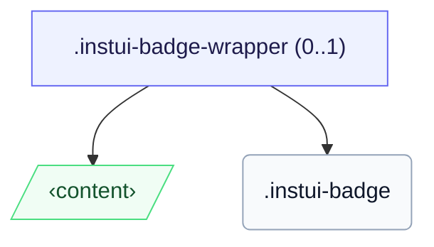

# CSS: badge

`.instui-badge` — Et lille tællings- eller statuspunkt placeret over et måls hjørne.

For at placere et badge over et mål skal du pakke begge dele i en `.instui-badge-wrapper` (positionsankeret) og fastgøre badgen med en `-placement-*` modifikator.

**Kilde:** [badge.css](https://github.com/thedannywahl/pantoken/blob/main/formats/components/src/components/badge/badge.css)

## Usage

```css
@import "@pantoken/components/components.css";
@import "@pantoken/components/badge.css";
```

## Demo

```demo
self:badge
```

## Examples

```html
<span class="instui-badge-wrapper">
  <button class="instui-button">Inbox</button>
  <span class="instui-badge -placement-top-end">4</span>
</span>
```

## Structure

Badgen gengives inline på sig selv, eller inde i en valgfri `instui-badge-wrapper` som forankrer den over et mål.

```text
.instui-badge-wrapper (0..1)
  ‹content›
  .instui-badge
```



## Modifiers

| Modifier                   | Description                                       |
| -------------------------- | ------------------------------------------------- |
| `.-color-danger`           | En opmærksomheds-/fejltælling.                    |
| `.-color-inverse`          | On-dark: et let chip med mørk tekst.              |
| `.-color-success`          | En positiv/komplet tælling.                       |
| `.-placement-bottom-end`   | Placer ved det nederste endhjørne.                |
| `.-placement-bottom-start` | Placer ved det nederste starthjørne.              |
| `.-placement-end-center`   | Placer centreret på endkanten.                    |
| `.-placement-start-center` | Placer centreret på startkanten.                  |
| `.-placement-top-end`      | Placer ved det øverste endhjørne.                 |
| `.-placement-top-start`    | Placer ved det øverste starthjørne.               |
| `.-pulse`                  | En pulserende opmærksomhedsring.                  |
| `.-standalone`             | Gengiv inline, ikke placeret over et måls hjørne. |
| `.-type-notification`      | Kun et punkt, ingen tælling.                      |

## Pseudo-elements

| Pseudo-element | Description                                                                         |
| -------------- | ----------------------------------------------------------------------------------- |
| `::before`     | Den pulserende opmærksomhedsring tegnet i badgets accentfarve (varianten `-pulse`). |

## Custom properties

| Property                  | Type      | Default | Description                                                      |
| ------------------------- | --------- | ------- | ---------------------------------------------------------------- |
| `--pantoken-badge-accent` | `<color>` | —       | Chipfyldet; hver `-color-*` variant og pulsringen læser fra det. |
| `--pantoken-badge-text`   | `<color>` | —       | Tekstfarven, parret til accenten så den forbliver læselig.       |

## Animations

| Animation              | Description          |
| ---------------------- | -------------------- |
| `pantoken-badge-pulse` | Pulsringanimationen. |

## Tokens consumed

| Token                                    | Type                                               | Value                                                                        |
| ---------------------------------------- | -------------------------------------------------- | ---------------------------------------------------------------------------- |
| `--instui-border-width-md`               | `<length>`                                         | `0.125rem`                                                                   |
| `--instui-component-badge-border-radius` | `<length>`                                         | `999rem`                                                                     |
| `--instui-component-badge-color`         | `<color>`                                          | `#ffffff`                                                                    |
| `--instui-component-badge-color-danger`  | `<color>`                                          | `#E62429`                                                                    |
| `--instui-component-badge-color-inverse` | `<color>`                                          | `#273540`                                                                    |
| `--instui-component-badge-color-primary` | `<color>`                                          | `light-dark(#1D354F, #EEF4FD)`                                               |
| `--instui-component-badge-color-success` | `<color>`                                          | `#03893D`                                                                    |
| `--instui-component-badge-font-family`   | `[ <font-family-name> \| <generic-font-family> ]#` | `Atkinson Hyperlegible Next, "Helvetica Neue", Helvetica, Arial, sans-serif` |
| `--instui-component-badge-font-size`     | `<length>`                                         | `0.75rem`                                                                    |
| `--instui-component-badge-font-weight`   | `<integer>`                                        | `600`                                                                        |
| `--instui-component-badge-padding`       | `<length>`                                         | `0.25rem`                                                                    |
| `--instui-component-badge-size`          | `<length>`                                         | `1rem`                                                                       |
| `--instui-spacing-space-sm`              | `<length>`                                         | `0.5rem`                                                                     |

## Related

- [pill](/da/api/css/pill.md) — Modstykket til inline label-chip.
