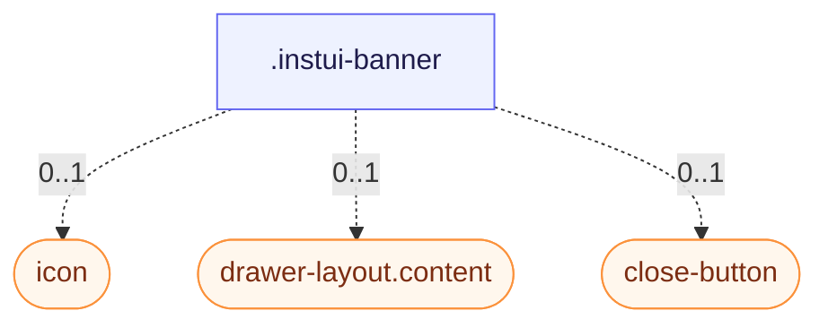

# CSS: banner

`.instui-banner` — En afviselig, ikoneret meddelelsesoverflade til sidevis eller kontekstuel annoncering.

**Størrelse** styrer polstring og spalte: `relaxed` (standard) er mere rummeligt; `compact` strammer begge.
**Farve** indstiller fyldet: bare (ingen modifikator) er uudfyldt — kun kant og ikon; `-color-violet`
og `-color-sea` tilføjer en farvet baggrund plus en matchende ikonspalette. `-variant-ai` erstatter
fyldet med en gradient fra top til bund i stedet for AI-tilskrevet meddelelser.

## Accessibility

Tilføj `role="status"` (eller `role="alert"` for presserende meddelelser) så assistiv teknologi annoncerer
banneret; markér et dekorativt ikon `aria-hidden="true"` og giv lukkeknappen en `aria-label`.

## Usage

@import "@pantoken/plugin-custom-components/custom-components.css";

```css
@import "@pantoken/plugin-custom-components/custom-components.css";
```

## Examples

-nocard

```html
<div class="instui-banner -color-violet" role="status">
  <span class="icon" aria-hidden="true"></span>
  <div class="content">This is a violet banner with an icon.</div>
  <button class="instui-close-button -size-xs" aria-label="Close"></button>
</div>
```

## Structure

```text
.instui-banner
  icon (component, 0..1)
  drawer-layout.content (component, 0..1)
  close-button (component, 0..1)
```



## Modifiers

| Modifier         | Description                                                   |
| ---------------- | ------------------------------------------------------------- |
| `.-color-sea`    | Havfarvet baggrund og ikonspalette.                           |
| `.-color-violet` | Violetfarvet baggrund og ikonspalette.                        |
| `.-size-compact` | Tættere polstring og spalte.                                  |
| `.-size-relaxed` | Mere rummeligt polstring og spalte (standard).                |
| `.-variant-ai`   | AI-tilskrevet gradientbaggrund i stedet for en flad fyldning. |

## Parts

| Part       | Description                                                                                    |
| ---------- | ---------------------------------------------------------------------------------------------- |
| `.content` | Meddelelsesindholdet stablet i en kolonne.                                                     |
| `.icon`    | Den valgfri ikonspalette; dens baggrund og hjørneradius kommer fra den aktive størrelse/farve. |

## Tokens consumed

| Token                                                           | Type       | Value                          |
| --------------------------------------------------------------- | ---------- | ------------------------------ |
| `--instui-component-banner-ai-background-bottom-gradient-color` | `<color>`  | `light-dark(#CFF0F6, #00424A)` |
| `--instui-component-banner-ai-background-top-gradient-color`    | `<color>`  | `light-dark(#F3E5F7, #522965)` |
| `--instui-component-banner-border-color`                        | `<color>`  | `light-dark(#5F6E7A, #9EA6AD)` |
| `--instui-component-banner-border-radius`                       | `<length>` | `1rem`                         |
| `--instui-component-banner-border-style`                        | —          | `solid`                        |
| `--instui-component-banner-border-width`                        | `<length>` | `0.0625rem`                    |
| `--instui-component-banner-close-button-margin-right`           | `<length>` | `0.5rem`                       |
| `--instui-component-banner-close-button-margin-top`             | `<length>` | `0.5rem`                       |
| `--instui-component-banner-color`                               | `<color>`  | `light-dark(#273540, #ffffff)` |
| `--instui-component-banner-compact-content-gap-horizontal`      | `<length>` | `0.5rem`                       |
| `--instui-component-banner-compact-icon-border-radius`          | `<length>` | `0.5rem`                       |
| `--instui-component-banner-compact-padding-horizontal`          | `<length>` | `0.75rem`                      |
| `--instui-component-banner-compact-padding-vertical`            | `<length>` | `0.75rem`                      |
| `--instui-component-banner-content-gap-vertical`                | `<length>` | `0.75rem`                      |
| `--instui-component-banner-icon-color`                          | `<color>`  | `#ffffff`                      |
| `--instui-component-banner-relaxed-content-gap-horizontal`      | `<length>` | `1rem`                         |
| `--instui-component-banner-relaxed-icon-border-radius`          | `<length>` | `0.75rem`                      |
| `--instui-component-banner-relaxed-padding-horizontal`          | `<length>` | `1.5rem`                       |
| `--instui-component-banner-relaxed-padding-vertical`            | `<length>` | `1.5rem`                       |
| `--instui-component-banner-sea-background`                      | `<color>`  | `light-dark(#CFF0F6, #00424A)` |
| `--instui-component-banner-sea-icon-background`                 | `<color>`  | `#00828E`                      |
| `--instui-component-banner-violet-background`                   | `<color>`  | `light-dark(#F3E5F7, #522965)` |
| `--instui-component-banner-violet-icon-background`              | `<color>`  | `#9E58BD`                      |

## Subcomponents

- [close-button](/da/api/css/close-button.md)
- [drawer-layout.content](/da/api/css/drawer-layout.content.md)
- [icon](/da/api/css/icon.md)

## Related

- [alert](/da/api/css/alert.md) — Et ikke-afviselligt, statusfarvet modstykke til inline-meddelelser.
- [close-button](/da/api/css/close-button.md) — Lukkekontrollen et banner kan omfatte.
