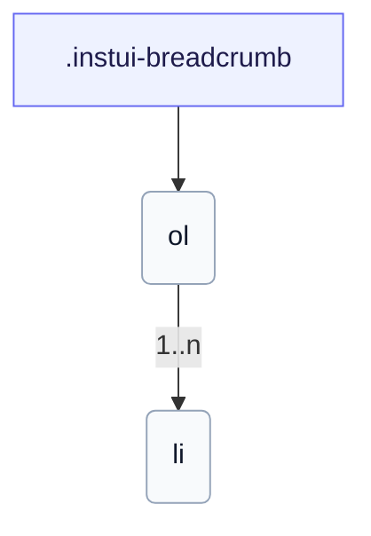

# CSS: breadcrumb

`.instui-breadcrumb` · <span class="instui-pill -color-success pantoken-doc-tag">stable</span> — En breadcrumb-sti med separatorer; det sidste lem er den aktuelle side.

Sammenfolder automatisk til en tilbage-pil på små skærme. Brug `breadcrumb.link` for hvert lem.

**Kilde:** [breadcrumb.css](https://github.com/thedannywahl/pantoken/blob/main/formats/components/src/components/breadcrumb/breadcrumb.css)

## Tilgængelighed

Omslut `&lt;ol&gt;` i et `<nav aria-label>` landemærke; marker den aktuelle sides lem med `aria-current="page"`.

## Brug

```css
@import "@pantoken/components/components.css";
@import "@pantoken/components/breadcrumb.css";
```

## Eksempler

```html
<nav class="instui-breadcrumb" aria-label="Breadcrumb">
  <ol>
    <li>
      <a class="-icon-house" href="#">Home</a>
    </li>
    <li><a href="#">Guides</a></li>
    <li><a href="#">Components</a></li>
    <li aria-current="page">Breadcrumb</li>
  </ol>
</nav>
```

## Struktur

```text
.instui-breadcrumb
  ol
    li (1..n)
```



## Modifikatorer

| Modifikator | Beskrivelse |
| --- | --- |
| `.-size-large` | Stor. @affects breadcrumb.link — Skalerer lem-separatorens mellemrum til at stemme overens. Lang form alias af `-size-lg`. |
| `.-size-lg` | Stor. @affects breadcrumb.link — Skalerer lem-separatorens mellemrum til at stemme overens. |
| `.-size-md` | Mellem (standard). @affects breadcrumb.link — Skalerer lem-separatorens mellemrum til at stemme overens. |
| `.-size-medium` | Mellem (standard). @affects breadcrumb.link — Skalerer lem-separatorens mellemrum til at stemme overens. Lang form alias af `-size-md`. |
| `.-size-sm` | Lille. @affects breadcrumb.link — Skalerer lem-separatorens mellemrum til at stemme overens. |
| `.-size-small` | Lille. @affects breadcrumb.link — Skalerer lem-separatorens mellemrum til at stemme overens. Lang form alias af `-size-sm`. |

## Forbrugte tokens

| Token | Type | Værdi |
| --- | --- | --- |
| `--instui-component-breadcrumb-gap-lg` | `<length>` | `0.5rem` |
| `--instui-component-breadcrumb-gap-md` | `<length>` | `0.25rem` |
| `--instui-component-breadcrumb-gap-sm` | `<length>` | `0.125rem` |
| `--instui-component-link-font-family` | `[ <font-family-name> \| <generic-font-family> ]#` | `Atkinson Hyperlegible Next, "Helvetica Neue", Helvetica, Arial, sans-serif` |
| `--instui-component-link-font-size-lg` | `<length>` | `1.75rem` |
| `--instui-component-link-font-size-md` | `<length>` | `1rem` |
| `--instui-component-link-font-size-sm` | `<length>` | `0.875rem` |

## Underkomponenter

- [breadcrumb.link](/da/api/css/breadcrumb.link.md)

