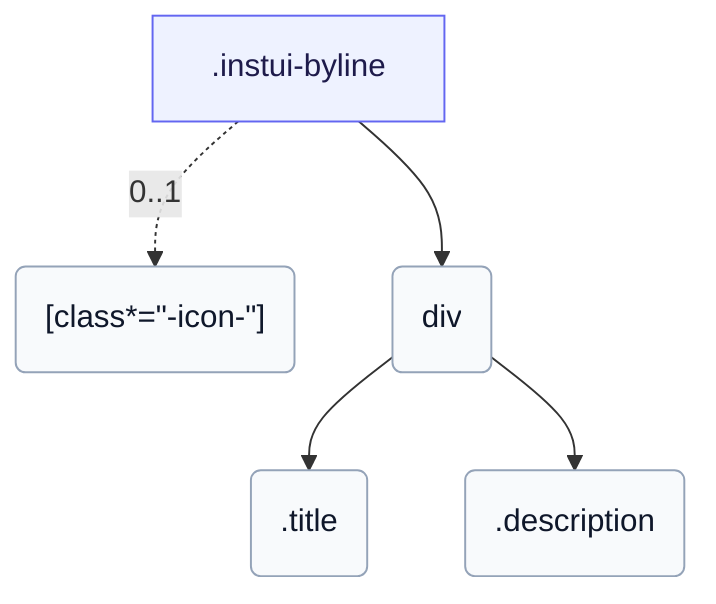

# CSS: byline

`.instui-byline` — Et medieobjekt: en hero-figur ved siden af en titel og beskrivelse.

Indstiller sin egen `gap` mellem figuren og tekstblokken; sammenkædning af en `-gap-*` spacing utility modifier tilsidesætter denne indbyggede værdi.

**Kilde:** [byline.css](https://github.com/thedannywahl/pantoken/blob/main/formats/components/src/components/byline/byline.css)

## Usage

```css
@import "@pantoken/components/components.css";
@import "@pantoken/components/byline.css";
```

## Examples

```html
<div class="instui-byline -size-md">
  <span class="instui-icon -icon-megaphone"></span>
  <div>
    <div class="title">What's new</div>
    <div class="description">
      The figure can be any leading visual — an icon, an avatar, or an image.
    </div>
  </div>
</div>
```

## Structure

```text
.instui-byline
  [class*="-icon-"] (0..1)
  div
    .title
    .description
```



## Modifiers

| Modifier                 | Description                                    |
| ------------------------ | ---------------------------------------------- |
| `.-align-content-center` | Centrer teksten lodret ved siden af hero'en.   |
| `.-align-content-top`    | Justér teksten til toppen af hero'en.          |
| `.-icon-*`               | Gengiv et ledende glyph-ikon før tekstblokken. |
| `.-size-large`           | Stor. Langt-form alias af `-size-lg`.          |
| `.-size-lg`              | Stor.                                          |
| `.-size-md`              | Mellem.                                        |
| `.-size-medium`          | Mellem. Langt alias for `-size-md`.            |
| `.-size-sm`              | Lille.                                         |
| `.-size-small`           | Lille. Langt-form alias af `-size-sm`.         |

## Parts

| Part           | Description                   |
| -------------- | ----------------------------- |
| `.description` | Den understøttende brødtekst. |
| `.title`       | Overskriftsteksten.           |

## Tokens consumed

| Token                                               | Type                                               | Value                                                                        |
| --------------------------------------------------- | -------------------------------------------------- | ---------------------------------------------------------------------------- |
| `--instui-component-byline-background`              | `<color>`                                          | `#00000000`                                                                  |
| `--instui-component-byline-color`                   | `<color>`                                          | `light-dark(#273540, #ffffff)`                                               |
| `--instui-component-byline-description-font-size`   | `<length>`                                         | `1rem`                                                                       |
| `--instui-component-byline-description-font-weight` | `<integer>`                                        | `400`                                                                        |
| `--instui-component-byline-description-line-height` | `<percentage>`                                     | `125%`                                                                       |
| `--instui-component-byline-figure-margin`           | `<length>`                                         | `0.75rem`                                                                    |
| `--instui-component-byline-font-family`             | `[ <font-family-name> \| <generic-font-family> ]#` | `Atkinson Hyperlegible Next, "Helvetica Neue", Helvetica, Arial, sans-serif` |
| `--instui-component-byline-large`                   | `<length>`                                         | `62em`                                                                       |
| `--instui-component-byline-medium`                  | `<length>`                                         | `48em`                                                                       |
| `--instui-component-byline-small`                   | `<length>`                                         | `30em`                                                                       |
| `--instui-component-byline-title-font-size`         | `<length>`                                         | `1.375rem`                                                                   |
| `--instui-component-byline-title-font-weight`       | `<integer>`                                        | `600`                                                                        |
| `--instui-component-byline-title-line-height`       | `<length>`                                         | `1.25rem`                                                                    |
| `--instui-component-byline-title-margin`            | `<length>`                                         | `0 0 0.5rem 0`                                                               |

## Browser support

- Indeholder sine elementstile med CSS-reglen `@scope`; kræver en nylig Chromium, Firefox eller Safari.
