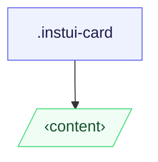

# CSS: card

`.instui-card` — En overfladecontainer, der accepterer vilkårligt indhold.

**Variant** styrer, hvordan direkte børn bliver stiliseret: `content` (standard) efterlader dem ustylet; `container` stables dem som kantede, polstrede sektioner. Padding skaleres med viewport-bredde og er den samme på tværs af begge varianter.
  **Size** er fuldt responsiv — padding og border-radius øges automatisk ved 320px (20rem) og 640px (40rem) via standard `min-width` mediespørgsmål; ingen størrelse-klasse er påkrævet.
  Parr med `@pantoken/components` for overskrifter, knapper og andre inline-komponenter.

## Tilgængelighed

Brug `&lt;article&gt;` som kartelementet, når kortet er en selvstændig indholdsenhed;
  brug `&lt;section&gt;` når grupperet inden for et større landemærke. I `-variant-container`, foretrækkes
  `&lt;section&gt;` elementer som direkte børn, så hver kantede region har semantisk betydning.

## Brug

@import "@pantoken/plugin-custom-components/custom-components.css";

```css
@import "@pantoken/plugin-custom-components/custom-components.css";
```

## Eksempler

Indholdskort -nocard
```html
<article class="instui-card">
  <h2 class="instui-heading -h3">Card title</h2>
  <p>Content here.</p>
  <button class="instui-button">Action</button>
</article>
```
Container-kort -nocard
```html
<article class="instui-card -variant-container">
  <section>First section</section>
  <section>Second section</section>
</article>
```

## Struktur

```text
.instui-card
  ‹content›
```



## Modifikatorer

| Modifikator | Beskrivelse |
| --- | --- |
| `.-variant-container` | Container-kort; direkte børn bliver kantede, polstrede sektioner. |
| `.-variant-content` | Standard indholdskort; børn er ustylet. Standard når ingen variant er angivet. |

## Betingelser

| Type | Forespørgsel | Beskrivelse |
| --- | --- | --- |
| media | `(min-width: 20rem)` | — |
| media | `(min-width: 40rem)` | — |

## Forbrugte tokens

| Token | Type | Værdi |
| --- | --- | --- |
| `--instui-component-card-background-color` | `<color>` | `light-dark(#ffffff, #1C222B)` |
| `--instui-component-card-border-radius-base-lg` | `<length>` | `1rem` |
| `--instui-component-card-border-radius-base-md` | `<length>` | `1rem` |
| `--instui-component-card-border-radius-base-sm` | `<length>` | `0.75rem` |
| `--instui-component-card-border-radius-nested-lg` | `<length>` | `0.75rem` |
| `--instui-component-card-border-radius-nested-md` | `<length>` | `0.5rem` |
| `--instui-component-card-border-radius-nested-sm` | `<length>` | `0.5rem` |
| `--instui-component-card-nested-border-color` | `<color>` | `light-dark(#E8EAEC, #2D3D49)` |
| `--instui-component-card-padding-base-lg` | `<length>` | `1.5rem` |
| `--instui-component-card-padding-base-md` | `<length>` | `1rem` |
| `--instui-component-card-padding-base-sm` | `<length>` | `0.75rem` |
| `--instui-component-card-padding-nested-lg` | `<length>` | `1rem` |
| `--instui-component-card-padding-nested-md` | `<length>` | `0.75rem` |
| `--instui-component-card-padding-nested-sm` | `<length>` | `0.5rem` |
| `--instui-component-shared-tokens-spacing-gap-cards-nested-containers-lg` | `<length>` | `1rem` |
| `--instui-component-shared-tokens-spacing-gap-cards-nested-containers-md` | `<length>` | `0.75rem` |
| `--instui-component-shared-tokens-spacing-gap-cards-nested-containers-sm` | `<length>` | `0.5rem` |
| `--instui-component-shared-tokens-stroke-width-sm` | `<length>` | `0.0625rem` |
| `--instui-elevation-card` | `none \| <shadow>#` | — |

## Browserunderstøttelse

- `@scope` er Baseline 2023 Nyt tilgængeligt; kortet forringes til et ikke-scoped fladt stylesheet
  i ældre browsere uden tab af synligt styling.

## Relateret

- [heading](/da/api/css/heading.md) — Placer direkte i kortet eller inden for en container-sektion.
- [button](/da/api/css/button.md) — Placer direkte i kortet eller inden for en container-sektion.
- [img](/da/api/css/img.md) — Placer direkte i kortet som et medieregion.
- [badge](/da/api/css/badge.md) — Placer direkte i kortet som en statusindikator.

## Se også

- https://drafts.csswg.org/css-cascade-6/#scoping

