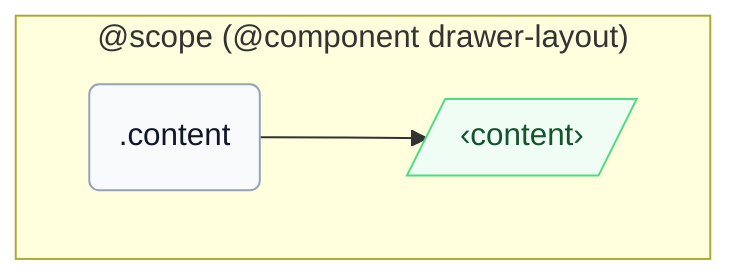

# CSS: drawer-layout.content

`.content` — Hovedindholdsruden, der udfylder det resterende område ved siden af bakken.

Når moderelementets inline-size falder under `46em` (`16em` bakkebredde + `30em` breakpoint), sænker en `@container` forespørgsel på moderelementets `pantoken-drawer-layout` beholder automatisk dette members `min-inline-size` til `0`, hvilket matcher den manuelle `[should-overlay-tray]` tilsidesættelse.

## Accessibility

Bær `role="region"` (InstUI's DrawerLayout-konvention) og navngiv det med `aria-label`/`aria-labelledby`, når kontekst alene ikke identificerer det.

## Usage

```css
@import "@pantoken/components/components.css";
@import "@pantoken/components/drawer-layout.content.css";
```

## Examples

```html
<div class="instui-drawer-layout">
  <div class="content" role="region">
    <p class="instui-text">Tray content</p>
  </div>
</div>
```

## Structure

```text
@scope (@component drawer-layout)
  .content
    ‹content›
```



## Conditions

| Type      | Query                                      | Description |
| --------- | ------------------------------------------ | ----------- |
| container | `pantoken-drawer-layout (max-width: 46em)` | —           |

## Tokens consumed

| Token                                     | Type       | Value  |
| ----------------------------------------- | ---------- | ------ |
| `--drawer-layout-content-min-inline-size` | `<length>` | —      |
| `--pantoken-bp-md`                        | `<length>` | `30em` |

## Related

- [drawer-layout.tray](/da/api/css/drawer-layout.tray.md) — Det tilstødende panel i samme flex-række.
