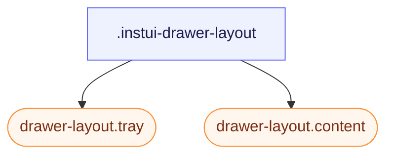

# CSS: drawer-layout

`.instui-drawer-layout` — Et delt layout med en sammenfoldelig sidebakke og en primær rulbar indholdsrude.

`-placement-end` og standard (start) bruger begge `flex-direction`/`inset-inline-*` logiske egenskaber, ikke `left`/`right`, så bakkens side følger automatisk `direction`/`dir="rtl"` — der er ikke behov for separate RTL-regler.

**Kilde:** [drawer-layout.css](https://github.com/thedannywahl/pantoken/blob/main/formats/components/src/components/drawer-layout/drawer-layout.css)

## Tilgængelighed

Når bakken fungerer som navigation, mærker du den med en tilgængelig overskrift eller `aria-label`. Giv `.content` `role="region"` (InstUI's DrawerLayout-konvention) og navngiv det med `aria-label`/`aria-labelledby`, når kontekst alene ikke identificerer det.

## Brug

```css
@import "@pantoken/components/components.css";
@import "@pantoken/components/drawer-layout.css";
```

## Eksempler

```html
<div class="instui-drawer-layout" id="drawer" open>
  <aside class="tray">Navigation</aside>
  <main class="content" role="region">Main content</main>
</div>
```

## Struktur

```text
.instui-drawer-layout
  drawer-layout.tray (component)
  drawer-layout.content (component)
```



## Modifikatorer

| Modifikator | Beskrivelse |
| --- | --- |
| `.-open` | Vis bakken selv når `open` attributten mangler. |
| `.-placement-end` | Dokk bakken på inline-end siden. |
| `.-placement-start` | Dokk bakken på inline-start siden (standard; indstiller den eksplicit). |
| `.-should-overlay-tray` | <span class="instui-pill pantoken-doc-tag pantoken-doc-tag-interaction">Interaction</span> — Render the tray as an overlay instead of shrinking content inline. |

## Dele

| Del | Beskrivelse |
| --- | --- |
| `.content` | Hovedruden. |
| `.tray` | Sidepanelet. |

## Brugerdefinerede egenskaber

| Egenskab | Type | Standard | Beskrivelse |
| --- | --- | --- | --- |
| `--pantoken-bp-md` | — | — | Breddetærskel for overlay-tilstand (`30em`, tematiseret via responsive værktøjer). |

## Browserunderstøttelse

- `drawer-layout.tray`/`drawer-layout.content` medlemmer skifter automatisk til overlay-tilstand via en `@container` forespørgsel, når dette elements inline-size falder under bakkebredde + `--pantoken-bp-md`. `@pantoken/interactions` adfærden skifter desuden `[should-overlay-tray]`/`.-should-overlay-tray` (en manuel tilsidesættelse) og udsender `overlaytraychange` for apps, der har brug for ændringen som en begivenhed.

## Underkomponenter

- [drawer-layout.content](/da/api/css/drawer-layout.content.md)
- [drawer-layout.tray](/da/api/css/drawer-layout.tray.md)
- [tray](/da/api/css/tray.md)

## Relateret

- [tray](/da/api/css/tray.md) — En selvstændig kantoverlay; dette layout holder bakke og indhold i samme flow.
- [context-view](/da/api/css/context-view.md) — En mindre forankret overflade til kontekstuelle handlinger og detaljer.

