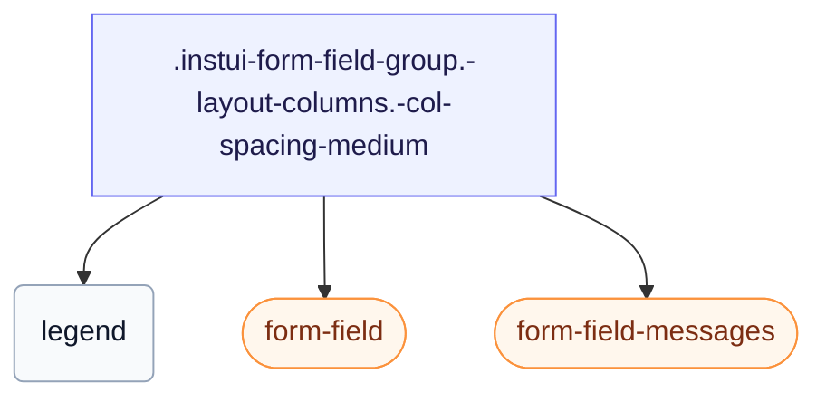

# CSS: form-field-group

`.instui-form-field-group` — En `&lt;fieldset&gt;` gruppe med en forklaring, en søjle- eller inline-layout og konfigurerbart mellemrum.

Indstiller sin egen `gap` mellem felter, som kan justeres med `-col-spacing-*`/`-row-spacing-*` modifikatorerne nedenfor — foretruk disse frem for at kæde en generisk `-gap-*` spacing utility modifier, som tilsidesætter den indbyggede værdi helt.

**Kilde:** [form-field-group.css](https://github.com/thedannywahl/pantoken/blob/main/formats/components/src/components/form-field-group/form-field-group.css)

## Tilgængelighed

Gengiver en indfødt `&lt;fieldset&gt;` med en `&lt;legend&gt;`, så legendeteksten navngiver hele gruppen for hjælpeteknologi.

## Brug

```css
@import "@pantoken/components/components.css";
@import "@pantoken/components/form-field-group.css";
```

## Eksempler

```html
<fieldset class="instui-form-field-group -layout-columns -col-spacing-medium">
  <legend>Shipping address</legend>
  <label class="instui-form-field">
    <span class="label">First name</span>
    <span class="controls"><input class="instui-text-input"></span>
  </label>
  <label class="instui-form-field">
    <span class="label">Last name</span>
    <span class="controls"><input class="instui-text-input"></span>
  </label>
  <label class="instui-form-field">
    <span class="label">City</span>
    <span class="controls"><input class="instui-text-input"></span>
  </label>
  <label class="instui-form-field">
    <span class="label">State</span>
    <span class="controls">
      <select class="instui-simple-select">
        <option>CA</option>
        <option>NY</option>
        <option>TX</option>
      </select>
    </span>
  </label>
  <div class="instui-form-field-messages">
    <span class="instui-form-field-message -type-hint">All fields are used for delivery only.</span>
  </div>
</fieldset>
```

## Struktur

```text
.instui-form-field-group.-layout-columns.-col-spacing-medium
  legend
  form-field (component)
  form-field-messages (component)
```



## Modifikatorer

| Modifikator | Beskrivelse |
| --- | --- |
| `.-col-spacing-large` | Stort kolonnegab. |
| `.-col-spacing-medium` | Mellemstort kolonnegab. |
| `.-col-spacing-none` | Intet kolonnegab. |
| `.-col-spacing-small` | Lille kolonnegab. |
| `.-layout-aligned` | Justér underordnede felter til et delt gitter. |
| `.-layout-columns` | Arranger underordnede felter i kolonner. |
| `.-layout-inline` | Arranger underordnede felter inline, i en række. |
| `.-required` | Markér gruppen som påkrævet. |
| `.-row-spacing-large` | Stort rækkegab. |
| `.-row-spacing-medium` | Mellemstort rækkegab. |
| `.-row-spacing-none` | Intet rækkegab. |
| `.-row-spacing-small` | Lille rækkegab. |
| `.-v-align-bottom` | Justér felterne til bunden. |
| `.-v-align-middle` | Justér felterne til midten. |
| `.-v-align-top` | Justér felterne til toppen. |

## Pseudo-elementer

| Pseudo-element | Beskrivelse |
| --- | --- |
| `::after` | Gengiver den dekorative påkrævet-felt asterisk efter legendeteksten, når gruppen er påkrævet. |

## Betingelser

| Type | Forespørgsel | Beskrivelse |
| --- | --- | --- |
| supports | `(grid-template-columns: subgrid)` | — |

## Forbrugte tokens

| Token | Type | Værdi |
| --- | --- | --- |
| `--instui-component-form-field-layout-asterisk-color` | `<color>` | `light-dark(#CF1F24, #FA917F)` |
| `--instui-component-form-field-layout-font-family` | `[ <font-family-name> \| <generic-font-family> ]#` | `Atkinson Hyperlegible Next, "Helvetica Neue", Helvetica, Arial, sans-serif` |
| `--instui-component-form-field-layout-font-size` | `<length>` | `1rem` |
| `--instui-component-form-field-layout-font-weight` | `<integer>` | `400` |
| `--instui-component-form-field-layout-gap-inputs` | `<length>` | `0.75rem` |
| `--instui-component-form-field-layout-gap-primitives` | `<length>` | `0.5rem` |
| `--instui-component-form-field-layout-line-height` | `<length>` | `1.125rem` |
| `--instui-component-form-field-layout-text-color` | `<color>` | `light-dark(#273540, #ffffff)` |
| `--instui-spacing-space-lg` | `<length>` | `1rem` |
| `--instui-spacing-space-md` | `<length>` | `0.75rem` |
| `--instui-spacing-space-sm` | `<length>` | `0.5rem` |

## Browserunderstøttelse

- `-layout-aligned`-tilstanden bruger CSS subgrid bag en `@supports` vagt; hvor subgrid ikke understøttes, falder felterne tilbage til deres egen stablede layout.

## Underkomponenter

- [form-field](/da/api/css/form-field.md)
- [form-field-messages](/da/api/css/form-field-messages.md)

## Relateret

- [form-field](/da/api/css/form-field.md) — Det enkelte felt, som denne gruppe gentager.
- [radio-input-group](/da/api/css/radio-input-group.md) — Grupperer radioinput under en legend.

