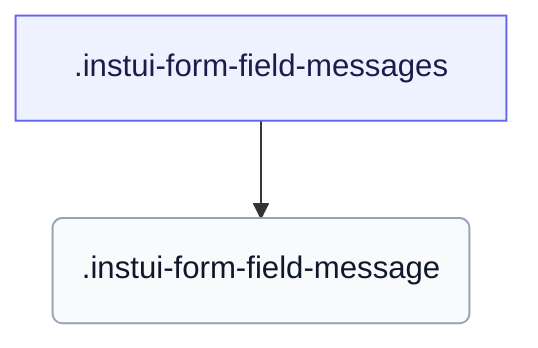

# CSS: form-field-messages

`.instui-form-field-messages` — Felthjælp og valideringsmeddelelser — hint, fejl, succes og kun skærmlæser — med en glyf ved fejl og succes.

Indstiller sin egen `gap` mellem stablede meddelelser; at kæde en `-gap-*` spacing utility modifier tilsidesætter denne indbyggede værdi.

**Kilde:** [form-field-messages.css](https://github.com/thedannywahl/pantoken/blob/main/formats/components/src/components/form-field-messages/form-field-messages.css)

## Accessibility

En `-type-screenreader-only` meddelelse er visuelt skjult, men forbliver i tilgængelighedstræet, så den annonceres stadig; parret fejl- og succemeddelelser med feltet via aria-describedby, så hjælpeteknologi læser dem med kontrollen.

## Usage

```css
@import "@pantoken/components/components.css";
@import "@pantoken/components/form-field-messages.css";
```

## Examples

```html
<div class="instui-form-field-messages">
  <span class="instui-form-field-message -type-hint">We'll never share it.</span>
  <span class="instui-form-field-message -type-error">Enter a valid email address.</span>
</div>
```

## Structure

```text
.instui-form-field-messages
  .instui-form-field-message
```



## Modifiers

| Modifier           | Description                                                                                   |
| ------------------ | --------------------------------------------------------------------------------------------- |
| `.-type-new-error` | <span class="instui-pill -color-info pantoken-doc-tag">Alias</span> — maps to `.-type-error`. |

## Parts

| Part                         | Description                                                                                           |
| ---------------------------- | ----------------------------------------------------------------------------------------------------- |
| `.instui-form-field-message` | En individuel meddelelse; dens `-type-*` vælger hint-, fejl-, succes- eller kun skærmlæser-varianten. |

## Pseudo-elements

| Pseudo-element | Description                                                                                                                |
| -------------- | -------------------------------------------------------------------------------------------------------------------------- |
| `::before`     | Gengiver den ledende statusglyf på fejl- og succemeddelelser: en advarselskreis for fejl og en markeringskreis for succes. |

## Tokens consumed

| Token                                                      | Type                                               | Value                                                                                                                                                                                                                                                                                                                                                                                                                                                                                                                                                    |
| ---------------------------------------------------------- | -------------------------------------------------- | -------------------------------------------------------------------------------------------------------------------------------------------------------------------------------------------------------------------------------------------------------------------------------------------------------------------------------------------------------------------------------------------------------------------------------------------------------------------------------------------------------------------------------------------------------- |
| `--instui-component-form-field-layout-gap-primitives`      | `<length>`                                         | `0.5rem`                                                                                                                                                                                                                                                                                                                                                                                                                                                                                                                                                 |
| `--instui-component-form-field-message-error-text-color`   | `<color>`                                          | `light-dark(#CF1F24, #FA917F)`                                                                                                                                                                                                                                                                                                                                                                                                                                                                                                                           |
| `--instui-component-form-field-message-font-family`        | `[ <font-family-name> \| <generic-font-family> ]#` | `Atkinson Hyperlegible Next, "Helvetica Neue", Helvetica, Arial, sans-serif`                                                                                                                                                                                                                                                                                                                                                                                                                                                                             |
| `--instui-component-form-field-message-font-size`          | `<length>`                                         | `0.875rem`                                                                                                                                                                                                                                                                                                                                                                                                                                                                                                                                               |
| `--instui-component-form-field-message-font-weight`        | `<integer>`                                        | `400`                                                                                                                                                                                                                                                                                                                                                                                                                                                                                                                                                    |
| `--instui-component-form-field-message-hint-text-color`    | `<color>`                                          | `light-dark(#273540, #ffffff)`                                                                                                                                                                                                                                                                                                                                                                                                                                                                                                                           |
| `--instui-component-form-field-message-line-height`        | `<length>`                                         | `1.25rem`                                                                                                                                                                                                                                                                                                                                                                                                                                                                                                                                                |
| `--instui-component-form-field-message-success-text-color` | `<color>`                                          | `light-dark(#037D37, #61C378)`                                                                                                                                                                                                                                                                                                                                                                                                                                                                                                                           |
| `--instui-icon-circle-alert`                               | `<image>`                                          | `url('data:image/svg+xml;utf8,%3Csvg%20xmlns%3D%22http%3A%2F%2Fwww.w3.org%2F2000%2Fsvg%22%20width%3D%2224%22%20height%3D%2224%22%20viewBox%3D%220%200%2024%2024%22%20fill%3D%22none%22%20stroke%3D%22currentColor%22%20stroke-width%3D%222%22%20stroke-linecap%3D%22round%22%20stroke-linejoin%3D%22round%22%3E%3Ccircle%20cx%3D%2212%22%20cy%3D%2212%22%20r%3D%2210%22%2F%3E%3Cline%20x1%3D%2212%22%20x2%3D%2212%22%20y1%3D%228%22%20y2%3D%2212%22%2F%3E%3Cline%20x1%3D%2212%22%20x2%3D%2212.01%22%20y1%3D%2216%22%20y2%3D%2216%22%2F%3E%3C%2Fsvg%3E')` |
| `--instui-icon-circle-check`                               | `<image>`                                          | `url('data:image/svg+xml;utf8,%3Csvg%20xmlns%3D%22http%3A%2F%2Fwww.w3.org%2F2000%2Fsvg%22%20width%3D%2224%22%20height%3D%2224%22%20viewBox%3D%220%200%2024%2024%22%20fill%3D%22none%22%20stroke%3D%22currentColor%22%20stroke-width%3D%222%22%20stroke-linecap%3D%22round%22%20stroke-linejoin%3D%22round%22%3E%3Ccircle%20cx%3D%2212%22%20cy%3D%2212%22%20r%3D%2210%22%2F%3E%3Cpath%20d%3D%22m9%2012%202%202%204-4%22%2F%3E%3C%2Fsvg%3E')`                                                                                                              |

## Related

- [form-field](/da/api/css/form-field.md) — Omslutter en etiket, kontrolelementer og disse meddelelser.
