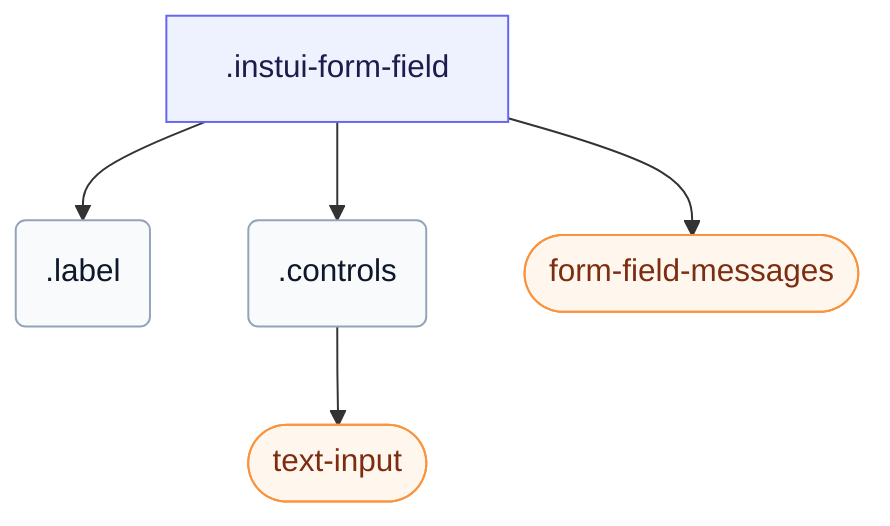

# CSS: form-field

`.instui-form-field` — En form-field-indpakning: en etiket, dens kontrolelementer og inline, påkrævet eller skrivebeskyttet layout.

En fejlmeddelelse forbliver skjult, indtil feltets kontrolelement er `:user-invalid` (efter brugerens interaktion), eller du tilføjer `-invalid`-klassen. Brug `-layout-inline` til at placere etiketten ved siden af kontrolelementerne og `-layout-stacked` til at placere den ovenfor. Indstiller også sin egen `gap` mellem etiketten, kontrolelementerne og meddelelserne; at kæde en `-gap-*` spacing utility modifier tilsidesætter denne indbyggede værdi.

**Kilde:** [form-field.css](https://github.com/thedannywahl/pantoken/blob/main/formats/components/src/components/form-field/form-field.css)

## Tilgængelighed

`&lt;label&gt;`-elementet omslutter kontrolelementet, så etiketteksten navngiver det naturligt; den påkrævede asterisk er dekorativ og skal være skjult for hjælpeteknologi (aria-hidden), og fejlmeddelelsen kommer til syne, når kontrolelementet er `:user-invalid`, eller du tilføjer `-invalid`-klassen.

## Brug

```css
@import "@pantoken/components/components.css";
@import "@pantoken/components/form-field.css";
```

## Eksempler

```html
<label class="instui-form-field">
  <span class="label">Email address</span>
  <span class="controls"><input class="instui-text-input" type="email" placeholder="you@example.com"></span>
  <div class="instui-form-field-messages">
    <span class="instui-form-field-message -type-hint">We'll never share it.</span>
    <span class="instui-form-field-message -type-error">Enter a valid email address.</span>
  </div>
</label>
```

## Struktur

```text
.instui-form-field
  .label
  .controls
    text-input (component)
  form-field-messages (component)
```



## Modifikatorer

| Modifikator | Beskrivelse |
| --- | --- |
| `.-inline` | Inline layout (forkortelse for `-layout-inline`). |
| `.-invalid` | Ugyldigt (fejl) tilstand. |
| `.-label-align-end` | Justér etiketteksten til slutningen. |
| `.-label-align-start` | Justér etiketteksten til starten. |
| `.-layout-inline` | Inline layout: etiket ved siden af kontrolelementerne. |
| `.-layout-stacked` | Stablet layout: etiket ovenfor kontrolelementerne. |
| `.-readonly` | Skrivebeskyttet tilstand. |
| `.-v-align-bottom` | Justér etiketten med kontrolelementerne til bunden. |
| `.-v-align-top` | Justér etiketten med kontrolelementerne til toppen. |

## Dele

| Del | Beskrivelse |
| --- | --- |
| `.controls` | Kontrolområdet ved siden af eller under etiketten. |
| `.label` | Feltetiketten. |

## Pseudo-elementer

| Pseudo-element | Beskrivelse |
| --- | --- |
| `::after` | Gengiver den dekorative påkrævet-felt asterisk efter etiketteksten, når feltet er påkrævet. |

## Tilstande

| Tilstand | Beskrivelse |
| --- | --- |
| `:required` | — |

## Forbrugte tokens

| Token | Type | Værdi |
| --- | --- | --- |
| `--instui-component-form-field-layout-asterisk-color` | `<color>` | `light-dark(#CF1F24, #FA917F)` |
| `--instui-component-form-field-layout-font-family` | `[ <font-family-name> \| <generic-font-family> ]#` | `Atkinson Hyperlegible Next, "Helvetica Neue", Helvetica, Arial, sans-serif` |
| `--instui-component-form-field-layout-font-size` | `<length>` | `1rem` |
| `--instui-component-form-field-layout-font-weight` | `<integer>` | `400` |
| `--instui-component-form-field-layout-gap-inputs` | `<length>` | `0.75rem` |
| `--instui-component-form-field-layout-gap-primitives` | `<length>` | `0.5rem` |
| `--instui-component-form-field-layout-line-height` | `<length>` | `1.125rem` |
| `--instui-component-form-field-layout-readonly-text-color` | `<color>` | `light-dark(#576773, #AAB0B5)` |
| `--instui-component-form-field-layout-text-color` | `<color>` | `light-dark(#273540, #ffffff)` |

## Browserunderstøttelse

- Indeholder sine elementstile med CSS-reglen `@scope`; kræver en nylig Chromium, Firefox eller Safari.

## Underkomponenter

- [form-field-messages](/da/api/css/form-field-messages.md)
- [text-input](/da/api/css/text-input.md)

## Relateret

- [form-field-messages](/da/api/css/form-field-messages.md) — Gengiver feltets hint-, fejl- og succemeddelelser.
- [form-field-group](/da/api/css/form-field-group.md) — Grupperer relaterede felter under en delt legend.

