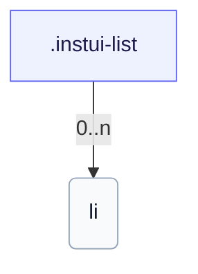

# CSS: list

`.instui-list` — En liste med token-drevet elementabstand.

Indstiller sin egen `padding-inline-start` til listeindrykking; sammenkæding af en `-p*`/`-padding*` spacing utility modifier tilsidesætter denne indbyggede værdi. Se `list.item`-medlemmet for de enkelte elementer.

**Kilde:** [list.css](https://github.com/thedannywahl/pantoken/blob/main/formats/components/src/components/list/list.css)

## Usage

```css
@import "@pantoken/components/components.css";
@import "@pantoken/components/list.css";
```

## Examples

```html
<ul class="instui-list">
  <li>First item</li>
  <li>Second item</li>
  <li>Third item</li>
</ul>
```

## Structure

```text
.instui-list
  li (0..n)
```



## Modifiers

| Modifier        | Description                                                                                                     |
| --------------- | --------------------------------------------------------------------------------------------------------------- |
| `.-inline`      | Stil elementer inline (vandret).                                                                                |
| `.-size-large`  | Stor. @affects list.item — Skalerer elementabstanden til at passe. Langtform alias for `-size-lg`.              |
| `.-size-lg`     | Stor. @affects list.item — Skalerer elementabstanden til at passe.                                              |
| `.-size-md`     | Medium (standard). @affects list.item — Skalerer elementabstanden til at passe.                                 |
| `.-size-medium` | Medium (standard). @affects list.item — Skalerer elementabstanden til at passe. Langtform alias for `-size-md`. |
| `.-size-sm`     | Lille. @affects list.item — Skalerer elementabstanden til at passe.                                             |
| `.-size-small`  | Lille. @affects list.item — Skalerer elementabstanden til at passe. Langtform alias for `-size-sm`.             |
| `.-unstyled`    | Fjern markere og polstring.                                                                                     |

## Tokens consumed

| Token                                           | Type                                               | Value                                                                        |
| ----------------------------------------------- | -------------------------------------------------- | ---------------------------------------------------------------------------- |
| `--instui-component-list-item-color`            | `<color>`                                          | `light-dark(#273540, #ffffff)`                                               |
| `--instui-component-list-item-font-family`      | `[ <font-family-name> \| <generic-font-family> ]#` | `Atkinson Hyperlegible Next, "Helvetica Neue", Helvetica, Arial, sans-serif` |
| `--instui-component-list-item-font-size-large`  | `<length>`                                         | `1.25rem`                                                                    |
| `--instui-component-list-item-font-size-medium` | `<length>`                                         | `1rem`                                                                       |
| `--instui-component-list-item-font-size-small`  | `<length>`                                         | `0.875rem`                                                                   |
| `--instui-component-list-item-font-weight`      | `<integer>`                                        | `400`                                                                        |
| `--instui-component-list-item-line-height`      | `<percentage>`                                     | `150%`                                                                       |
| `--instui-component-list-item-spacing-medium`   | `<length>`                                         | `1.5rem`                                                                     |
| `--instui-component-list-list-padding`          | `<length>`                                         | `2.25rem`                                                                    |

## Subcomponents

- [list.item](/da/api/css/list.item.md)
