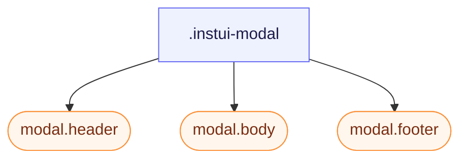

# CSS: modal

`.instui-modal` — En dialog-flade (fungerer på en native &lt;dialog&gt;); header/body/footer dele.

Se medlemmerne `modal.header`, `modal.body` og `modal.footer` for de enkelte dele.

**Kilde:** [body.css](https://github.com/thedannywahl/pantoken/blob/main/formats/components/src/components/modal/members/body/body.css)

<!-- js-requirement -->
> [!TIP]
> **JS-forbedring** — Denne components CSS gengives og fungerer på sin egen; parrer den med `@pantoken/interactions` for at tilføje den interaktive opførsel. Se [modifikator-tabel nedenfor](#modifiers).


## Tilgængelighed

Åbn det oprindelige `&lt;dialog&gt;` med `showModal()` for modal-semantik og Esc-til-luk, og navngiv det med `aria-labelledby` der peger på `.header`.

## Brug

```css
@import "@pantoken/components/components.css";
@import "@pantoken/components/modal.css";
```

## Demo

```demo
self:modal
```

## Eksempler

```html
<dialog class="instui-modal -size-sm" id="modal-sm">
  <div class="header"><strong>Small</strong></div>
  <div class="body"><code>-size-sm</code> — a narrow modal.</div>
  <div class="footer">
    <button class="instui-button">Close</button>
  </div>
</dialog>
```

## Struktur

```text
.instui-modal
  modal.header (component)
  modal.body (component)
  modal.footer (component)
```



## Modifikatorer

| Modifikator | Beskrivelse |
| --- | --- |
| `.-blur` | Sløring af backdrop bag modalen. |
| `.-color-inverse` | On-dark chrome (parrer med mediakrop). @affects modal.header @affects modal.body @affects modal.footer — Giver hver del on-dark-udseendet. |
| `.-density-compact` | Strammere delpolstring. @affects modal.header @affects modal.body @affects modal.footer — Stramper hver dels polstring. |
| `.-overflow-fit` | Begræns til visningsporten og rul kroppen. @affects modal.body — Ruller kroppen når modalen er begrænset til visningsporten. |
| `.-size-auto` | Størrelse tilpasset indhold. |
| `.-size-fullscreen` | Kant-til-kant. |
| `.-size-large` | En bred modal. Langt alias af `-size-lg`. |
| `.-size-lg` | En bred modal. |
| `.-size-sm` | En smal modal. |
| `.-size-small` | En smal modal. Langt alias af `-size-sm`. |

## Pseudo-elementer

| Pseudo-element | Beskrivelse |
| --- | --- |
| `::backdrop` | Formørker siden bag dialogen som dens maske og fryser den under `-blur`. |

## Forbrugte tokens

| Token | Type | Værdi |
| --- | --- | --- |
| `--instui-component-mask-background-color` | `<color>` | `light-dark(rgba(255,255,255,0.75), rgba(28,34,43,0.75))` |
| `--instui-component-modal-auto-min-width` | `<length>` | `16em` |
| `--instui-component-modal-background-color` | `<color>` | `light-dark(#ffffff, #171B21)` |
| `--instui-component-modal-border-color` | `<color>` | `light-dark(#E8EAEC, #334450)` |
| `--instui-component-modal-border-radius` | `<length>` | `1rem` |
| `--instui-component-modal-border-width` | `<length>` | `0.0625rem` |
| `--instui-component-modal-font-family` | `[ <font-family-name> \| <generic-font-family> ]#` | `Atkinson Hyperlegible Next, "Helvetica Neue", Helvetica, Arial, sans-serif` |
| `--instui-component-modal-inverse-background-color` | `<color>` | `light-dark(#273540, #1C222B)` |
| `--instui-component-modal-inverse-border-color` | `<color>` | `#334450` |
| `--instui-component-modal-inverse-text-color` | `<color>` | `#ffffff` |
| `--instui-component-modal-large-max-width` | `<length>` | `62em` |
| `--instui-component-modal-medium-max-width` | `<length>` | `48em` |
| `--instui-component-modal-small-max-width` | `<length>` | `30em` |
| `--instui-component-modal-text-color` | `<color>` | `light-dark(#273540, #F2F4F5)` |
| `--instui-elevation-topmost` | `none \| <shadow>#` | — |
| `--instui-spacing-space-xl` | `<length>` | `1.5rem` |

## Browserunderstøttelse

- Udformer et oprindeligt &lt;dialog&gt;-element og dets `::backdrop`; top-layer-rendering og backdrop-styling kræver en browser, der understøtter dialog-elementet.

## Underkomponenter

- [modal.body](/da/api/css/modal.body.md)
- [modal.footer](/da/api/css/modal.footer.md)
- [modal.header](/da/api/css/modal.header.md)

## Relateret

- [tray](/da/api/css/tray.md) — En bakke er det samme afviselige overlay-mønster, forankret til en skærmkant.

