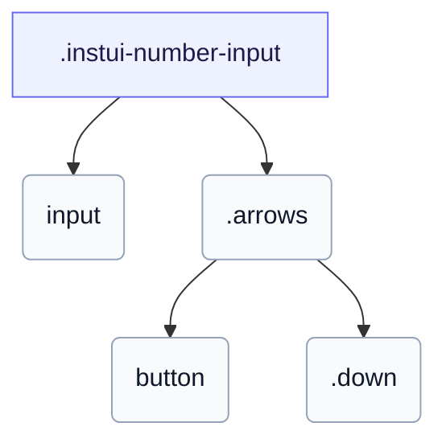

# CSS: number-input

`.instui-number-input` — En number-input-facade med en +/- spinner-kolonne.

Knapperne `.arrows` er `aria-hidden` og rent visuelle — forbrugeren skal forbinde JavaScript til at øge/formindske værdien ved klik.

**Kilde:** [number-input.css](https://github.com/thedannywahl/pantoken/blob/main/formats/components/src/components/number-input/number-input.css)

## Tilgængelighed

Placer det tilgængelige navn på `&lt;input&gt;` (f.eks. `aria-label`) så feltet ejer værdien; +/- spinner-knapperne er dekorative og markeret `aria-hidden="true"`.

## Brug

```css
@import "@pantoken/components/components.css";
@import "@pantoken/components/number-input.css";
```

## Eksempler

```html
<span class="instui-number-input">
  <input id="qty" type="number" value="1" aria-label="Quantity">
  <span class="arrows">
    <button type="button" id="up" aria-hidden="true"></button>
    <button class="down" type="button" id="down" aria-hidden="true"></button>
  </span>
</span>
```

## Struktur

```text
.instui-number-input
  input
  .arrows
    button
    .down
```



## Modifikatorer

| Modifikator | Beskrivelse |
| --- | --- |
| `.-disabled` | Deaktiveret tilstand. |
| `.-invalid` | Ugyldigt (fejl) tilstand. |
| `.-readonly` | Skrivebeskyttet tilstand. |
| `.-size-large` | Stor. Langt-form alias af `-size-lg`. |
| `.-size-lg` | Stor. |
| `.-size-md` | (standard) Mellem. |
| `.-size-medium` | (standard) Mellem. Langt alias af `-size-md`. |
| `.-size-sm` | Lille. |
| `.-size-small` | Lille. Langt-form alias af `-size-sm`. |
| `.-success` | Succestilstand (gyldig). |

## Dele

| Del | Beskrivelse |
| --- | --- |
| `.arrows` | +/- spinner-kolonnen ved inline-end. |
| `.down` | Dekrementknappen; den uklassificerede knap øger. |

## Pseudo-elementer

| Pseudo-element | Beskrivelse |
| --- | --- |
| `::before` | Det maskerede chevron-glyf på hver spinner-knap: op til stigning, ned på `.down`. |
| `::placeholder` | Pladsholderteksten for det indre input i en dæmpet farve. |

## Tilstande

| Tilstand | Beskrivelse |
| --- | --- |
| `:disabled` | — |

## Forbrugte tokens

| Token | Type | Værdi |
| --- | --- | --- |
| `--instui-color-icon-interactive-action-secondary-base` | `<color>` | `light-dark(#1D354F, #ffffff)` |
| `--instui-component-text-input-arrows-background-active-color` | `<color>` | `light-dark(#44709F, #2E5177)` |
| `--instui-component-text-input-arrows-background-color` | `<color>` | `light-dark(#44709F, #86A8D5)` |
| `--instui-component-text-input-arrows-background-disabled-color` | `<color>` | `light-dark(#DFE1E3, #334450)` |
| `--instui-component-text-input-arrows-background-hover-color` | `<color>` | `light-dark(#44709F, #86A8D5)` |
| `--instui-component-text-input-background-color` | `<color>` | `light-dark(#ffffff, #171B21)` |
| `--instui-component-text-input-background-disabled-color` | `<color>` | `light-dark(#E8EAEC, #334450)` |
| `--instui-component-text-input-background-hover-color` | `<color>` | `light-dark(#ffffff, #171B21)` |
| `--instui-component-text-input-background-readonly-color` | `<color>` | `light-dark(#C7CACD, #6A7883)` |
| `--instui-component-text-input-border-color` | `<color>` | `light-dark(#7E8792, #5F6E7A)` |
| `--instui-component-text-input-border-disabled-color` | `<color>` | `light-dark(#C7CACD, #4A5B68)` |
| `--instui-component-text-input-border-hover-color` | `<color>` | `light-dark(#334450, #7E8792)` |
| `--instui-component-text-input-border-radius` | `<length>` | `0.75rem` |
| `--instui-component-text-input-border-readonly-color` | `<color>` | `#8D959F` |
| `--instui-component-text-input-border-width` | `<length>` | `0.0625rem` |
| `--instui-component-text-input-error-border-color` | `<color>` | `light-dark(#CF1F24, #F56050)` |
| `--instui-component-text-input-font-family` | `[ <font-family-name> \| <generic-font-family> ]#` | `Atkinson Hyperlegible Next, "Helvetica Neue", Helvetica, Arial, sans-serif` |
| `--instui-component-text-input-font-size-lg` | `<length>` | `1.25rem` |
| `--instui-component-text-input-font-size-md` | `<length>` | `1rem` |
| `--instui-component-text-input-font-size-sm` | `<length>` | `0.875rem` |
| `--instui-component-text-input-gap-content` | `<length>` | `0.75rem` |
| `--instui-component-text-input-height-lg` | `<length>` | `3rem` |
| `--instui-component-text-input-height-md` | `<length>` | `2.5rem` |
| `--instui-component-text-input-height-sm` | `<length>` | `2rem` |
| `--instui-component-text-input-padding-horizontal-lg` | `<length>` | `0.75rem` |
| `--instui-component-text-input-padding-horizontal-md` | `<length>` | `0.75rem` |
| `--instui-component-text-input-padding-horizontal-sm` | `<length>` | `0.5rem` |
| `--instui-component-text-input-placeholder-color` | `<color>` | `light-dark(#5F6E7A, #7E8792)` |
| `--instui-component-text-input-success-border-color` | `<color>` | `light-dark(#037D37, #3EA75B)` |
| `--instui-component-text-input-text-color` | `<color>` | `light-dark(#273540, #ffffff)` |
| `--instui-component-text-input-text-disabled-color` | `<color>` | `light-dark(#8D959F, #9EA6AD)` |
| `--instui-component-text-input-text-readonly-color` | `<color>` | `light-dark(#273540, #ffffff)` |
| `--instui-focus-outline-color` | `auto \| <color>` | — |
| `--instui-focus-outline-color-danger` | `auto \| <color>` | — |
| `--instui-focus-outline-color-success` | `auto \| <color>` | — |
| `--instui-focus-outline-offset` | `<length>` | — |
| `--instui-focus-outline-radius` | `<length-percentage [0,∞]>{1,4} [ / <length-percentage [0,∞]>{1,4} ]?` | — |
| `--instui-focus-outline-style` | `auto \| <outline-line-style>` | — |
| `--instui-focus-outline-width` | `<line-width>` | — |
| `--instui-icon-chevron-down` | `<image>` | `url('data:image/svg+xml;utf8,%3Csvg%20xmlns%3D%22http%3A%2F%2Fwww.w3.org%2F2000%2Fsvg%22%20width%3D%2224%22%20height%3D%2224%22%20viewBox%3D%220%200%2024%2024%22%20fill%3D%22none%22%20stroke%3D%22currentColor%22%20stroke-width%3D%222%22%20stroke-linecap%3D%22round%22%20stroke-linejoin%3D%22round%22%3E%3Cpath%20d%3D%22m6%209%206%206%206-6%22%2F%3E%3C%2Fsvg%3E')` |
| `--instui-icon-chevron-up` | `<image>` | `url('data:image/svg+xml;utf8,%3Csvg%20xmlns%3D%22http%3A%2F%2Fwww.w3.org%2F2000%2Fsvg%22%20width%3D%2224%22%20height%3D%2224%22%20viewBox%3D%220%200%2024%2024%22%20fill%3D%22none%22%20stroke%3D%22currentColor%22%20stroke-width%3D%222%22%20stroke-linecap%3D%22round%22%20stroke-linejoin%3D%22round%22%3E%3Cpath%20d%3D%22m18%2015-6-6-6%206%22%2F%3E%3C%2Fsvg%3E')` |

## Relateret

- [text-input](/da/api/css/text-input.md) — Deler det samme input-facade-udseende.
- [range-input](/da/api/css/range-input.md) — En anden numerisk inputkontrol.

