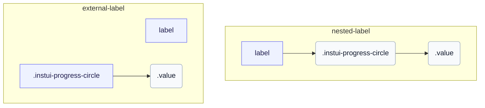

# CSS: progress-circle

`.instui-progress-circle` · <span class="instui-pill -color-success pantoken-doc-tag">stable</span> — En cirkulær progressionsring drevet af `--value` og `--value-max` brugerdefinerede egenskaber.

Ringen er en `conic-gradient` doughnut malet på `::before` og beskåret med en radialgradient-maske; `--value` divideret med `--value-max` driver buen. Tilføj `-should-animate` og indlæs interaktionseditpunktet for at animere det fra nul ved montering. InstUI har ingen ubestemt tilstand; `:indeterminate` er et kun pantoken bedste gæt (nativt `&lt;progress&gt;` uden et `value` attribut), som drejer ringen ved en fast bue og skjuler `.value` siden der intet meningsfuldt tal er at vise. `&lt;meter&gt;` har ingen ubestemt tilstand, så det er upåvirket.

**Kilde:** [progress-circle.css](https://github.com/thedannywahl/pantoken/blob/main/formats/components/src/components/progress-circle/progress-circle.css)

<!-- js-requirement -->

> [!TIP]
> **JS Enhancement** — Denne components CSS gengives og virker af sig selv; parr den med `@pantoken/interactions` for at tilføje den interaktive adfærd. Dens `-should-animate` modifikator er drevet af denne adfærd. Se [modifikatortabellen nedenfor](#modifiers).

## Accessibility

Brug native `&lt;progress&gt;` til en nulbaseret opgavefuldførelsesinterval og `&lt;meter&gt;` når minimumet ikke er nul. Giv enten element et tilgængeligt navn ved at indlejre det i `&lt;label&gt;` eller associer et separat `&lt;label&gt;` gennem matchende `for` og `id` værdier.

## Usage

```css
@import "@pantoken/components/components.css";
@import "@pantoken/components/progress-circle.css";
```

## Examples

### Nested label

```html
<label>
  Uploading Document: <progress class="instui-progress-circle -size-sm" value="70">70%</progress>
</label>
```

### External label

```html
<label for="score">Score</label>
<meter id="score" class="instui-progress-circle -color-success" min="20" value="40" max="60">
  50%
</meter>
```

## Structure

`// Variant: nested-label`

```text
label
  .instui-progress-circle
    .value
```

`// Variant: external-label`

```text
label
.instui-progress-circle
  .value
```



## Modifiers

| Modifier                    | Description                                                                                                                                                   |
| --------------------------- | ------------------------------------------------------------------------------------------------------------------------------------------------------------- |
| `.-color-brand`             | Mål farve for brand.                                                                                                                                          |
| `.-color-danger`            | Mål farve for fare.                                                                                                                                           |
| `.-color-info`              | Informativ mål farve.                                                                                                                                         |
| `.-color-primary-inverse`   | Mål farve for on-dark (primær invers).                                                                                                                        |
| `.-color-success`           | Mål farve for succes.                                                                                                                                         |
| `.-color-warning`           | Mål farve for advarsel.                                                                                                                                       |
| `.-meter-color-alert`       | <span class="instui-pill -color-danger pantoken-doc-tag">Deprecated</span> — use `.-color-warning`.                                                           |
| `.-meter-color-brand`       | <span class="instui-pill -color-danger pantoken-doc-tag">Deprecated</span> — use `.-color-brand`.                                                             |
| `.-meter-color-danger`      | <span class="instui-pill -color-danger pantoken-doc-tag">Deprecated</span> — use `.-color-danger`.                                                            |
| `.-meter-color-info`        | <span class="instui-pill -color-danger pantoken-doc-tag">Deprecated</span> — use `.-color-info`.                                                              |
| `.-meter-color-success`     | <span class="instui-pill -color-danger pantoken-doc-tag">Deprecated</span> — use `.-color-success`.                                                           |
| `.-meter-color-warning`     | <span class="instui-pill -color-danger pantoken-doc-tag">Deprecated</span> — use `.-color-warning`.                                                           |
| `.-shold-animate-on-mount`  | <span class="instui-pill -color-info pantoken-doc-tag">Alias</span> — maps to `.-should-animate`.                                                             |
| `.-should-animate`          | <span class="instui-pill pantoken-doc-tag pantoken-doc-tag-interaction">Interaction</span> — Animate the meter, ring, and centered value into place on mount. |
| `.-should-animate-on-mount` | <span class="instui-pill -color-info pantoken-doc-tag">Alias</span> — maps to `.-should-animate`.                                                             |
| `.-size-large`              | Stor. Langt-form alias af `-size-lg`.                                                                                                                         |
| `.-size-lg`                 | Stor.                                                                                                                                                         |
| `.-size-md`                 | Medium (standard).                                                                                                                                            |
| `.-size-medium`             | Medium (standard). Længere alias for `-size-md`.                                                                                                              |
| `.-size-sm`                 | Lille.                                                                                                                                                        |
| `.-size-small`              | Lille. Langt-form alias af `-size-sm`.                                                                                                                        |
| `.-size-x-small`            | Ekstra lille. Langt-form alias af `-size-xs`.                                                                                                                 |
| `.-size-xs`                 | Ekstra lille.                                                                                                                                                 |

## Parts

| Part     | Description                           |
| -------- | ------------------------------------- |
| `.value` | Værditeksten centreret i ringens hul. |

## Pseudo-elements

| Pseudo-element     | Description                                                                                                                                                             |
| ------------------ | ----------------------------------------------------------------------------------------------------------------------------------------------------------------------- |
| `:::indeterminate` | Brugerdefineret, ikke en del af InstUI. Gælder kun for en native `&lt;progress&gt;` uden dets `value` attribut; spinder `::before` ved en fast bue og skjuler `.value`. |
| `::before`         | Tegner ringen selv: en kegle-gradient donut klippet med en radial maske, hvis bue sporer den `--value` brugerdefinerede egenskab.                                       |

## States

| State            | Description |
| ---------------- | ----------- |
| `:indeterminate` | —           |

## Custom properties

| Property               | Type       | Default | Description                                                                 |
| ---------------------- | ---------- | ------- | --------------------------------------------------------------------------- |
| `--animation-delay`    | `<number>` | —       | Millisekunder at vente før monteringsanimationen startes (standard `0`).    |
| `--max`                | `<number>` | —       | Den maksimale fremskridtsværdi (standard `100`).                            |
| `--min`                | `<number>` | —       | Målenes minimumsværdi (standard `0`).                                       |
| `--pantoken-pc-fill`   | `<color>`  | —       | Den udfyldt bue (mål) farve; -color-* modifikatorer indstiller den.         |
| `--pantoken-pc-stroke` | `<length>` | —       | Ringens stregbredde; -size-* modifikatorer indstiller den.                  |
| `--pantoken-pc-track`  | `<color>`  | —       | Den udfyldtes sporets farve.                                                |
| `--value`              | `<number>` | —       | Den aktuelle fremskridtsværdi; registreret med @property så den kan overgå. |
| `--value-max`          | `<number>` | —       | @alias {@link --max} Den maksimale fremskridtsværdi (standard `100`).       |
| `--value-now`          | `<number>` | —       | @alias Alias for `--value`.                                                 |

## Animations

| Animation                                | Description |
| ---------------------------------------- | ----------- |
| `pantoken-progress-circle-indeterminate` | —           |

## Tokens consumed

| Token                                                            | Type                                               | Value                                                                        |
| ---------------------------------------------------------------- | -------------------------------------------------- | ---------------------------------------------------------------------------- |
| `--instui-component-progress-circle-color`                       | `<color>`                                          | `light-dark(#273540, #ffffff)`                                               |
| `--instui-component-progress-circle-color-inverse`               | `<color>`                                          | `light-dark(#ffffff, #1C222B)`                                               |
| `--instui-component-progress-circle-font-family`                 | `[ <font-family-name> \| <generic-font-family> ]#` | `Atkinson Hyperlegible Next, "Helvetica Neue", Helvetica, Arial, sans-serif` |
| `--instui-component-progress-circle-font-weight`                 | `<integer>`                                        | `600`                                                                        |
| `--instui-component-progress-circle-large-size`                  | `<length>`                                         | `9em`                                                                        |
| `--instui-component-progress-circle-large-stroke-width`          | `<length>`                                         | `0.875em`                                                                    |
| `--instui-component-progress-circle-line-height`                 | `<percentage>`                                     | `125%`                                                                       |
| `--instui-component-progress-circle-medium-size`                 | `<length>`                                         | `7em`                                                                        |
| `--instui-component-progress-circle-medium-stroke-width`         | `<length>`                                         | `0.625em`                                                                    |
| `--instui-component-progress-circle-meter-color-brand`           | `<color>`                                          | `light-dark(#1D354F, #EEF4FD)`                                               |
| `--instui-component-progress-circle-meter-color-brand-inverse`   | `<color>`                                          | `light-dark(#ffffff, #6A7883)`                                               |
| `--instui-component-progress-circle-meter-color-danger`          | `<color>`                                          | `#E62429`                                                                    |
| `--instui-component-progress-circle-meter-color-danger-inverse`  | `<color>`                                          | `light-dark(#ffffff, #6A7883)`                                               |
| `--instui-component-progress-circle-meter-color-info`            | `<color>`                                          | `#2B7ABC`                                                                    |
| `--instui-component-progress-circle-meter-color-info-inverse`    | `<color>`                                          | `light-dark(#ffffff, #6A7883)`                                               |
| `--instui-component-progress-circle-meter-color-success`         | `<color>`                                          | `#03893D`                                                                    |
| `--instui-component-progress-circle-meter-color-success-inverse` | `<color>`                                          | `light-dark(#ffffff, #6A7883)`                                               |
| `--instui-component-progress-circle-meter-color-warning`         | `<color>`                                          | `#CF4A00`                                                                    |
| `--instui-component-progress-circle-meter-color-warning-inverse` | `<color>`                                          | `light-dark(#ffffff, #6A7883)`                                               |
| `--instui-component-progress-circle-small-size`                  | `<length>`                                         | `5em`                                                                        |
| `--instui-component-progress-circle-small-stroke-width`          | `<length>`                                         | `0.5em`                                                                      |
| `--instui-component-progress-circle-track-color`                 | `<color>`                                          | `light-dark(#ffffff, #10141A)`                                               |
| `--instui-component-progress-circle-track-color-inverse`         | `<color>`                                          | `#00000000`                                                                  |
| `--instui-component-progress-circle-x-small-size`                | `<length>`                                         | `3em`                                                                        |
| `--instui-component-progress-circle-x-small-stroke-width`        | `<length>`                                         | `0.2em`                                                                      |

## Browser support

- Registrerer de numeriske fremskridtsegenskaber med `@property` og maler med CSS `mask` og `conic-gradient`; hvor brugerdefinerede egenskabers overgange ikke understøttes, gengives ringen stadig, men animeres ikke.

## Related

- [progress](/da/api/css/progress.md) — Den lineære stangform af samme bestemte fremskridt.
