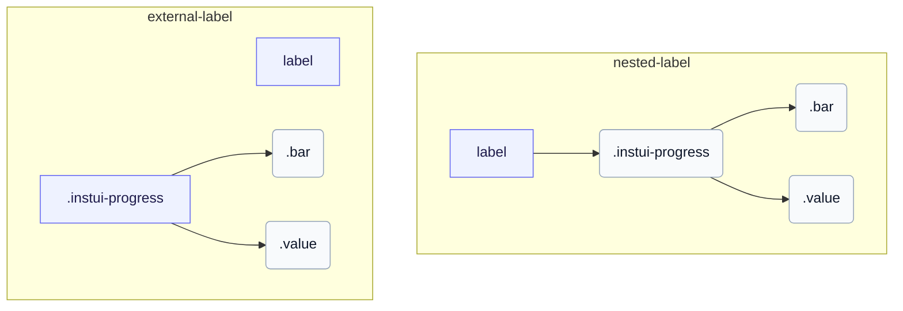

# CSS: progress

`.instui-progress` · <span class="instui-pill -color-success pantoken-doc-tag">stable</span> — En bestemt fremgangslinje med en farvet måler, størrelser og en valgfri værdi etiket.

`.value` er en søster af `.bar`, begge børn af roden — som spejler hvordan progress-circle indlejrer sin egen `.value` del. InstUI har ingen ubestemt tilstand; `:indeterminate` er pantoken-kun bedste gæt (native `&lt;progress&gt;` uden et `value` attribut), animering `.bar` som et glidende segment og skjuler `.value` da der ingen meningsfuldt tal at vise. `&lt;meter&gt;` har ingen ubestemt tilstand, så det påvirkes ikke.

**Kilde:** [progress.css](https://github.com/thedannywahl/pantoken/blob/main/formats/components/src/components/progress/progress.css)

## Tilgængelighed

Brug native `&lt;progress&gt;` til en nulbaseret opgavefuldførelsesinterval og `&lt;meter&gt;` når minimumet ikke er nul. Giv enten element et tilgængeligt navn ved at indlejre det i `&lt;label&gt;` eller associer et separat `&lt;label&gt;` gennem matchende `for` og `id` værdier.

## Brug

```css
@import "@pantoken/components/components.css";
@import "@pantoken/components/progress.css";
```

## Eksempler

### Nested label
```html
<label>
  Uploading Document: <progress class="instui-progress -color-brand" value="70">70%</progress>
</label>
```
### External label
```html
<label for="storage-used">Storage used</label>
<meter id="storage-used" class="instui-progress -color-warning" min="20" value="40" max="60">50%</meter>
```

## Struktur

`// Variant: nested-label`

```text
label
  .instui-progress
    .bar
    .value
```

`// Variant: external-label`

```text
label
.instui-progress
  .bar
  .value
```



## Modifikatorer

| Modifikator | Beskrivelse |
| --- | --- |
| `.-color-brand` | Mål farve for brand. |
| `.-color-danger` | Mål farve for fare. |
| `.-color-info` | Informativ mål farve. |
| `.-color-inverse` | Til mørke baggrunde. |
| `.-color-primary-inverse` | Mål farve for on-dark (primær invers). |
| `.-color-success` | Mål farve for succes. |
| `.-color-warning` | Mål farve for advarsel. |
| `.-meter-color-alert` | <span class="instui-pill -color-danger pantoken-doc-tag">Udløbet</span> — use `.-color-warning`. |
| `.-meter-color-brand` | <span class="instui-pill -color-danger pantoken-doc-tag">Udløbet</span> — use `.-color-brand`. |
| `.-meter-color-danger` | <span class="instui-pill -color-danger pantoken-doc-tag">Udløbet</span> — use `.-color-danger`. |
| `.-meter-color-info` | <span class="instui-pill -color-danger pantoken-doc-tag">Udløbet</span> — use `.-color-info`. |
| `.-meter-color-success` | <span class="instui-pill -color-danger pantoken-doc-tag">Udløbet</span> — use `.-color-success`. |
| `.-meter-color-warning` | <span class="instui-pill -color-danger pantoken-doc-tag">Udløbet</span> — use `.-color-warning`. |
| `.-render-value-inside` | Gengiver `.value` indeni sporet, justeret til dets start, i stedet for ved siden af det; stil den for læsbarhed over målfarven. |
| `.-should-animate` | <span class="instui-pill pantoken-doc-tag pantoken-doc-tag-interaction">Interaction</span> — Animate meter changes over half a second. |
| `.-size-large` | Stor. Langt-form alias af `-size-lg`. |
| `.-size-lg` | Stor. |
| `.-size-md` | Medium (standard). |
| `.-size-medium` | Medium (standard). Længere alias for `-size-md`. |
| `.-size-sm` | Lille. |
| `.-size-small` | Lille. Langt-form alias af `-size-sm`. |
| `.-size-x-small` | Ekstra lille. Langt-form alias af `-size-xs`. |
| `.-size-xs` | Ekstra lille. |

## Dele

| Del | Beskrivelse |
| --- | --- |
| `.bar` | Målestangen udfyldt. |
| `.value` | Værditeksten ved siden af stangen. |

## Pseudo-elementer

| Pseudo-element | Beskrivelse |
| --- | --- |
| `:::indeterminate` | Brugerdefineret, ikke en del af InstUI. Gælder kun for en native `&lt;progress&gt;` uden dets `value` attribut; animerer `.bar` som et glidende segment og skjuler `.value`. |
| `::after` | Tegner sporets bundlinjer som dets eget lag over måleren, så hele kanten og bundkanten forbliver uafhængige på tværs af temaer. |

## Tilstande

| Tilstand | Beskrivelse |
| --- | --- |
| `:indeterminate` | — |

## Brugerdefinerede egenskaber

| Egenskab | Type | Standard | Beskrivelse |
| --- | --- | --- | --- |
| `--max` | `<number>` | — | Den maksimale fremskridtsværdi (standard `100`). |
| `--min` | `<number>` | — | Målenes minimumsværdi (standard `0`). |
| `--value` | `<number>` | — | Den aktuelle fremskridtsværdi. |
| `--value-max` | `<number>` | — | @alias {@link --max} Den maksimale fremskridtsværdi (standard `100`). |
| `--value-now` | `<number>` | — | @alias Alias for `--value`. |

## Animationer

| Animation | Beskrivelse |
| --- | --- |
| `pantoken-progress-indeterminate` | — |

## Forbrugte tokens

| Token | Type | Værdi |
| --- | --- | --- |
| `--instui-color-background-brand` | `<color>` | `light-dark(#1D354F, #EEF4FD)` |
| `--instui-color-background-error` | `<color>` | `#E62429` |
| `--instui-color-background-info` | `<color>` | `#2B7ABC` |
| `--instui-color-background-success` | `<color>` | `#03893D` |
| `--instui-color-background-warning` | `<color>` | `#CF4A00` |
| `--instui-component-progress-bar-border-color` | `<color>` | `light-dark(#1D354F, #EEF4FD)` |
| `--instui-component-progress-bar-border-color-inverse` | `<color>` | `light-dark(#ffffff, #6A7883)` |
| `--instui-component-progress-bar-border-radius` | `<length>` | `0.5rem` |
| `--instui-component-progress-bar-font-family` | `[ <font-family-name> \| <generic-font-family> ]#` | `Atkinson Hyperlegible Next, "Helvetica Neue", Helvetica, Arial, sans-serif` |
| `--instui-component-progress-bar-font-weight` | `<integer>` | `400` |
| `--instui-component-progress-bar-large-height` | `<length>` | `2rem` |
| `--instui-component-progress-bar-line-height` | `<percentage>` | `125%` |
| `--instui-component-progress-bar-medium-height` | `<length>` | `1.5rem` |
| `--instui-component-progress-bar-medium-value-font-size` | `<length>` | `1rem` |
| `--instui-component-progress-bar-meter-color-brand-inverse` | `<color>` | `light-dark(#ffffff, #10141A)` |
| `--instui-component-progress-bar-small-height` | `<length>` | `1rem` |
| `--instui-component-progress-bar-text-color` | `<color>` | `light-dark(#576773, #AAB0B5)` |
| `--instui-component-progress-bar-text-color-inverse` | `<color>` | `light-dark(#ffffff, #1C222B)` |
| `--instui-component-progress-bar-track-bottom-border-color` | `<color>` | `#00000000` |
| `--instui-component-progress-bar-track-bottom-border-color-inverse` | `<color>` | `#00000000` |
| `--instui-component-progress-bar-track-bottom-border-width` | `<length>` | `0.0625rem` |
| `--instui-component-progress-bar-track-color` | `<color>` | `#00000000` |
| `--instui-component-progress-bar-track-color-inverse` | `<color>` | `#00000000` |
| `--instui-component-progress-bar-value-padding` | `<length>` | `0.5rem` |
| `--instui-component-progress-bar-x-small-height` | `<length>` | `0.5rem` |

## Browserunderstøttelse

- Scoper måledelens regler med `@scope` at-reglen; browsere uden `@scope` understøttelse ignorerer disse omfangsbestemte regler.

## Relateret

- [progress-circle](/da/api/css/progress-circle.md) — Den cirkulære form af samme bestemte fremskridt.

