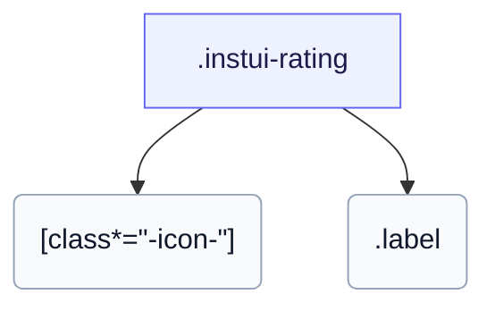

# CSS: rating

`.instui-rating` — En stjernebedømmelse med fyldte og tomme glyphs og en valgfri numerisk etiket.

Indstiller sin egen `gap` mellem stjerneglypher; sammenkædning af en `-gap-*` afstandsverktøj-modifier tilsidesætter denne indbyggede værdi.

**Kilde:** [rating.css](https://github.com/thedannywahl/pantoken/blob/main/formats/components/src/components/rating/rating.css)

## Accessibility

Giv det role="img" og en aria-label, der angiver bedømmelsen, da stjernerne er ikon-glyphs.

## Usage

```css
@import "@pantoken/components/components.css";
@import "@pantoken/components/rating.css";
```

## Examples

```html
<span class="instui-rating -size-sm" role="img" aria-label="2 out of 3 stars">
  <span class="instui-icon -icon-star-solid"></span>
  <span class="instui-icon -icon-star-solid"></span> <span class="instui-icon -icon-star"></span>
  <span class="label">2/3</span>
</span>
```

## Structure

```text
.instui-rating
  [class*="-icon-"]
  .label
```



## Modifiers

| Modifier       | Description                                                           |
| -------------- | --------------------------------------------------------------------- |
| `.-icon-*`     | Genrender stjerneglypher med ikinklasser (f.eks. `-icon-star-solid`). |
| `.-size-large` | Stor. Langt-form alias af `-size-lg`.                                 |
| `.-size-lg`    | Stor.                                                                 |
| `.-size-sm`    | Lille.                                                                |
| `.-size-small` | Lille. Langt-form alias af `-size-sm`.                                |

## Parts

| Part     | Description                         |
| -------- | ----------------------------------- |
| `.label` | Den numeriske etiket, f.eks. "3/5". |

## Tokens consumed

| Token                                                  | Type                                               | Value                                                                        |
| ------------------------------------------------------ | -------------------------------------------------- | ---------------------------------------------------------------------------- |
| `--instui-color-text-base`                             | `<color>`                                          | `light-dark(#273540, #F2F4F5)`                                               |
| `--instui-component-rating-icon-icon-empty-color`      | `<color>`                                          | `light-dark(#1D354F, #EEF4FD)`                                               |
| `--instui-component-rating-icon-icon-filled-color`     | `<color>`                                          | `light-dark(#1D354F, #EEF4FD)`                                               |
| `--instui-component-rating-icon-icon-margin`           | `<length>`                                         | `0.125rem`                                                                   |
| `--instui-component-rating-icon-large-icon-font-size`  | `<length>`                                         | `2.375rem`                                                                   |
| `--instui-component-rating-icon-medium-icon-font-size` | `<length>`                                         | `1.375rem`                                                                   |
| `--instui-component-rating-icon-small-icon-font-size`  | `<length>`                                         | `1rem`                                                                       |
| `--instui-font-family-base`                            | `[ <font-family-name> \| <generic-font-family> ]#` | `Atkinson Hyperlegible Next, "Helvetica Neue", Helvetica, Arial, sans-serif` |
| `--instui-font-size-text-base`                         | `<length>`                                         | `1rem`                                                                       |
