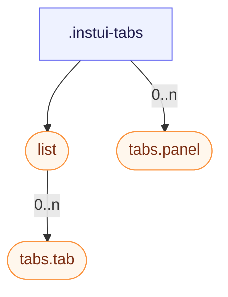

# CSS: tabs

`.instui-tabs` — Et fane-panel sæt: en fane liste, valgbare faner og deres paneler.

Se medlemmerne `tabs.tab` og `tabs.panel` for de individuelle faneknapper og deres indholdsepaneler.

**Kilde:** [panel.css](https://github.com/thedannywahl/pantoken/blob/main/formats/components/src/components/tabs/members/panel/panel.css)

## Accessibility

Indstil fane listen med role="tablist", hver fane med role="tab" og aria-selected, og hver panel med role="tabpanel".

## Usage

```css
@import "@pantoken/components/components.css";
@import "@pantoken/components/tabs.css";
```

## Examples

```html
<div class="instui-tabs">
  <div class="list" role="tablist" aria-label="Default tabs">
    <button class="tab -selected" role="tab" aria-selected="true">Overview</button>
    <button class="tab" role="tab" aria-selected="false">Details</button>
    <button class="tab -disabled" role="tab" aria-disabled="true" disabled>Disabled</button>
    <button class="tab" role="tab" aria-selected="false">History</button>
  </div>
  <div class="panel" role="tabpanel">The Overview tab's content shows here.</div>
</div>
```

## Structure

```text
.instui-tabs
  list (component)
    tabs.tab (component, 0..n)
  tabs.panel (component, 0..n)
```



## Modifiers

| Modifier              | Description                                                                                                                                                            |
| --------------------- | ---------------------------------------------------------------------------------------------------------------------------------------------------------------------- |
| `.-overflow-scroll`   | Hold fane listen på en linje og lad den scrolle horisontalt i stedet for at pakke ind, skjul scrollbaren.                                                              |
| `.-variant-secondary` | Afrundede "folder"-faner med en valgt fane som visuelt forbinder til panelet nedenfor. @affects tabs.tab — Restyler faneknapperne til det afrundede "folder"-udseende. |

## Parts

| Part    | Description      |
| ------- | ---------------- |
| `.list` | Rækken af faner. |

## Tokens consumed

| Token                                        | Type      | Value       |
| -------------------------------------------- | --------- | ----------- |
| `--instui-component-tabs-default-background` | `<color>` | `#00000000` |

## Subcomponents

- [list](/da/api/css/list.md)
- [tabs.panel](/da/api/css/tabs.panel.md)
- [tabs.tab](/da/api/css/tabs.tab.md)
