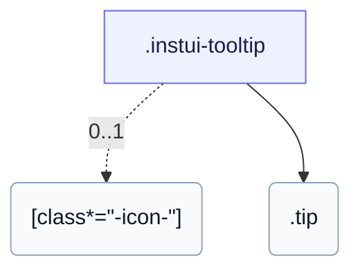

# CSS: tooltip

`.instui-tooltip` — En CSS-hover- og fokus-tooltipboble, som kan positioneres på enhver side.

Skiftning er ren CSS (`:hover`/`:focus-within`), så boblen kun når tastaturbrugere gennem en fokusserbar trigger; i modsætning til `popover` er den ikke afvisbar eller klik-udløst.

**Kilde:** [tooltip.css](https://github.com/thedannywahl/pantoken/blob/main/formats/components/src/components/tooltip/tooltip.css)

<!-- js-requirement -->

> [!TIP]
> **JS Enhancement** — Denne components CSS gengives og fungerer på sin egen; parrer den med `@pantoken/interactions` for at tilføje den interaktive opførsel. Se [modifikator-tabel nedenfor](#modifiers).

## Accessibility

Peg triggeren mod boblen med aria-describedby og giv boblen role="tooltip".

## Usage

```css
@import "@pantoken/components/components.css";
@import "@pantoken/components/tooltip.css";
```

## Examples

```html
<span class="instui-tooltip" aria-describedby="tt-1">
  <span class="instui-icon -icon-info"></span>
  <span class="tip" id="tt-1" role="tooltip">Default placement is top</span>
</span>
```

## Structure

```text
.instui-tooltip
  [class*="-icon-"] (0..1)
  .tip
```



## Modifiers

| Modifier   | Description                                                    |
| ---------- | -------------------------------------------------------------- |
| `.-icon-*` | Gengivelse af et triggerglyf-ikon ved siden af tooltip-boblen. |

## Parts

| Part   | Description                                  |
| ------ | -------------------------------------------- |
| `.tip` | Boblen; `-placement-*` indstiller dens side. |

## Tokens consumed

| Token                                    | Type                                               | Value                                                                        |
| ---------------------------------------- | -------------------------------------------------- | ---------------------------------------------------------------------------- |
| `--instui-border-radius-sm`              | `<length>`                                         | `0.25rem`                                                                    |
| `--instui-color-background-inverse`      | `<color>`                                          | `light-dark(#334450, #F2F4F5)`                                               |
| `--instui-color-text-inverse`            | `<color>`                                          | `light-dark(#ffffff, #1C222B)`                                               |
| `--instui-component-tooltip-font-family` | `[ <font-family-name> \| <generic-font-family> ]#` | `Atkinson Hyperlegible Next, "Helvetica Neue", Helvetica, Arial, sans-serif` |
| `--instui-component-tooltip-font-size`   | `<length>`                                         | `0.875rem`                                                                   |
| `--instui-component-tooltip-font-weight` | `<integer>`                                        | `400`                                                                        |
| `--instui-component-tooltip-padding`     | `<length>`                                         | `0.75rem`                                                                    |
| `--instui-spacing-space-xs`              | `<length>`                                         | `0.25rem`                                                                    |

## Related

- [popover](/da/api/css/popover.md) — Den større, klik-udløst ankrede overflade.
- [context-view](/da/api/css/context-view.md) — En relateret ankret overflade med en pointer.
