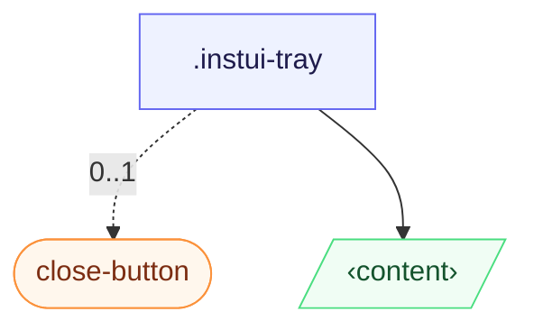

# CSS: tray

`.instui-tray` — Et kantfæstnet panel, der glider ind fra enhver side; et oprindeligt `[popover]` eller `&lt;dialog&gt;`.

Start/slut-placeringer løses mod `inset-inline` (logisk, retningsbevidst); glidning-ind-transformationen spejler sig automatisk under en forfader `[dir="rtl"]`, så der ikke er behov for ekstra markup til højre-til-venstre-layouts.

**Kilde:** [tray.css](https://github.com/thedannywahl/pantoken/blob/main/formats/components/src/components/tray/tray.css)

## Tilgængelighed

Bakken er en dialog- eller popover-overflade, så navngiv den med `aria-label` eller `aria-labelledby`, og dens lukningskontrol har en `aria-label` (eksemplet på `.instui-close-button` bruger `aria-label="Close"`).

## Brug

```css
@import "@pantoken/components/components.css";
@import "@pantoken/components/tray.css";
```

## Eksempler

```html
<div class="instui-tray -placement-end -size-sm">
  <span class="instui-heading -level-h3">Filters</span>
  <p class="-size-sm">A tray slides in from the start edge and fills the viewport height.</p>
</div>
<button class="instui-button -toggle">toggle tray</button>
```

## Struktur

```text
.instui-tray
  close-button (component, 0..1)
  ‹content›
```



## Modifikatorer

| Modifikator | Beskrivelse |
| --- | --- |
| `.-placement-bottom` | Fastgør til bundkanten. |
| `.-placement-end` | Fastgør til slutkanten (inline-end). |
| `.-placement-start` | (standard) Fastgør til startkanten (inline-start). |
| `.-placement-top` | Fastgør til topkanten. |
| `.-size-large` | Stor. Langt-form alias af `-size-lg`. |
| `.-size-lg` | Stor. |
| `.-size-md` | (standard) Mellem. |
| `.-size-medium` | (standard) Mellem. Langt alias af `-size-md`. |
| `.-size-regular` | <span class="instui-pill -color-danger pantoken-doc-tag">Udløbet</span> — use `.-size-md`. |
| `.-size-sm` | Lille. |
| `.-size-small` | Lille. Langt-form alias af `-size-sm`. |
| `.-size-x-large` | Ekstra stor. Langt-form alias af `-size-xl`. |
| `.-size-x-small` | Ekstra lille. Langt-form alias af `-size-xs`. |
| `.-size-xl` | Ekstra stor. |
| `.-size-xs` | Ekstra lille. |

## Betingelser

| Type | Forespørgsel | Beskrivelse |
| --- | --- | --- |
| supports | `(transition-behavior: allow-discrete)` | — |

## Forbrugte tokens

| Token | Type | Værdi |
| --- | --- | --- |
| `--instui-component-tray-background-color` | `<color>` | `light-dark(#ffffff, #1C222B)` |
| `--instui-component-tray-border-color` | `<color>` | `light-dark(#E8EAEC, #334450)` |
| `--instui-component-tray-border-width` | `<length>` | `0.0625rem` |
| `--instui-component-tray-padding` | `<length>` | `1.5rem` |
| `--instui-component-tray-width-lg` | `<length>` | `48em` |
| `--instui-component-tray-width-md` | `<length>` | `30em` |
| `--instui-component-tray-width-sm` | `<length>` | `20em` |
| `--instui-component-tray-width-xl` | `<length>` | `62em` |
| `--instui-component-tray-width-xs` | `<length>` | `16em` |
| `--instui-component-tray-z-index` | `<integer>` | `9999` |
| `--instui-elevation-topmost` | `none \| <shadow>#` | — |
| `--tray-slide-x` | — | `-100%` |
| `--tray-slide-y` | — | `0%` |

## Browserunderstøttelse

- Åbnes med det oprindelige `[popover]` API og `@starting-style`; glidning-ind sidder bag en `@supports (transition-behavior: allow-discrete)` beskyttelse, så browsere uden det stadig åbner bakken, bare uden glidningen.

## Underkomponenter

- [close-button](/da/api/css/close-button.md)

## Relateret

- [modal](/da/api/css/modal.md) — Det samme afvisbare overlay-mønster, centreret i stedet for kantfæstnet.
- [popover](/da/api/css/popover.md) — Den generiske toplags-overflade, som dette bygger på.

