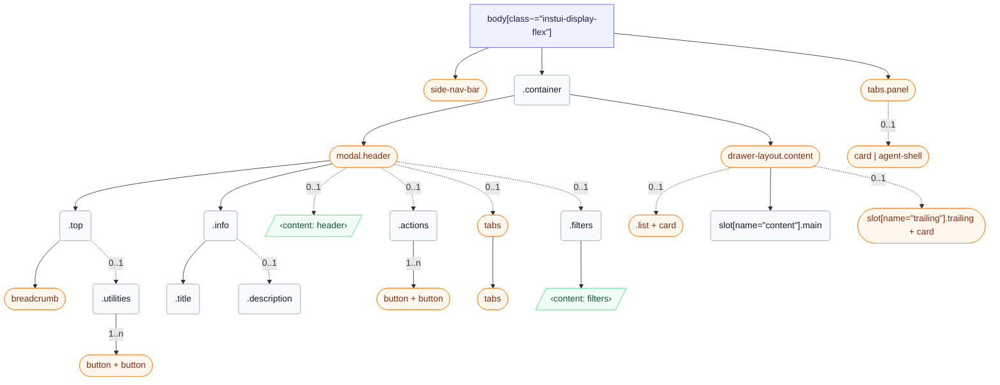

# CSS: wrapper

`body[class~="instui-display-flex"]` — App-skal række: side nav, beholder med header og valgfrit panel.

✅ Brug Wrapper når:

- Opbygning af en fuld Canvas-produktside, der har brug for et konsistent layoutskal
- Siden bruger GlobalNav som det primære navigationsfixpunkt
- Siden har brug for sidepaneler: ContentTabList, TrailingContentArea eller en UtilityPanel
- Du skal have ensartet containerudvoldning og maksimal indholdsbredde på hele siden
  🚫 Brug ikke Wrapper når:

- Opbygning af en Modal, Tray eller Drawer — de har deres egne layoutcontainere
- Omslutning af et underafsnit på en side — Wrapper indeholder hele siden, ikke et område

## Accessibility

- Kortlæg hovedindholdsområdet til et &lt;main&gt;-landemærke med et skip-nav-link, så tastaturbrugere kan omgå GlobalNav
- Giv ContentTabList rolle="navigation" med en særskilt aria-label som f.eks. "Sidenavigation" — adskilt fra GlobalNav's landemærke
- Giv TrailingContentArea rolle="complementary" med en beskrivende aria-label, der afspejler dens indhold, som f.eks. "Studerendeoplysninger"
- Giv hvert UtilityPanel et særskilt aria-label: "AI-assistent", "Meddelelser" eller "Filtre"
- Når et UtilityPanel åbnes, skal fokus flyttes til panelet; når det lukkes, skal fokus returneres til udløseren, der åbnede det

## Usage

```css
@import "@pantoken/plugin-layouts/layouts.css";
```

## Structure

```text
body[class~="instui-display-flex"]
  side-nav-bar (component)
  .container
    modal.header (component)
      .top
        breadcrumb (component)
        .utilities (0..1)
          button + button (component, 1..n)
      .info
        .title
        .description (0..1)
      ‹content: header› (0..1)
      .actions (0..1)
        button + button (component, 1..n)
      tabs (component, 0..1)
        tabs (component)
      .filters (0..1)
        ‹content: filters›
    drawer-layout.content (component)
      list + card (component, 0..1)
      slot[name="content"].main
      slot[name="trailing"].trailing + card (component, 0..1)
  tabs.panel (component)
    card | agent-shell (component, 0..1)
```



## Slots

| Slot       | Description                                 |
| ---------- | ------------------------------------------- |
| `content`  | Primært sideindhold.                        |
| `filters`  | Valgfrit filterindhold inde i headeren.     |
| `header`   | Valgfrit headerslot under sidebeskrivelsen. |
| `panel`    | Indhold af utility-panel.                   |
| `trailing` | Bagfølgende komplementært indhold.          |

## Parts

| Part           | Description                                              |
| -------------- | -------------------------------------------------------- |
| `.actions`     | Valgfrie headerknapper ved slutningen af øverste række.  |
| `.container`   | Hovedsidekolonne, der indeholder header og indhold.      |
| `.content`     | Primært indholdsområde inde i containerkolonnen.         |
| `.description` | Valgfri sidebeskrivelse under titlen.                    |
| `.filters`     | Valgfrit filterområde inde i headeren.                   |
| `.header`      | Headerregion inde i containerkolonnen.                   |
| `.info`        | Container til sidetitel og valgfri beskrivelse.          |
| `.list`        | Valgfri navigationkolonne inde i indhold.                |
| `.main`        | Hovedindholdskolonne inde i indhold.                     |
| `.panel`       | Utility-panelregion, der åbnes på højre side af siden.   |
| `.tabs`        | Valgfrit navigationsfaner ved starten af indholdsrækken. |
| `.title`       | Sidetitel under øverste række.                           |
| `.top`         | Gitterrække indeholdende brødkrummer og utilities.       |
| `.trailing`    | Valgfri komplementær kolonne inde i indhold.             |
| `.utilities`   | Utility-handlinger ved slutningen af øverste række.      |

## States

| State       | Description |
| ----------- | ----------- |
| `:optional` | —           |

## Tokens consumed

| Token                            | Type | Value |
| -------------------------------- | ---- | ----- |
| `--instui-background-color-page` | —    | —     |

## Subcomponents

- [agent-shell](/da/api/css/agent-shell.md)
- [breadcrumb](/da/api/css/breadcrumb.md)
- [button](/da/api/css/button.md)
- [card](/da/api/css/card.md)
- [drawer-layout.content](/da/api/css/drawer-layout.content.md)
- [list](/da/api/css/list.md)
- [modal.header](/da/api/css/modal.header.md)
- [side-nav-bar](/da/api/css/side-nav-bar.md)
- [tabs](/da/api/css/tabs.md)
- [tabs.panel](/da/api/css/tabs.panel.md)

## Related

- [card](/da/api/css/card.md)
- [agent-shell](/da/api/css/agent-shell.md)
- [breadcrumb](/da/api/css/breadcrumb.md)
- [tabs](/da/api/css/tabs.md)
- [button](/da/api/css/button.md)
- [heading](/da/api/css/heading.md)
