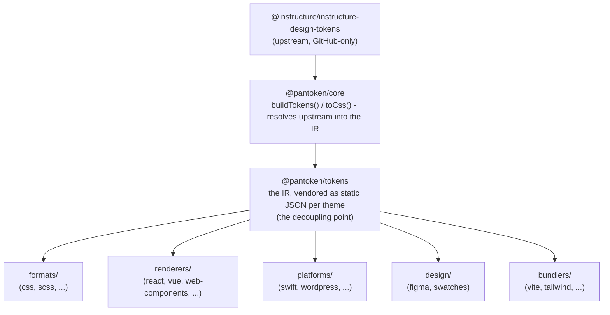

# Arkitektur

pantoken har én opgave: at opløse Instructures designtokens og ikoner én gang, og derefter omforme den model
til hvert mål. Lagene nedenfor sørger for, at den omformning forbliver korrekt og holder de publicerede pakker fri
for enhver GitHub-only upstream.

## Lagene

- **`@pantoken/model`** indeholder typekontrakterne og intet andet. Det er sandhedskilden for
  `Token`-formen og plugin-kontrakten, uden afhængigheder, så enhver pakke frit kan afhænge af den.
- **`@pantoken/core`** er den eneste pakke, der rører ved upstream-kilden. Den opløser tokens og
  ikoner til den kanoniske IR og renderer CSS.
- **`@pantoken/tokens`** leverer den IR som statisk JSON ved byggetid. Dette er afkoblingspunktet:
  downstream-pakker læser `@pantoken/tokens`, aldrig `@pantoken/core`, så `npm i pantoken` aldrig
  rækker ud efter den GitHub-only upstream.
- **`@pantoken/utils`** bærer de delte hjælpefunktioner — `var(--x)`-resolveren, referenceregexerne,
  case- og farvekonversion, og driftkontrollerne der holder det genererede output tro mod IR'en.

## Hvorfor tokens bliver vendoret

Upstream-tokenpakken ligger på GitHub, ikke på npm. Hvis alle downstream-pakker afhængte af den,
ville `npm i pantoken` fejle for alle uden den adgang. I stedet opløser `@pantoken/tokens` upstream én gang ved byggetid og skriver resultatet til statisk JSON. De publicerede pakker bærer den
JSON, så de installerer rent fra npm, pinner til semver og virker offline.

## Buckets

Hver downstream-bucket er en måde at forbruge IR'en på:

- **formats/** — omdanner tokens til en fil (CSS, SCSS, Less, Stylus, DTCG).
- **renderers/** — framework- og værktøjsintegrationer (React, Vue, Svelte, MUI, Pendo og flere).
- **bundlers/** — build-værktøjs-plugins og presets (Vite, Next, Tailwind, Panda, PostCSS, webpack).
- **platforms/** — native- og site-generator-mål (Swift, Kotlin, Rust, WordPress, Drupal).
- **design/** — payloads til designværktøjer (Figma, farveprøver).
- **plugins/** — valgfrie transformationer, der udvider token- eller CSS-outputtet. Se [Plugins](/guide/plugins).

## Genereret output

Hver pakke, der emitterer en fil, skriver den til et per-pakke `generated/`-bibliotek som et build
reproducerer, så intet genereret bliver committet. En workspace-opgave validerer det hele. Se
[Generated output](/guide/generated-output).
