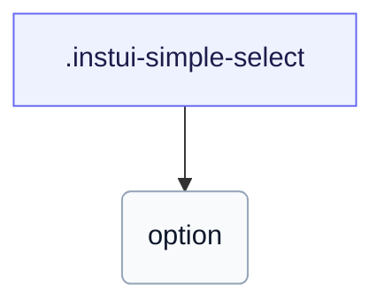

# CSS: simple-select

`.instui-simple-select` — A styled native `&lt;select&gt;` with a caret, matching the text-input states and sizes.

Wraps a plain native `&lt;select&gt;` with no custom dropdown/menu markup, so browser-native option rendering and keyboard behavior apply as-is; it shares its field chrome with `text-input`.

**Source:** [select.css](https://github.com/thedannywahl/pantoken/blob/main/formats/components/src/components/select/select.css)

## Verwendung

```css
@import "@pantoken/components/components.css";
@import "@pantoken/components/simple-select.css";
```

## Beispiele

```html
<select class="instui-simple-select">
  <option>Choose a fruit…</option>
  <option>Apple</option>
  <option>Orange</option>
  <option>Pear</option>
</select>
```

## Struktur

```text
.instui-simple-select
  option
```



## Modifikatoren

| Modifikator | Beschreibung |
| --- | --- |
| `.-disabled` | Disabled state. |
| `.-invalid` | Invalid (error) state. |
| `.-readonly` | Read-only state. |
| `.-size-large` | Large. Long-form alias of `-size-lg`. |
| `.-size-lg` | Large. |
| `.-size-md` | (default) Medium. |
| `.-size-medium` | (default) Medium. Long-form alias of `-size-md`. |
| `.-size-sm` | Small. |
| `.-size-small` | Small. Long-form alias of `-size-sm`. |
| `.-success` | Success (valid) state. |

## Pseudo-Elemente

| Pseudo-Element | Beschreibung |
| --- | --- |
| `::placeholder` | The placeholder text, in a muted color that shifts on hover. |

## Zustände

| Zustand | Beschreibung |
| --- | --- |
| `:disabled` | — |

## Verbrauchte Tokens

| Token | Typ | Wert |
| --- | --- | --- |
| `--instui-component-text-input-background-color` | `<color>` | `light-dark(#ffffff, #171B21)` |
| `--instui-component-text-input-background-disabled-color` | `<color>` | `light-dark(#E8EAEC, #334450)` |
| `--instui-component-text-input-background-hover-color` | `<color>` | `light-dark(#ffffff, #171B21)` |
| `--instui-component-text-input-background-readonly-color` | `<color>` | `light-dark(#C7CACD, #6A7883)` |
| `--instui-component-text-input-border-color` | `<color>` | `light-dark(#7E8792, #5F6E7A)` |
| `--instui-component-text-input-border-disabled-color` | `<color>` | `light-dark(#C7CACD, #4A5B68)` |
| `--instui-component-text-input-border-hover-color` | `<color>` | `light-dark(#334450, #7E8792)` |
| `--instui-component-text-input-border-radius` | `<length>` | `0.75rem` |
| `--instui-component-text-input-border-readonly-color` | `<color>` | `#8D959F` |
| `--instui-component-text-input-border-width` | `<length>` | `0.0625rem` |
| `--instui-component-text-input-error-border-color` | `<color>` | `light-dark(#CF1F24, #F56050)` |
| `--instui-component-text-input-font-family` | `[ <font-family-name> \| <generic-font-family> ]#` | `Atkinson Hyperlegible Next, "Helvetica Neue", Helvetica, Arial, sans-serif` |
| `--instui-component-text-input-font-size-lg` | `<length>` | `1.25rem` |
| `--instui-component-text-input-font-size-md` | `<length>` | `1rem` |
| `--instui-component-text-input-font-size-sm` | `<length>` | `0.875rem` |
| `--instui-component-text-input-font-weight` | `<integer>` | `500` |
| `--instui-component-text-input-height-lg` | `<length>` | `3rem` |
| `--instui-component-text-input-height-md` | `<length>` | `2.5rem` |
| `--instui-component-text-input-height-sm` | `<length>` | `2rem` |
| `--instui-component-text-input-padding-horizontal-lg` | `<length>` | `0.75rem` |
| `--instui-component-text-input-padding-horizontal-md` | `<length>` | `0.75rem` |
| `--instui-component-text-input-padding-horizontal-sm` | `<length>` | `0.5rem` |
| `--instui-component-text-input-placeholder-color` | `<color>` | `light-dark(#5F6E7A, #7E8792)` |
| `--instui-component-text-input-placeholder-hover-color` | `<color>` | `light-dark(#334450, #9EA6AD)` |
| `--instui-component-text-input-success-border-color` | `<color>` | `light-dark(#037D37, #3EA75B)` |
| `--instui-component-text-input-text-color` | `<color>` | `light-dark(#273540, #ffffff)` |
| `--instui-component-text-input-text-disabled-color` | `<color>` | `light-dark(#8D959F, #9EA6AD)` |
| `--instui-component-text-input-text-readonly-color` | `<color>` | `light-dark(#273540, #ffffff)` |
| `--instui-focus-outline-color-danger` | `auto \| <color>` | — |
| `--instui-focus-outline-color-success` | `auto \| <color>` | — |

## Verwandt

- [text-input](/de/api/css/text-input.md) — Shares the same field chrome, states, and sizes.
- [menu](/de/api/css/menu.md) — The dropdown surface a richer select reuses.

