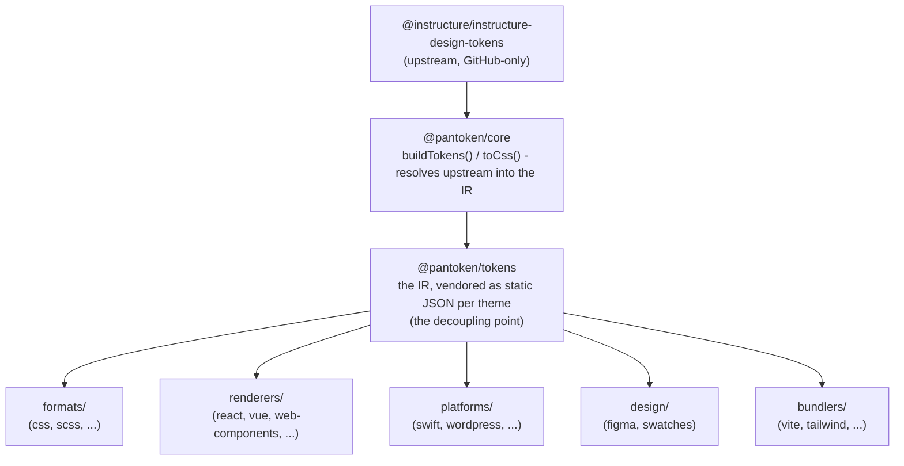

# Architektur

pantoken hat eine Aufgabe: Instructures Design-Token und Icons einmal auflösen und dieses Modell
dann für jedes Ziel umformen. Die untenstehenden Schichten sorgen dafür, dass diese Umformung korrekt bleibt und die veröffentlichten Pakete frei
von jeglichem GitHub-only Upstream bleiben.

## Die Schichten

- **`@pantoken/model`** enthält die Typverträge und sonst nichts. Es ist die Quelle der Wahrheit für die
  `Token`-Form und den Plugin-Vertrag, mit null Abhängigkeiten, sodass jedes Paket frei davon abhängen kann.
- **`@pantoken/core`** ist das einzige Paket, das die Upstream-Quelle berührt. Es löst Tokens und
  Icons in die kanonische IR auf und rendert CSS.
- **`@pantoken/tokens`** liefert diese IR zur Build-Zeit als statisches JSON aus. Das ist der Entkopplungspunkt:
  Downstream-Pakete lesen `@pantoken/tokens`, nie `@pantoken/core`, sodass `npm i pantoken` niemals
  auf den GitHub-only Upstream zugreift.
- **`@pantoken/utils`** enthält die geteilten Helfer — den `var(--x)` Resolver, die Referenz-Regexes,
  Case- und Farbkonvertierung sowie die Drift-Prüfungen, die sicherstellen, dass der generierte Output der IR treu bleibt.

## Warum Tokens ausgeliefert werden

Das Upstream-Token-Paket liegt auf GitHub, nicht bei npm. Wenn jedes Downstream-Paket davon abhängen würde,
würde `npm i pantoken` für alle ohne diesen Zugriff fehlschlagen. Stattdessen löst `@pantoken/tokens`
den Upstream einmal zur Build-Zeit auf und schreibt das Ergebnis in statisches JSON. Die veröffentlichten Pakete tragen dieses
JSON mit sich, sodass sie sauber von npm installierbar sind, auf SemVer pinnen und offline funktionieren.

## Buckets

Jeder Downstream-Bucket ist eine Art, die IR zu konsumieren:

- **formats/** — wandelt die Tokens in eine Datei um (CSS, SCSS, Less, Stylus, DTCG).
- **renderers/** — Framework- und Tool-Integrationen (React, Vue, Svelte, MUI, Pendo und mehr).
- **bundlers/** — Build-Tool-Plugins und Presets (Vite, Next, Tailwind, Panda, PostCSS, webpack).
- **platforms/** — native und Site-Generator-Ziele (Swift, Kotlin, Rust, WordPress, Drupal).
- **design/** — Nutzlasten für Design-Tools (Figma, Farbswatches).
- **plugins/** — optionale Transforms, die das Token- oder CSS-Output erweitern. Siehe [Plugins](/guide/plugins).

## Generierter Output

Jedes Paket, das eine Datei erzeugt, schreibt sie in ein paketweises `generated/` Verzeichnis, das ein Build
reproduziert, sodass nichts Generiertes committed wird. Eine Workspace-Aufgabe validiert alles. Siehe
[Generated output](/guide/generated-output).
