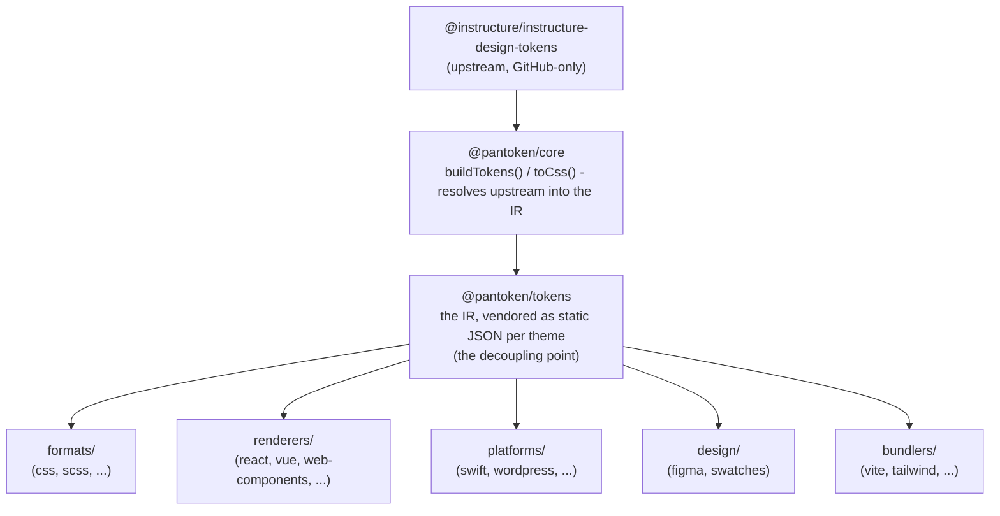

# Αρχιτεκτονική

το pantoken έχει ένα έργο: να επιλύει τα design tokens και τα εικονίδια της Instructure μία φορά, και στη συνέχεια να αναδιαμορφώνει αυτό το μοντέλο για κάθε προορισμό. Τα παρακάτω στρώματα διατηρούν αυτήν την αναδιαμόρφωση αξιόπιστη και κρατούν τα δημοσιευμένα πακέτα απαλλαγμένα από οποιοδήποτε GitHub-only upstream.

## Τα στρώματα

- **`@pantoken/model`** περιέχει τα συμβόλαια τύπων, και τίποτε άλλο. Είναι η πηγή της αλήθειας για το σχήμα `Token` και το συμβόλαιο των plugin, με μηδενικές εξαρτήσεις, ώστε οποιοδήποτε πακέτο να μπορεί να εξαρτάται από αυτό απρόσκοπτα.
- **`@pantoken/core`** είναι το μοναδικό πακέτο που αγγίζει την upstream πηγή. Επιλύει tokens και εικονίδια στην κανονική IR και αποδίδει CSS.
- **`@pantoken/tokens`** προμηθεύει (vendors) εκείνη την IR ως στατικό JSON κατά το χρόνο build. Αυτό είναι το σημείο αποσύνδεσης: τα downstream πακέτα διαβάζουν `@pantoken/tokens`, ποτέ `@pantoken/core`, οπότε `npm i pantoken` δεν φτάνει ποτέ την GitHub-only upstream.
- **`@pantoken/utils`** μεταφέρει τους κοινόχρηστους βοηθητικούς — τον resolver `var(--x)`, τα regex για αναφορές, τη μετατροπή πεζών/κεφαλαίων και χρωμάτων, και τους ελέγχους drift που κρατούν την παραγόμενη έξοδο πιστή στην IR.

## Γιατί τα tokens προμηθεύονται ως vendor

Το upstream πακέτο tokens φιλοξενείται στο GitHub, όχι στο npm. Αν κάθε downstream πακέτο εξαρτιόταν από αυτό, `npm i pantoken` θα απέτυχε για οποιονδήποτε χωρίς εκείνη την πρόσβαση. Αντίθετα, `@pantoken/tokens` επιλύει το upstream μία φορά κατά το χρόνο build και γράφει το αποτέλεσμα σε στατικό JSON. Τα δημοσιευμένα πακέτα φέρουν αυτό το JSON, οπότε εγκαθίστανται καθαρά από το npm, κλειδώνουν σε semver, και δουλεύουν offline.

## Κάδοι (Buckets)

Κάθε downstream κάδος είναι ένας τρόπος κατανάλωσης της IR:

- **formats/** — μετατρέπει τα tokens σε αρχείο (CSS, SCSS, Less, Stylus, DTCG).
- **renderers/** — ενσωματώσεις framework και εργαλείων (React, Vue, Svelte, MUI, Pendo, και άλλα).
- **bundlers/** — plugin και presets για εργαλεία build (Vite, Next, Tailwind, Panda, PostCSS, webpack).
- **platforms/** — native και site-generator προορισμοί (Swift, Kotlin, Rust, WordPress, Drupal).
- **design/** — payloads για εργαλεία σχεδίασης (Figma, color swatches).
- **plugins/** — προαιρετικοί μετασχηματισμοί που επεκτείνουν τα tokens ή την έξοδο CSS. Δείτε [Plugins](/guide/plugins).

## Παραγόμενη έξοδος

Κάθε πακέτο που εκδίδει ένα αρχείο το γράφει σε έναν ανά-πακέτο κατάλογο `generated/` που αναπαράγει μια διαδικασία build, έτσι τίποτε παραγόμενο δεν δεσμεύεται στο repo. Ένα workspace task επικυρώνει όλο αυτό. Δείτε [Generated output](/guide/generated-output).
