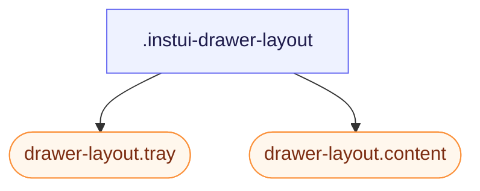

# CSS: drawer-layout

`.instui-drawer-layout` — A split layout with a collapsible side tray and a primary scrollable content pane.

`-placement-end` and the default (start) both use `flex-direction`/`inset-inline-*` logical properties, not `left`/`right`, so the tray's side follows `direction`/`dir="rtl"` automatically — no separate RTL rules are needed.

**Source:** [drawer-layout.css](https://github.com/thedannywahl/pantoken/blob/main/formats/components/src/components/drawer-layout/drawer-layout.css)

## Accesibilidad

When the tray acts as navigation, label it with an accessible heading or `aria-label`. Give `.content` `role="region"` (InstUI's DrawerLayout convention) and name it with `aria-label`/`aria-labelledby` when context alone doesn't identify it.

## Uso

```css
@import "@pantoken/components/components.css";
@import "@pantoken/components/drawer-layout.css";
```

## Ejemplos

```html
<div class="instui-drawer-layout" id="drawer" open>
  <aside class="tray">Navigation</aside>
  <main class="content" role="region">Main content</main>
</div>
```

## Estructura

```text
.instui-drawer-layout
  drawer-layout.tray (component)
  drawer-layout.content (component)
```



## Modificadores

| Modificador | Descripción |
| --- | --- |
| `.-open` | Show the tray even when the `open` attribute is absent. |
| `.-placement-end` | Dock the tray on the inline-end side. |
| `.-placement-start` | Dock the tray on the inline-start side (the default; sets it explicitly). |
| `.-should-overlay-tray` | <span class="instui-pill pantoken-doc-tag pantoken-doc-tag-interaction">Interaction</span> — Render the tray as an overlay instead of shrinking content inline. |

## Partes

| Parte | Descripción |
| --- | --- |
| `.content` | The main pane. |
| `.tray` | The side panel. |

## Propiedades personalizadas

| Propiedad | Tipo | Predeterminado | Descripción |
| --- | --- | --- | --- |
| `--pantoken-bp-md` | — | — | Width threshold for overlay mode (`30em`, themed via responsive utilities). |

## Compatibilidad con navegadores

- The `drawer-layout.tray`/`drawer-layout.content` members switch to overlay mode automatically via a `@container` query once this element's inline-size drops below tray-width + `--pantoken-bp-md`. The `@pantoken/interactions` behavior additionally toggles `[should-overlay-tray]`/`.-should-overlay-tray` (a manual override) and emits `overlaytraychange` for apps that need the change as an event.

## Subcomponentes

- [drawer-layout.content](/es/api/css/drawer-layout.content.md)
- [drawer-layout.tray](/es/api/css/drawer-layout.tray.md)
- [tray](/es/api/css/tray.md)

## Relacionado

- [tray](/es/api/css/tray.md) — A standalone edge overlay; this layout keeps tray and content in the same flow.
- [context-view](/es/api/css/context-view.md) — A smaller anchored surface for contextual actions and detail.

