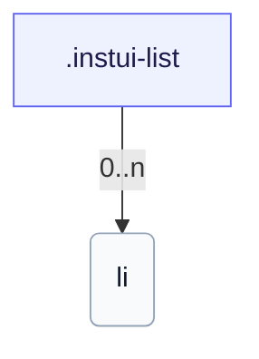

# CSS: list

`.instui-list` — A list with token-driven item spacing.

Sets its own `padding-inline-start` for list indentation; chaining a `-p*`/`-padding*` spacing utility modifier overrides that built-in value. See the `list.item` member for the individual items.

**Source:** [list.css](https://github.com/thedannywahl/pantoken/blob/main/formats/components/src/components/list/list.css)

## Uso

```css
@import "@pantoken/components/components.css";
@import "@pantoken/components/list.css";
```

## Ejemplos

```html
<ul class="instui-list">
  <li>First item</li>
  <li>Second item</li>
  <li>Third item</li>
</ul>
```

## Estructura

```text
.instui-list
  li (0..n)
```



## Modificadores

| Modificador | Descripción |
| --- | --- |
| `.-inline` | Lay items out inline (horizontal). |
| `.-size-large` | Large. @affects list.item — Scales the item spacing to match. Long-form alias of `-size-lg`. |
| `.-size-lg` | Large. @affects list.item — Scales the item spacing to match. |
| `.-size-md` | Medium (default). @affects list.item — Scales the item spacing to match. |
| `.-size-medium` | Medium (default). @affects list.item — Scales the item spacing to match. Long-form alias of `-size-md`. |
| `.-size-sm` | Small. @affects list.item — Scales the item spacing to match. |
| `.-size-small` | Small. @affects list.item — Scales the item spacing to match. Long-form alias of `-size-sm`. |
| `.-unstyled` | Remove markers and padding. |

## Tokens consumidos

| Token | Tipo | Valor |
| --- | --- | --- |
| `--instui-component-list-item-color` | `<color>` | `light-dark(#273540, #ffffff)` |
| `--instui-component-list-item-font-family` | `[ <font-family-name> \| <generic-font-family> ]#` | `Atkinson Hyperlegible Next, "Helvetica Neue", Helvetica, Arial, sans-serif` |
| `--instui-component-list-item-font-size-large` | `<length>` | `1.25rem` |
| `--instui-component-list-item-font-size-medium` | `<length>` | `1rem` |
| `--instui-component-list-item-font-size-small` | `<length>` | `0.875rem` |
| `--instui-component-list-item-font-weight` | `<integer>` | `400` |
| `--instui-component-list-item-line-height` | `<percentage>` | `150%` |
| `--instui-component-list-item-spacing-medium` | `<length>` | `1.5rem` |
| `--instui-component-list-list-padding` | `<length>` | `2.25rem` |

## Subcomponentes

- [list.item](/es/api/css/list.item.md)

