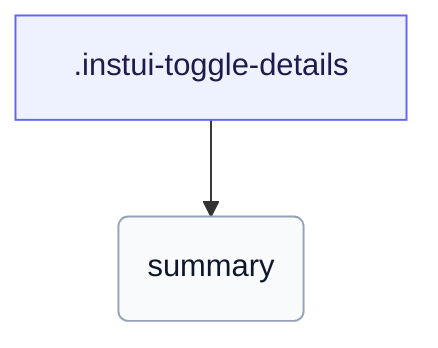

# CSS: toggle-details

`.instui-toggle-details` — A styled native `&lt;details&gt;` disclosure with a rotating chevron.

Built on the native `&lt;details&gt;` element, so the browser drives open and close plus keyboard support; the CSS only hides the default marker and supplies the rotating chevron.

**Source:** [toggle-details.css](https://github.com/thedannywahl/pantoken/blob/main/formats/components/src/components/toggle-details/toggle-details.css)

## Uso

```css
@import "@pantoken/components/components.css";
@import "@pantoken/components/toggle-details.css";
```

## Ejemplos

```html
<details class="instui-toggle-details" open>
  <summary>What ships in this package?</summary>
  Class-based component styles, built from the Instructure tokens, plus a prose layer.
</details>
```

## Estructura

```text
.instui-toggle-details
  summary
```



## Modificadores

| Modificador | Descripción |
| --- | --- |
| `.-chevron-end` | Place the chevron after the summary. |
| `.-size-large` | Large. Long-form alias of `-size-lg`. |
| `.-size-lg` | Large. |
| `.-size-sm` | Small. |
| `.-size-small` | Small. Long-form alias of `-size-sm`. |
| `.-variant-filled` | Filled (surface) variant. |

## Pseudoelementos

| Pseudoelemento | Descripción |
| --- | --- |
| `::before` | Draws the summary's disclosure chevron, a masked glyph that rotates to point down when the disclosure is open. |

## Estados

| Estado | Descripción |
| --- | --- |
| `:state(open)` | — |

## Tokens consumidos

| Token | Tipo | Valor |
| --- | --- | --- |
| `--instui-color-background-interactive-action-secondary-base` | `<color>` | `light-dark(#44709F, #345B84)` |
| `--instui-component-toggle-details-content-padding-large` | `<length>` | `1.375rem` |
| `--instui-component-toggle-details-content-padding-medium` | `<length>` | `1.125rem` |
| `--instui-component-toggle-details-content-padding-small` | `<length>` | `1.125rem` |
| `--instui-component-toggle-details-font-family` | `[ <font-family-name> \| <generic-font-family> ]#` | `Atkinson Hyperlegible Next, "Helvetica Neue", Helvetica, Arial, sans-serif` |
| `--instui-component-toggle-details-font-size-large` | `<length>` | `1.25rem` |
| `--instui-component-toggle-details-font-size-medium` | `<length>` | `1rem` |
| `--instui-component-toggle-details-font-size-small` | `<length>` | `0.875rem` |
| `--instui-component-toggle-details-font-weight` | `<integer>` | `400` |
| `--instui-component-toggle-details-icon-margin` | `<length>` | `0.375rem` |
| `--instui-component-toggle-details-line-height` | `<percentage>` | `150%` |
| `--instui-component-toggle-details-text-color` | `<color>` | `light-dark(#273540, #ffffff)` |
| `--instui-component-toggle-details-toggle-border-radius` | `<length>` | `0.75rem` |
| `--instui-component-toggle-details-toggle-padding` | `<length>` | `0.375rem` |
| `--instui-icon-chevron-right` | `<image>` | `url('data:image/svg+xml;utf8,%3Csvg%20xmlns%3D%22http%3A%2F%2Fwww.w3.org%2F2000%2Fsvg%22%20width%3D%2224%22%20height%3D%2224%22%20viewBox%3D%220%200%2024%2024%22%20fill%3D%22none%22%20stroke%3D%22currentColor%22%20stroke-width%3D%222%22%20stroke-linecap%3D%22round%22%20stroke-linejoin%3D%22round%22%3E%3Cpath%20d%3D%22m9%2018%206-6-6-6%22%2F%3E%3C%2Fsvg%3E')` |

## Relacionado

- [toggle-group](/es/api/css/toggle-group.md) — The bordered, grouped form of the same disclosure.

