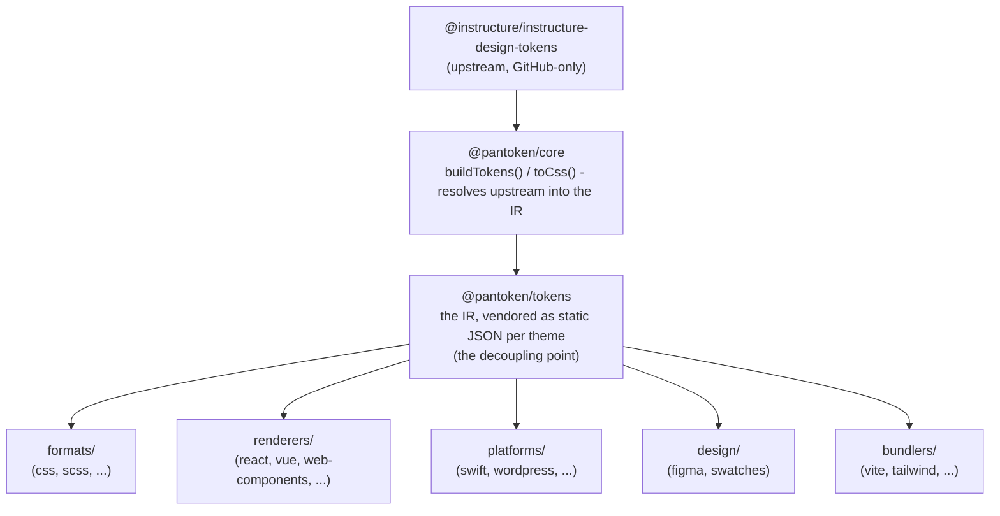

# Arquitectura

pantoken tiene un trabajo: resolver los design tokens e iconos de Instructure una vez, y luego remodelar ese modelo
para cada destino. Las capas a continuación mantienen esa remodelación honesta y mantienen los paquetes publicados libres
de cualquier upstream exclusivo de GitHub.

## Las capas

- **`@pantoken/model`** contiene los contratos de tipo, y nada más. Es la fuente de la verdad para la
  forma de `Token` y el contrato de plugins, sin dependencias, de modo que cualquier paquete puede depender de él
  libremente.
- **`@pantoken/core`** es el único paquete que toca la fuente upstream. Resuelve tokens e
  iconos en la IR canónica y genera CSS.
- **`@pantoken/tokens`** provee esa IR como JSON estático en tiempo de compilación. Este es el punto de desacoplo:
  los paquetes downstream leen `@pantoken/tokens`, nunca `@pantoken/core`, así que `npm i pantoken` nunca
  alcanza el upstream exclusivo de GitHub.
- **`@pantoken/utils`** contiene los helpers compartidos — el resolvedor `var(--x)`, las expresiones regulares de referencia,
  conversión de mayúsculas/minúsculas y de color, y las comprobaciones de deriva que mantienen la salida generada fiel a la IR.

## Por qué los tokens se proveen como paquete

El paquete de tokens upstream vive en GitHub, no en npm. Si cada paquete downstream dependiera de él,
`npm i pantoken` fallaría para cualquiera sin ese acceso. En su lugar, `@pantoken/tokens` resuelve el
upstream una vez en tiempo de compilación y escribe el resultado en JSON estático. Los paquetes publicados llevan ese
JSON, por lo que se instalan limpiamente desde npm, se fijan por semver y funcionan sin conexión.

## Buckets

Cada bucket downstream es una forma de consumir la IR:

- **formats/** — convierte los tokens en un archivo (CSS, SCSS, Less, Stylus, DTCG).
- **renderers/** — integraciones con frameworks y herramientas (React, Vue, Svelte, MUI, Pendo y más).
- **bundlers/** — plugins y presets para herramientas de build (Vite, Next, Tailwind, Panda, PostCSS, webpack).
- **platforms/** — destinos nativos y generadores de sitios (Swift, Kotlin, Rust, WordPress, Drupal).
- **design/** — cargas útiles para herramientas de diseño (Figma, paletas de color).
- **plugins/** — transformaciones opcionales que extienden los tokens o la salida CSS. Ver [Plugins](/guide/plugins).

## Salida generada

Cada paquete que emite un archivo lo escribe en un directorio `generated/` por paquete que una compilación
reproduce, por lo que nada generado se compromete en el repositorio. Una tarea del workspace valida todo ello. Ver
[Generated output](/guide/generated-output).
