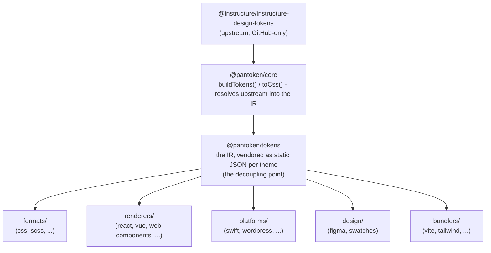

# معماری

pantoken یک کار دارد: توکن‌ها و آیکون‌های طراحی Instructure را یک‌بار حل کند، سپس آن مدل را برای هر هدف بازشکل دهد. لایه‌های زیر آن بازشکل‌دهی را معتبر نگه می‌دارند و بسته‌های منتشرشده را از هر منبع upstream فقط-گیت‌هابی جدا نگه می‌دارند.

## لایه‌ها

- **`@pantoken/model`** قراردادهای نوع را نگه می‌دارد، و هیچ چیز دیگری. این منبع حقیقت برای شکل `Token` و قرارداد پلاگین است، با صفر وابستگی، بنابراین هر بسته‌ای می‌تواند آزادانه به آن وابسته باشد.
- **`@pantoken/core`** تنها بسته‌ای است که به منبع upstream دست می‌زند. این بسته توکن‌ها و آیکون‌ها را به IR کانونیکال تبدیل می‌کند و CSS را رندر می‌کند.
- **`@pantoken/tokens`** آن IR را در زمان ساخت به‌صورت JSON استاتیک درون‌سپاری می‌کند. این نقطه جداسازی است: بسته‌های پایین‌دست `@pantoken/tokens` را می‌خوانند، هرگز `@pantoken/core` را، بنابراین `npm i pantoken` هرگز به upstream فقط-گیت‌هابی دسترسی پیدا نمی‌کند.
- **`@pantoken/utils`** کمک‌کننده‌های مشترک را حمل می‌کند — حل‌کننده `var(--x)`، رِگِکس‌های ارجاع، تبدیل حروف و رنگ، و چک‌های drift که خروجی تولیدشده را وفادار به IR نگه می‌دارد.

## چرا توکن‌ها درون‌سپاری می‌شوند

پکیج توکن upstream روی GitHub است، نه npm. اگر هر بسته‌ی پایین‌دست به آن وابسته می‌شد، `npm i pantoken` برای هر کسی که آن دسترسی را نداشت شکست می‌خورد. در عوض `@pantoken/tokens` یک‌بار در زمان ساخت upstream را حل می‌کند و نتیجه را به JSON استاتیک می‌نویسد. بسته‌های منتشرشده آن JSON را حمل می‌کنند، بنابراین از npm به‌خوبی نصب می‌شوند، به semver چسبیده می‌شوند و آفلاین نیز کار می‌کنند.

## باکت‌ها

هر باکت پایین‌دست یک روش مصرف IR است:

- **formats/** — تبدیل توکن‌ها به یک فایل (CSS، SCSS، Less، Stylus، DTCG).
- **renderers/** — یکپارچگی با فِریم‌ورک‌ها و ابزارها (React، Vue، Svelte، MUI، Pendo و غیره).
- **bundlers/** — پلاگین‌ها و پریست‌های ابزار ساخت (Vite، Next، Tailwind، Panda، PostCSS، webpack).
- **platforms/** — اهداف بومی و سازندگان سایت (Swift، Kotlin، Rust، WordPress، Drupal).
- **design/** — payloadها برای ابزارهای طراحی (Figma، پالت‌های رنگ).
- **plugins/** — تبدیل‌های اختیاری که خروجی توکن یا CSS را گسترش می‌دهند. مشاهده کنید [Plugins](/guide/plugins).

## خروجی تولیدشده

هر بسته‌ای که فایلی منتشر می‌کند آن را در دایرکتوری `generated/` مخصوص بسته می‌نویسد که یک کار ساخت بازتولید می‌کند، بنابراین هیچ چیز تولیدشده‌ای کمیت نمی‌شود. یک تسک workspace همه‌ی آن را اعتبارسنجی می‌کند. ببینید [Generated output](/guide/generated-output).
