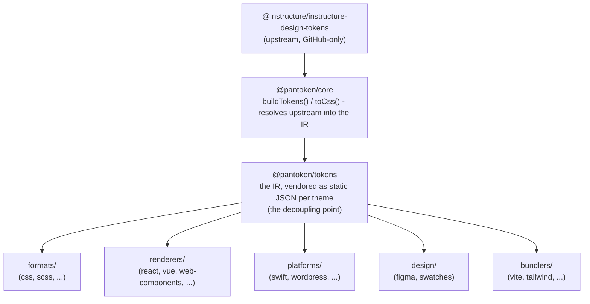

# Arkkitehtuuri

pantokenilla on yksi tehtävä: ratkaista Instructuren design-tokens ja ikonit kerran ja sitten muokata tuota mallia
jokaiselle kohteelle. Alla olevat kerrokset pitävät tämän muokkauksen rehellisenä ja pitävät julkaistut paketit vapaina
minkään GitHubille tarkoitetusta upstreamista.

## Kerrokset

- **`@pantoken/model`** pitää tyypin sopimukset, eikä mitään muuta. Se on totuuden lähde
  `Token`-muodolle ja plugin-sopimukselle, täysin ilman riippuvuuksia, joten mikä tahansa paketti voi riippua siitä
  vapaasti.
- **`@pantoken/core`** on ainoa paketti, joka koskettaa upstream-lähdettä. Se ratkaisee tokenit ja
  ikonit kanoniseen IR:ään ja renderöi CSS:n.
- **`@pantoken/tokens`** toimittaa tuon IR:n staattisena JSON:ina build-aikana. Tämä on irtikytkentäpiste:
  downstream-paketit lukevat `@pantoken/tokens`, eivät koskaan `@pantoken/core`, joten `npm i pantoken` ei koskaan
  yletä GitHubille tarkoitetulle upstreamille.
- **`@pantoken/utils`** kantaa jaetut apurutiinit — `var(--x)`-resolverin, viittaus-regexit,
  tapa- ja värimuunnokset sekä drift-tarkistukset, jotka pitävät generoiden ulostulon uskollisena IR:lle.

## Miksi tokenit on toimittajakoottu (vendoroitu)

Upstream-token-paketti sijaitsee GitHubissa, ei npm:ssä. Jos jokainen downstream-paketti riippuisi siitä,
`npm i pantoken` epäonnistuisi kenellä tahansa ilman pääsyä. Sen sijaan `@pantoken/tokens` ratkaisee
upstreamin kerran build-aikana ja kirjoittaa tuloksen staattiseen JSON:iin. Julkaistut paketit kantavat tuota
JSON:ia, joten ne asentuvat puhtaasti npm:stä, pinnaavat semveriin ja toimivat offline-tilassa.

## Buckets

Jokainen downstream-bucket on tapa hyödyntää IR:ää:

- **formats/** — muuntaa tokenit tiedostoksi (CSS, SCSS, Less, Stylus, DTCG).
- **renderers/** — framework- ja työkalukytkennät (React, Vue, Svelte, MUI, Pendo ja lisää).
- **bundlers/** — build-työkalujen plugin- ja preset-integraatiot (Vite, Next, Tailwind, Panda, PostCSS, webpack).
- **platforms/** — natiivi- ja sivugeneraattorikohteet (Swift, Kotlin, Rust, WordPress, Drupal).
- **design/** — payloadit suunnittelutyökaluille (Figma, värinäytteet).
- **plugins/** — valinnaiset transformaatiot, jotka laajentavat token- tai CSS-ulostuloa. Katso [Plugins](/guide/plugins).

## Generoitu ulostulo

Jokainen paketti, joka tuottaa tiedoston, kirjoittaa sen per-paketin `generated/`-hakemistoon, jonka build
uudelleenluo, joten mitään generoituja tiedostoja ei ole commitoitu. Workspace-tehtävä validoi kaiken sen. Katso
[Generated output](/guide/generated-output).
