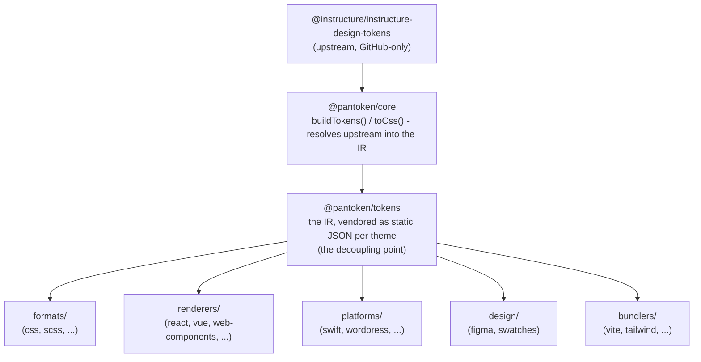

# Architecture

pantoken a une seule mission : résoudre les design tokens et les icônes d'Instructure une fois, puis remodeler ce modèle
pour chaque cible. Les couches ci‑dessous gardent ce remodelage fidèle et maintiennent les paquets publiés exempts
de tout upstream réservé à GitHub.

## Les couches

- **`@pantoken/model`** contient les contrats de types, et rien d'autre. C'est la source de vérité pour la
  forme `Token` et le contrat de plugin, sans dépendances, de sorte que n'importe quel paquet peut en dépendre
  librement.
- **`@pantoken/core`** est le seul paquet qui touche la source upstream. Il résout les tokens et
  les icônes en IR canonique et génère du CSS.
- **`@pantoken/tokens`** fournit cet IR sous forme de JSON statique au moment de la compilation. C'est le point de découplage :
  les paquets en aval lisent `@pantoken/tokens`, jamais `@pantoken/core`, ainsi `npm i pantoken` n'atteint jamais
  l'upstream réservé à GitHub.
- **`@pantoken/utils`** transporte les aides partagées — le résolveur `var(--x)`, les regex de référence,
  la conversion de casse et de couleur, et les contrôles de dérive qui gardent la sortie générée fidèle à l'IR.

## Pourquoi les tokens sont fournis en vendor

Le paquet de tokens upstream vit sur GitHub, pas sur npm. Si chaque paquet en aval en dépendait,
`npm i pantoken` échouerait pour quiconque n'a pas cet accès. À la place, `@pantoken/tokens` résout l'
upstream une seule fois à la compilation et écrit le résultat en JSON statique. Les paquets publiés embarquent ce
JSON, ils s'installent donc proprement depuis npm, se fixent à une semver, et fonctionnent hors ligne.

## Buckets

Chaque bucket en aval est une façon de consommer l'IR :

- **formats/** — transforme les tokens en fichier (CSS, SCSS, Less, Stylus, DTCG).
- **renderers/** — intégrations pour frameworks et outils (React, Vue, Svelte, MUI, Pendo, et plus).
- **bundlers/** — plugins et presets pour outils de build (Vite, Next, Tailwind, Panda, PostCSS, webpack).
- **platforms/** — cibles natives et générateurs de site (Swift, Kotlin, Rust, WordPress, Drupal).
- **design/** — charges utiles pour outils de design (Figma, nuanciers de couleurs).
- **plugins/** — transformations optionnelles qui étendent la sortie de tokens ou de CSS. Voir [Plugins](/guide/plugins).

## Sortie générée

Chaque paquet qui émet un fichier l'écrit dans un répertoire `generated/` par paquet qu'une compilation
reproduit, donc rien de généré n'est commité. Une tâche workspace valide le tout. Voir
[Generated output](/guide/generated-output).
