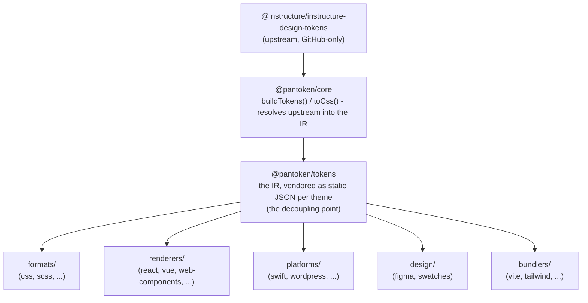

# Architecture

pantoken a une tâche : résoudre une fois les design tokens et les icônes d'Instructure, puis remodeler ce modèle
pour chaque cible. Les couches ci-dessous maintiennent l'intégrité de ce remodelage et gardent les packages publiés exempts
de toute dépendance en amont spécifique à GitHub.

## Les couches

- **`@pantoken/model`** contient les contrats de types, et rien d'autre. C'est la source de vérité pour la
  forme `Token` et le contrat de plugin, sans dépendances, de sorte que n'importe quel package peut en dépendre
  librement.
- **`@pantoken/core`** est le seul package qui touche la source en amont. Il résout les tokens et
  les icônes en IR canonical et génère du CSS.
- **`@pantoken/tokens`** fournit cet IR sous forme de JSON statique au moment de la construction. C'est le point de découplage :
  les packages en aval lisent `@pantoken/tokens`, jamais `@pantoken/core`, ainsi `npm i pantoken` n'atteint jamais
  la source en amont spécifique à GitHub.
- **`@pantoken/utils`** porte les helpers partagés — le résolveur `var(--x)`, les regex de référence,
  la conversion de casse et de couleur, et les contrôles de dérive qui maintiennent la fidélité de la sortie générée à l'IR.

## Pourquoi les tokens sont fournis (vendored)

Le package de tokens en amont vit sur GitHub, pas sur npm. Si chaque package en aval y dépendait,
`npm i pantoken` échouerait pour toute personne sans cet accès. À la place, `@pantoken/tokens` résout la
source en amont une fois au moment de la construction et écrit le résultat en JSON statique. Les packages publiés embarquent ce
JSON, ils s'installent donc proprement depuis npm, se figent sur semver, et fonctionnent hors ligne.

## Buckets

Chaque bucket en aval est une manière de consommer l'IR :

- **formats/** — transforme les tokens en fichier (CSS, SCSS, Less, Stylus, DTCG).
- **renderers/** — intégrations de frameworks et d'outils (React, Vue, Svelte, MUI, Pendo, et plus).
- **bundlers/** — plugins et presets pour outils de build (Vite, Next, Tailwind, Panda, PostCSS, webpack).
- **platforms/** — cibles natives et générateurs de sites (Swift, Kotlin, Rust, WordPress, Drupal).
- **design/** — payloads pour outils de design (Figma, nuanciers de couleurs).
- **plugins/** — transformations optionnelles qui étendent la sortie token ou CSS. Voir [Plugins](/guide/plugins).

## Sortie générée

Chaque package qui émet un fichier l'écrit dans un répertoire `generated/` par package qu'une construction
reproduit, ainsi rien de généré n'est commis. Une tâche de workspace valide l'ensemble. Voir
[Generated output](/guide/generated-output).
