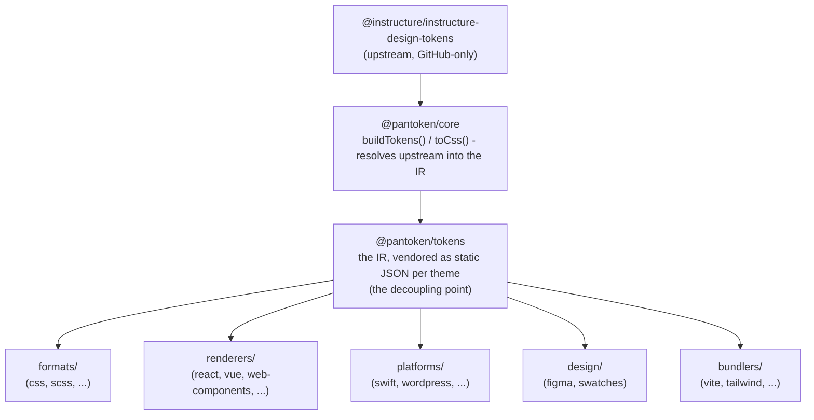

# Ailtireacht

tá post amháin ag pantoken: réitigh toghthóirí dearadh agus siombailí Instructure uair amháin, ansin athmhúnlaigh an tsamhail sin do gach sprioc. Coinníonn na sraitheanna thíos an athmhúnlú sin daingean agus coinníonn siad na pacáistí foilsithe saor ó aon upstream atá ar GitHub amháin.

## Na sraitheanna

- **`@pantoken/model`** cuireann na conarthaí cineálacha air, agus ní rud ar bith eile. Is í an fhoinse fhírinne don struchtúr `Token` agus don chonradh plugin, gan spleáchais ar bith, mar sin is féidir le haon phacáiste brath air go saor.
- **`@pantoken/core`** an t-aon phacáiste a théann i dteagmháil leis an fhoinse upstream. Réitíonn sé na toghthóirí agus na siombailí isteach sa IR chanónach agus déanann sé CSS a ghiniúint.
- **`@pantoken/tokens`** soláthraíonn an IR sin mar JSON statach ag am an tionscnaimh. Is é seo an point dhíchumaisc: léann pacáistí síosreatha `@pantoken/tokens`, ní léann siad `@pantoken/core`, mar sin ní éiríonn le `npm i pantoken` riamh an upstream atá ar GitHub amháin a bhaint amach.
- **`@pantoken/utils`** iompraíonn na cabhrach roinnte — an réititheoir `var(--x)`, na regexanna tagartha, tiontú cás agus dath, agus na seiceálacha drift a choinníonn aschur ginte dílis don IR.

## Cén fáth a ndéantar na toghthóirí a sholáthar mar chuid den phacáiste

Tá pacáiste na dtokean upstream ar GitHub, ní ar npm. Dá gcuirfeadh gach pacáiste síosreatha spleáchas air, d’fhéadfadh `npm i pantoken` teip do dhuine ar bith gan an rochtain sin. Ina ionad sin, réitíonn `@pantoken/tokens` an upstream uair amháin ag am an bhfoirgnimh agus scríobhann sé an toradh mar JSON statach. Iomparann na pacáistí foilsithe an JSON sin, mar sin suiteálann siad go glan ó npm, pinteann siad le semver, agus oibríonn siad aslíne.

## Buicéid

Is bealach é gach buicéad síosreatha chun an IR a ídiú:

- **formats/** — casann sé na toghthóirí isteach i gcomhad (CSS, SCSS, Less, Stylus, DTCG).
- **renderers/** — comhtháthú le frámaí agus uirlisí (React, Vue, Svelte, MUI, Pendo, agus eile).
- **bundlers/** — breiseáin agus réamhshocruithe uirlis tógála (Vite, Next, Tailwind, Panda, PostCSS, webpack).
- **platforms/** — spriocanna dúchais agus gineadóirí suíomhanna (Swift, Kotlin, Rust, WordPress, Drupal).
- **design/** — páiréid do uirlisí dearaidh (Figma, paistí dathanna).
- **plugins/** — claochluithe roghnacha a leathnaíonn an aschur token nó CSS. Féach [Plugins](/guide/plugins).

## Aschur ginte

Scríobhann gach pacáiste a ghineann comhad é chuig eolaire `generated/` ar leith do gach pacáiste a athghineann an t-uirlis tógála, mar sin ní chuirtear aon rud ginte i mbun a chomhalta. Bailíonn tasc spásobair an láidir seo iad go léir. Féach [Aschur ginte](/guide/generated-output).
