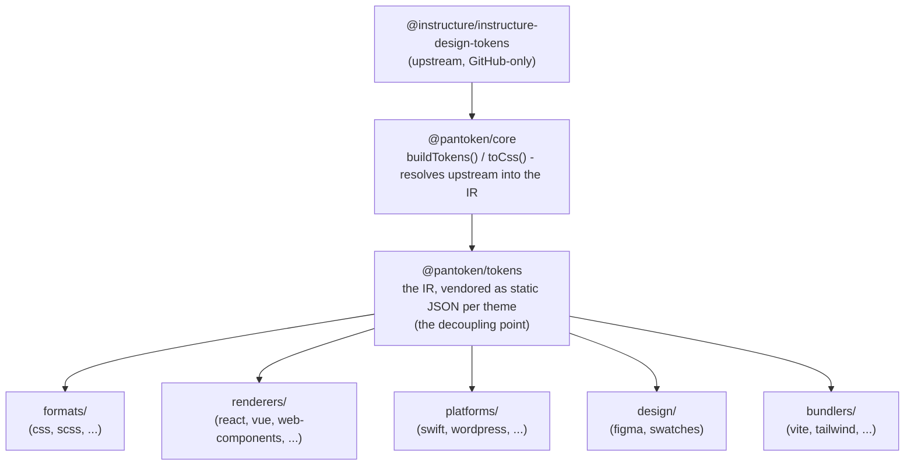

# Architecture

pantoken has one job: resolve Instructure's design tokens and icons once, then reshape that model
for every target. The layers below keep that reshaping honest and keep the published packages free
of any GitHub-only upstream.

## The layers

- **`@pantoken/model`** holds the type contracts, and nothing else. It's the source of truth for the
  `Token` shape and the plugin contract, with zero dependencies, so any package can depend on it
  freely.
- **`@pantoken/core`** is the only package that touches the upstream source. It resolves tokens and
  icons into the canonical IR and renders CSS.
- **`@pantoken/tokens`** vendors that IR as static JSON at build time. This is the decoupling point:
  downstream packages read `@pantoken/tokens`, never `@pantoken/core`, so `npm i pantoken` never
  reaches for the GitHub-only upstream.
- **`@pantoken/utils`** carries the shared helpers — the `var(--x)` resolver, the reference regexes,
  case and color conversion, and the drift checks that keep generated output faithful to the IR.

## Why tokens are vendored

The upstream token package lives on GitHub, not npm. If every downstream package depended on it,
`npm i pantoken` would fail for anyone without that access. Instead `@pantoken/tokens` resolves the
upstream once at build time and writes the result to static JSON. The published packages carry that
JSON, so they install cleanly from npm, pin to semver, and work offline.

## Buckets

Each downstream bucket is a way of consuming the IR:

- **formats/** — turn the tokens into a file (CSS, SCSS, Less, Stylus, DTCG).
- **renderers/** — framework and tool integrations (React, Vue, Svelte, MUI, Pendo, and more).
- **bundlers/** — build-tool plugins and presets (Vite, Next, Tailwind, Panda, PostCSS, webpack).
- **platforms/** — native and site-generator targets (Swift, Kotlin, Rust, WordPress, Drupal).
- **design/** — payloads for design tools (Figma, color swatches).
- **plugins/** — optional transforms that extend the token or CSS output. See [Plugins](/guide/plugins).

## Generated output

Every package that emits a file writes it to a per-package `generated/` directory that a build
reproduces, so nothing generated is committed. A workspace task validates all of it. See
[Generated output](/guide/generated-output).
