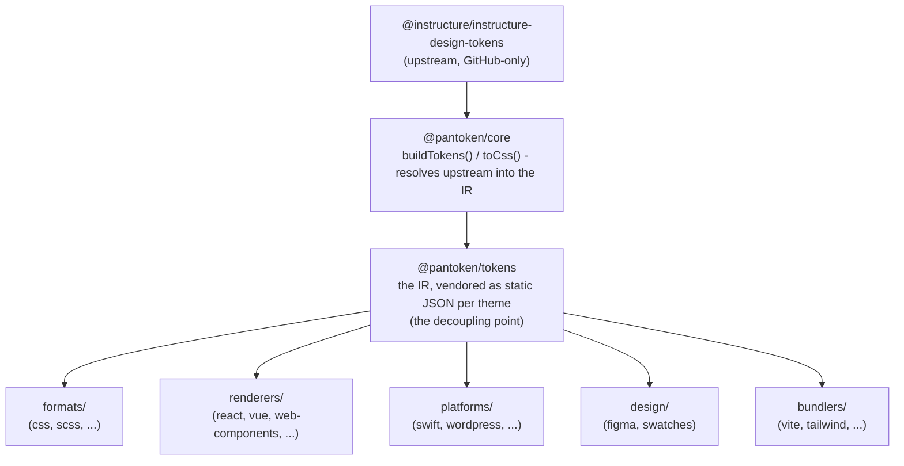

# ארכיטקטורה

ל-pantoken יש משימה אחת: לפרש את עיצובי הטוקנים והאייקונים של Instructure פעם אחת, ואז לעצב מחדש את המודל לכל יעד. השכבות למטה שומרות על נכונות העיצוב המחודש ושומרות על החבילות שפורסמו נקיות מכל Upstream הייחודי ל-GitHub.

## השכבות

- **`@pantoken/model`** מחזיק את חוזי הטיפוס, ולא שום דבר נוסף. זו המקור האמין לצורת `Token` וחוזה התוסף, ללא תלותיות, כך שכל חבילה יכולה להסתמך עליו בחופשיות.
- **`@pantoken/core`** היא החבילה היחידה שנוגעת במקור ה-upstream. היא פותרת טוקנים ואייקונים ל-IR הקנוני ומייצרת CSS.
- **`@pantoken/tokens`** מספקת את ה-IR הזה כ-JSON סטטי בזמן בנייה. זהו נקודת הפיצול: חבילות מטה קוראות ל-`@pantoken/tokens`, לעולם לא ל-`@pantoken/core`, כך ש-`npm i pantoken` לעולם לא מגיע ל-upstream הייחודי ל-GitHub.
- **`@pantoken/utils`** נושאת את העזרים המשותפים — הפותר `var(--x)`, ה-regexes של ההפניות, המרת תיבות מקרה וצבע, ובדיקות ה-drift שמשמרות שהפלט המיוצר נאמן ל-IR.

## מדוע הטוקנים מושקעים (vendored)

חבילת הטוקנים של ה-upstream живёт ב-GitHub, לא ב-npm. אם כל חבילת מטה הייתה תלויה בה,
`npm i pantoken` הייתה נכשלת לכל מי שאין לו את הגישה הזו. במקום זאת `@pantoken/tokens` פותרת את ה-upstream פעם אחת בזמן בנייה וכותבת את התוצאה כ-JSON סטטי. החבילות שפורסמו נושאות את ה-JSON הזה, כך שהן מתקינות נקי מ-npm, מקבעות ל-semver, ועובדות אופליין.

## דליים (Buckets)

כל דלי מטה הוא דרך לצרוך את ה-IR:

- **formats/** — הופך את הטוקנים לקובץ (CSS, SCSS, Less, Stylus, DTCG).
- **renderers/** — אינטגרציות מסגרת וכלים (React, Vue, Svelte, MUI, Pendo ועוד).
- **bundlers/** — פלאגינים ופריסטים לכלי בנייה (Vite, Next, Tailwind, Panda, PostCSS, webpack).
- **platforms/** — יעדי מקומי ו- site-generator (Swift, Kotlin, Rust, WordPress, Drupal).
- **design/** — מטענים לכלי עיצוב (Figma, דגימות צבע).
- **plugins/** — טרנספורמציות אופציונליות שמרחיבות את הפלט של הטוקנים או ה-CSS. ראה [Plugins](/guide/plugins).

## פלט שנוצר

כל חבילה שמפיקה קובץ כותבת אותו לתיקיית `generated/` פר חבילה שהבנייה משחזרת, כך ששום דבר שנוצר אינו מחויב בגרסה. משימה בסביבת העבודה מאמתת את הכל. ראה [Generated output](/guide/generated-output).
