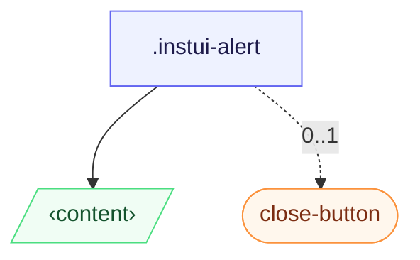

# CSS: alert

`.instui-alert` · <span class="instui-pill -color-success pantoken-doc-tag">stable</span> — An inline message with a status colour bar and a masked status glyph from the shared icon set.

A custom `-icon-&lt;name&gt;` swaps the status glyph but keeps the variant's coloured bar; the bar fill is re-asserted at higher specificity so the shared icon painter doesn't consume it. A direct close button defaults to small; add a size modifier to override it.

**Source:** [alert.css](https://github.com/thedannywahl/pantoken/blob/main/formats/components/src/components/alert/alert.css)

<!-- js-requirement -->
> [!TIP]
> **JS संवर्धन** — This component's CSS renders and works on its own; pair it with `@pantoken/interactions` to add the interactive behavior. Its `-timeout` modifier is driven by that behavior. See the [modifier table below](#modifiers).


## एक्सेसिबिलिटी

For an important message, add `role="alert"` or an `aria-live` region so assistive tech announces it; the dismiss control is a labelled close button (the `.instui-close-button` in the example carries `aria-label="Close"`).

## उपयोग

```css
@import "@pantoken/components/components.css";
@import "@pantoken/components/alert.css";
```

## उदाहरण

-nocard
```html
<div class="instui-alert -icon-megaphone --mb-md">
  An alert with the default <code>info</code> color, and a custom icon.
</div>
<div class="instui-alert -color-success">
  Congratulations! You're using the "success" color.
  <button class="instui-close-button" aria-label="Close"></button>
</div>
```

## संरचना

```text
.instui-alert
  ‹content›
  close-button (component, 0..1)
```



## स्लॉट्स

| स्लॉट | विवरण |
| --- | --- |
| `content` | The alert's message content; may include a dismiss button. |

## मॉडिफायर

| मॉडिफायर | विवरण |
| --- | --- |
| `.-color-danger` | An error message. |
| `.-color-info` | Informational (default). |
| `.-color-success` | A positive/confirmation message. |
| `.-color-warning` | A cautionary message. |
| `.-has-shadow-false` | <span class="instui-pill -color-info pantoken-doc-tag">Alias</span> — maps to `.-without-shadow`. |
| `.-icon-*` | Swap the status glyph for a custom icon (e.g. `-icon-megaphone`), kept white on the variant's coloured bar. |
| `.-render-custom-icon-*` | <span class="instui-pill -color-danger pantoken-doc-tag">अप्रमाणित</span> — The former `renderCustomIcon` prop; still works as an alias, but use `-icon-<name>` (or override `--pantoken-alert-glyph`) instead. |
| `.-screen-reader-only` | Visually hidden but announced. |
| `.-timeout` | <span class="instui-pill pantoken-doc-tag pantoken-doc-tag-interaction">Interaction</span> — The alert will automatically dismiss after a default of 5 seconds. |
| `.-timeout-1` | One second before automatic dismissal. |
| `.-timeout-2` | Two seconds before automatic dismissal. |
| `.-timeout-3` | Three seconds before automatic dismissal. |
| `.-timeout-4` | Four seconds before automatic dismissal. |
| `.-timeout-5` | Five seconds before automatic dismissal. |
| `.-variant-error` | <span class="instui-pill -color-danger pantoken-doc-tag">अप्रमाणित</span> — use `.-color-danger`. |
| `.-variant-info` | <span class="instui-pill -color-danger pantoken-doc-tag">अप्रमाणित</span> — use `.-color-info`. |
| `.-variant-success` | <span class="instui-pill -color-danger pantoken-doc-tag">अप्रमाणित</span> — use `.-color-success`. |
| `.-variant-warning` | <span class="instui-pill -color-danger pantoken-doc-tag">अप्रमाणित</span> — use `.-color-warning`. |
| `.-without-shadow` | Remove the default elevation shadow (InstUI `hasShadow={false}`). |

## स्यूडो-एलिमेंट्स

| स्यूडो-एलिमेंट | विवरण |
| --- | --- |
| `::after` | The white status glyph, masked and centred over the bar. |
| `::before` | The solid variant-coloured status bar, flush to the rounded start edge. |

## कस्टम प्रॉपर्टीज

| प्रॉपर्टी | प्रकार | डिफ़ॉल्ट | विवरण |
| --- | --- | --- | --- |
| `--pantoken-alert-glyph` | `<url>` | — | The low-level status-glyph source; `-icon-&lt;name&gt;` sets it for you. Override for a custom icon (a url-encoded SVG). |
| `--pantoken-alert-icon-bg` | `<color>` | — | The coloured status-bar fill behind the glyph; each `-color-*` variant sets its own. |
| `--timeout` | `<integer>` | — | Milliseconds before automatic dismissal; `0` disables it. Requires the alert interaction bundle. |

## उपयोग किये गए टोकन

| टोकन | प्रकार | मान |
| --- | --- | --- |
| `--instui-component-alert-background` | `<color>` | `light-dark(#ffffff, #171B21)` |
| `--instui-component-alert-border-radius` | `<length>` | `0.75rem` |
| `--instui-component-alert-border-style` | — | `solid` |
| `--instui-component-alert-border-width` | `<length>` | `0.125rem` |
| `--instui-component-alert-color` | `<color>` | `light-dark(#273540, #ffffff)` |
| `--instui-component-alert-content-font-family` | `[ <font-family-name> \| <generic-font-family> ]#` | `Atkinson Hyperlegible Next, "Helvetica Neue", Helvetica, Arial, sans-serif` |
| `--instui-component-alert-content-font-size` | `<length>` | `1rem` |
| `--instui-component-alert-content-font-weight` | `<integer>` | `400` |
| `--instui-component-alert-content-line-height` | `<percentage>` | `125%` |
| `--instui-component-alert-content-padding-horizontal` | `<length>` | `1.5rem` |
| `--instui-component-alert-content-padding-vertical` | `<length>` | `0.75rem` |
| `--instui-component-alert-danger-border-color` | `<color>` | `#E62429` |
| `--instui-component-alert-danger-icon-background` | `<color>` | `#E62429` |
| `--instui-component-alert-icon-color` | `<color>` | `#ffffff` |
| `--instui-component-alert-info-border-color` | `<color>` | `#2B7ABC` |
| `--instui-component-alert-info-icon-background` | `<color>` | `#2B7ABC` |
| `--instui-component-alert-success-border-color` | `<color>` | `#03893D` |
| `--instui-component-alert-success-icon-background` | `<color>` | `#03893D` |
| `--instui-component-alert-warning-border-color` | `<color>` | `#CF4A00` |
| `--instui-component-alert-warning-icon-background` | `<color>` | `#CF4A00` |
| `--instui-component-base-button-medium-height` | `<length>` | `2.5rem` |
| `--instui-component-base-button-small-height` | `<length>` | `2rem` |
| `--instui-elevation-above` | `none \| <shadow>#` | — |
| `--instui-icon-circle-check` | `<image>` | `url('data:image/svg+xml;utf8,%3Csvg%20xmlns%3D%22http%3A%2F%2Fwww.w3.org%2F2000%2Fsvg%22%20width%3D%2224%22%20height%3D%2224%22%20viewBox%3D%220%200%2024%2024%22%20fill%3D%22none%22%20stroke%3D%22currentColor%22%20stroke-width%3D%222%22%20stroke-linecap%3D%22round%22%20stroke-linejoin%3D%22round%22%3E%3Ccircle%20cx%3D%2212%22%20cy%3D%2212%22%20r%3D%2210%22%2F%3E%3Cpath%20d%3D%22m9%2012%202%202%204-4%22%2F%3E%3C%2Fsvg%3E')` |
| `--instui-icon-circle-x` | `<image>` | `url('data:image/svg+xml;utf8,%3Csvg%20xmlns%3D%22http%3A%2F%2Fwww.w3.org%2F2000%2Fsvg%22%20width%3D%2224%22%20height%3D%2224%22%20viewBox%3D%220%200%2024%2024%22%20fill%3D%22none%22%20stroke%3D%22currentColor%22%20stroke-width%3D%222%22%20stroke-linecap%3D%22round%22%20stroke-linejoin%3D%22round%22%3E%3Ccircle%20cx%3D%2212%22%20cy%3D%2212%22%20r%3D%2210%22%2F%3E%3Cpath%20d%3D%22m15%209-6%206%22%2F%3E%3Cpath%20d%3D%22m9%209%206%206%22%2F%3E%3C%2Fsvg%3E')` |
| `--instui-icon-info` | `<image>` | `url('data:image/svg+xml;utf8,%3Csvg%20xmlns%3D%22http%3A%2F%2Fwww.w3.org%2F2000%2Fsvg%22%20width%3D%2224%22%20height%3D%2224%22%20viewBox%3D%220%200%2024%2024%22%20fill%3D%22none%22%20stroke%3D%22currentColor%22%20stroke-width%3D%222%22%20stroke-linecap%3D%22round%22%20stroke-linejoin%3D%22round%22%3E%3Ccircle%20cx%3D%2212%22%20cy%3D%2212%22%20r%3D%2210%22%2F%3E%3Cpath%20d%3D%22M12%2016v-4%22%2F%3E%3Cpath%20d%3D%22M12%208h.01%22%2F%3E%3C%2Fsvg%3E')` |
| `--instui-icon-triangle-alert` | `<image>` | `url('data:image/svg+xml;utf8,%3Csvg%20xmlns%3D%22http%3A%2F%2Fwww.w3.org%2F2000%2Fsvg%22%20width%3D%2224%22%20height%3D%2224%22%20viewBox%3D%220%200%2024%2024%22%20fill%3D%22none%22%20stroke%3D%22currentColor%22%20stroke-width%3D%222%22%20stroke-linecap%3D%22round%22%20stroke-linejoin%3D%22round%22%3E%3Cpath%20d%3D%22m21.73%2018-8-14a2%202%200%200%200-3.48%200l-8%2014A2%202%200%200%200%204%2021h16a2%202%200%200%200%201.73-3%22%2F%3E%3Cpath%20d%3D%22M12%209v4%22%2F%3E%3Cpath%20d%3D%22M12%2017h.01%22%2F%3E%3C%2Fsvg%3E')` |
| `--instui-spacing-space-xs` | `<length>` | `0.25rem` |
| `--pantoken-glyph` | `<url>` | `url("data:image/svg+xml` |

## सबकम्पोनेन्ट्स

- [close-button](/hi/api/css/close-button.md)

## संबंधित

- [close-button](/hi/api/css/close-button.md) — The dismiss control an alert may include.

