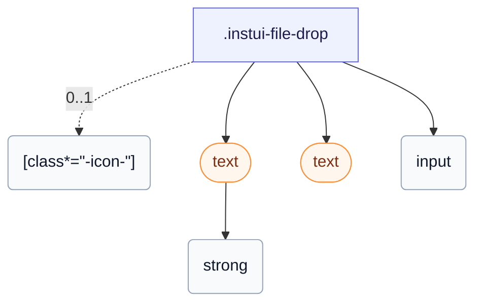

# CSS: file-drop

`.instui-file-drop` — A file dropzone with hover, accepted, and rejected states.

The `-hover`/`-accepted`/`-rejected` classes are purely visual — actual drag-and-drop detection and file validation are the consumer's JS to wire up around the wrapped native input.

**Source:** [file-drop.css](https://github.com/thedannywahl/pantoken/blob/main/formats/components/src/components/file-drop/file-drop.css)

## एक्सेसिबिलिटी

Wrap a native `<input type="file">` in the `&lt;label&gt;` drop zone so it stays a real, labelled file control that the keyboard and assistive tech can operate.

## उपयोग

```css
@import "@pantoken/components/components.css";
@import "@pantoken/components/file-drop.css";
```

## उदाहरण

```html
<label class="instui-file-drop" id="fd">
  <span class="instui-icon -icon-cloud-upload"></span>
  <div class="instui-text"><strong>Drag an image here</strong>, or click to browse.</div>
  <div class="instui-text -size-sm instui-fg-muted" id="fd-msg">PNG or JPG up to 5&nbsp;MB.</div>
  <input type="file" id="fd-input">
</label>
```

## संरचना

```text
.instui-file-drop
  [class*="-icon-"] (0..1)
  text (component)
    strong
  text (component)
  input
```



## मॉडिफायर

| मॉडिफायर | विवरण |
| --- | --- |
| `.-accepted` | Drag state for an acceptable file. |
| `.-hover` | Hover or drag-over state. |
| `.-icon-*` | Render the leading dropzone glyph icon. |
| `.-rejected` | Drag state for a rejected file. |

## उपयोग किये गए टोकन

| टोकन | प्रकार | मान |
| --- | --- | --- |
| `--instui-color-text-base` | `<color>` | `light-dark(#273540, #F2F4F5)` |
| `--instui-component-file-drop-accepted-color` | `<color>` | `light-dark(#1D354F, #EEF4FD)` |
| `--instui-component-file-drop-background-color` | `<color>` | `light-dark(#ffffff, #1C222B)` |
| `--instui-component-file-drop-border-color` | `<color>` | `light-dark(#7E8792, #5F6E7A)` |
| `--instui-component-file-drop-border-radius` | `<length>` | `1rem` |
| `--instui-component-file-drop-border-style` | — | `dashed` |
| `--instui-component-file-drop-border-width` | `<length>` | `0.0625rem` |
| `--instui-component-file-drop-hover-border-color` | `<color>` | `light-dark(#1D354F, #EEF4FD)` |
| `--instui-component-file-drop-rejected-color` | `<color>` | `light-dark(#CF1F24, #F56050)` |
| `--instui-spacing-space-lg` | `<length>` | `1rem` |

## सबकम्पोनेन्ट्स

- [text](/hi/api/css/text.md)

