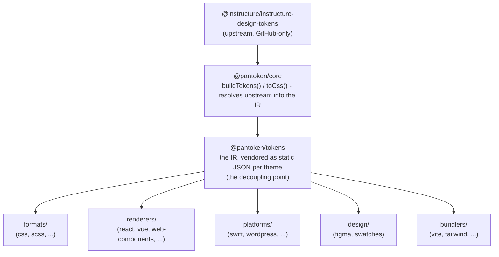

# संरचना

pantoken का एक ही काम है: Instructure के डिजाइन टोकन और आइकॉन्स को एक बार हल करना, फिर उस मॉडल को
प्रत्येक लक्ष्य के लिए फिर से आकार देना। नीचे दिए गए परतें उस पुनर्रचना को ईमानदार रखती हैं और प्रकाशित पैकेजों को किसी भी GitHub-विशिष्ट अपस्ट्रीम से मुक्त रखती हैं।

## परतें

- **`@pantoken/model`** टाइप अनुबंधों को रखता है, और कुछ भी नहीं। यह `Token` आकार और प्लगइन अनुबंध का सत्य स्रोत है, शून्य निर्भरताओं के साथ, इसलिए कोई भी पैकेज इससे स्वतंत्र रूप से निर्भर हो सकता है।
- **`@pantoken/core`** एकमात्र पैकेज है जो अपस्ट्रीम स्रोत को छूता है। यह टोकन और
  आइकॉन्स को कैनोनिकल IR में हल करता है और CSS रेंडर करता है।
- **`@pantoken/tokens`** उस IR को बिल्ड समय पर स्थिर JSON के रूप में वेंडर करता है। यही अलगाव बिंदु है:
  डाउनस्ट्रीम पैकेज `@pantoken/tokens` पढ़ते हैं, कभी `@pantoken/core` नहीं, इसलिए `npm i pantoken`
  GitHub-विशिष्ट अपस्ट्रीम तक कभी नहीं पहुँचता।
- **`@pantoken/utils`** साझा सहायक फ़ंक्शन्स ले जाता है — `var(--x)` रेसोल्वर, रेफ़रेंस रेजेक्स,
  केस और रंग रूपांतरण, और ड्रिफ्ट चेक जो जनरेट किए गए आउटपुट को IR के प्रति वफादार रखते हैं।

## क्यों टोकन वेंडर किए जाते हैं

अपस्ट्रीम टोकन पैकेज GitHub पर रहता है, npm पर नहीं। अगर प्रत्येक डाउनस्ट्रीम पैकेज उस पर निर्भर होता,
तो `npm i pantoken` उन लोगों के लिए विफल हो जाएगा जिनके पास वह एक्सेस नहीं है। इसके बजाय `@pantoken/tokens`
अपस्ट्रीम को बिल्ड समय पर एक बार हल करता है और परिणाम को स्थिर JSON में लिखता है। प्रकाशित पैकेज वो
JSON साथ लेकर चलते हैं, इसलिए वे npm से साफ-सुथरे तरीके से इंस्टॉल होते हैं, सेमवेर पर पिन होते हैं, और ऑफलाइन काम करते हैं।

## बकेट्स

प्रत्येक डाउनस्ट्रीम बकेट IR का उपभोग करने का एक तरीका है:

- **formats/** — टोकन को एक फ़ाइल (CSS, SCSS, Less, Stylus, DTCG) में बदलना।
- **renderers/** — फ़्रेमवर्क और टूल इंटीग्रेशन (React, Vue, Svelte, MUI, Pendo, और अधिक)।
- **bundlers/** — बिल्ड-टूल प्लगइन्स और प्रीसेट्स (Vite, Next, Tailwind, Panda, PostCSS, webpack)।
- **platforms/** — नेटिव और साइट-जनरेटर लक्ष्य (Swift, Kotlin, Rust, WordPress, Drupal)।
- **design/** — डिजाइन टूल्स के लिए पेलोड (Figma, रंग स्वैच)।
- **plugins/** — वैकल्पिक परिवर्तन जो टोकन या CSS आउटपुट का विस्तार करते हैं। देखें [Plugins](/guide/plugins).

## जनरेट किया गया आउटपुट

हर पैकेज जो एक फ़ाइल उत्सर्जित करता है वह उसे प्रति-पैकेज `generated/` निर्देशिका में लिखता है जिसे एक बिल्ड
पुनरुत्पन्न करता है, इसलिए कुछ भी जनरेट किया गया कमिट नहीं किया जाता। एक वर्कस्पेस टास्क इसका सभी सत्यापन करता है। देखें
[Generated output](/guide/generated-output).
