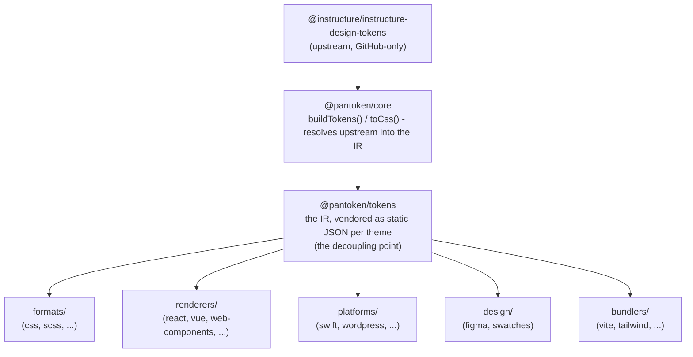

# Achitekti

pantoken gen yon sèl travay: rezoud tokens konsepsyon Instructure yo ak ikòn yo yon sèl fwa, epi re-fòme modèl sa a
pou chak sib. Kouch ki anba yo kenbe refòm sa a onèt epi fè pakè yo pibliye lib
de nenpòt upstream ki sèlman sou GitHub.

## Kouch yo

- **`@pantoken/model`** kenbe kontra tip yo, e pa anyen lòt. Li se sous verite pou
  fòm `Token` ak kontra plugin nan, san okenn depandans, konsa nenpòt pake ka depann sou li
  lib.
- **`@pantoken/core`** se sèl pake ki manyen sous upstream la. Li rezoud tokens ak
  ikòn yo nan IR kanonik la epi rann CSS.
- **`@pantoken/tokens`** founi IR sa a kòm JSON estatik nan tan build. Sa a se pwen dekoupaj la:
  pake downstream yo li `@pantoken/tokens`, pa janm `@pantoken/core`, konsa `npm i pantoken` pa janm
  ale chèche upstream ki sèlman sou GitHub la.
- **`@pantoken/utils`** pote èd pataje yo — rezolisè `var(--x)`, regex referans yo,
  konvèsyon ka ak koulè, ak chèk drift yo ki kenbe rezilta jenere yo fidèl ak IR la.

## Poukisa tokens yo vann (vendored)

Pake token upstream la sou GitHub, pa sou npm. Si chak pake downstream te depann sou li,
`npm i pantoken` ta echwe pou nenpòt moun ki pa gen aksè sa a. Olye de sa `@pantoken/tokens` rezoud
upstream la yon sèl fwa nan tan build epi ekri rezilta a kòm JSON estatik. Pake pibliye yo pote
JSON sa a, konsa yo enstale pwòp soti nan npm, fikse sou semver, epi travay offline.

## Bokit (Buckets)

Chak bokit downstream se yon fason pou konsome IR la:

- **formats/** — tounen tokens yo an yon fichye (CSS, SCSS, Less, Stylus, DTCG).
- **renderers/** — entegrasyon kad ak zouti (React, Vue, Svelte, MUI, Pendo, ak plis).
- **bundlers/** — plugin ak preset zouti build (Vite, Next, Tailwind, Panda, PostCSS, webpack).
- **platforms/** — sib natif ak jeneratè sit (Swift, Kotlin, Rust, WordPress, Drupal).
- **design/** — payloads pou zouti konsepsyon (Figma, echantiyon koulè).
- **plugins/** — transfòmasyon opsyonèl ki elaji token oswa pwodiksyon CSS la. Gade [Plugins](/guide/plugins).

## Rezilta jenere

Chak pake ki emèt yon fichye ekri li nan yon repètwa `generated/` pa-pake ke yon build
reprodwi, konsa anyen jenere pa komite. Yon task workspace valide tout sa. Gade
[Generated output](/guide/generated-output).
