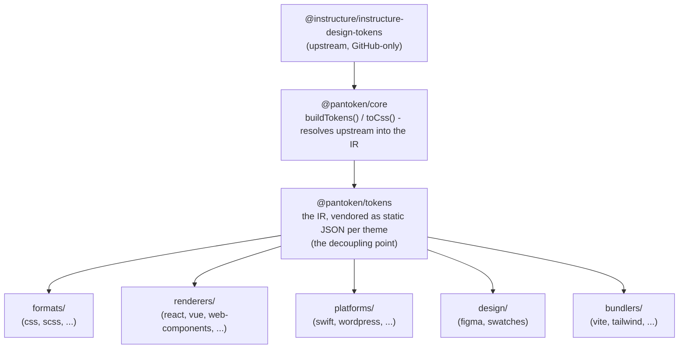

# Architektúra

A pantoken egyetlen feladata: egyszer feloldani az Instructure design tokenjeit és ikonjait, majd újraformálni ezt a modellt
minden célra. Az alábbi rétegek gondoskodnak arról, hogy ez az újraformálás következetes maradjon, és hogy a publikált csomagok mentesek
legyenek bármilyen csak-GitHubon elérhető upstream függőségtől.

## A rétegek

- **`@pantoken/model`** kizárólag a típusszerződéseket tartalmazza. Ez az igazság forrása az
  `Token` formájához és a plugin szerződéshez, nulla függőséggel, így bármelyik csomag szabadon
  függhet tőle.
- **`@pantoken/core`** az egyetlen csomag, amely az upstream forráshoz nyúl. Feloldja a tokeneket és
  ikonokat a kanonikus IR-be, és CSS-t renderel.
- **`@pantoken/tokens`** ezt az IR-t statikus JSON-ként ágyazza be build időben. Ez a leválasztási pont:
  a downstream csomagok `@pantoken/tokens`-t olvasnak, soha nem `@pantoken/core`-t, így `npm i pantoken` soha nem
  nyúl a csak-GitHubon elérhető upstream forráshoz.
- **`@pantoken/utils`** hordozza a közös segédeszközöket — az `var(--x)` feloldót, a referencia reguláris kifejezéseket,
  a kis-nagybetűs és színkonverziót, valamint a drift-ellenőrzéseket, amelyek gondoskodnak arról, hogy a generált kimenet hű maradjon az IR-hez.

## Miért ágyazzuk be a tokeneket

Az upstream token csomag a GitHubon él, nem az npm-en. Ha minden downstream csomag ettől függne,
az `npm i pantoken` hibát dobna mindenkinek, aki nem rendelkezik hozzáféréssel. Ehelyett az `@pantoken/tokens` build időben egyszer feloldja az
upstream forrást, és az eredményt statikus JSON-ba írja. A publikált csomagok magukban hordozzák ezt a
JSON-t, így tisztán települnek az npm-ről, semver-hez rögzülnek, és offline is működnek.

## Csoportok

Minden downstream csoport az IR fogyasztásának egy módja:

- **formats/** — a tokeneket fájllá alakítja (CSS, SCSS, Less, Stylus, DTCG).
- **renderers/** — keretrendszer- és eszközintegrációk (React, Vue, Svelte, MUI, Pendo, és mások).
- **bundlers/** — build eszköz pluginok és preset-ek (Vite, Next, Tailwind, Panda, PostCSS, webpack).
- **platforms/** — natív és oldalgeneráló célok (Swift, Kotlin, Rust, WordPress, Drupal).
- **design/** — hasznos adatok design eszközökhöz (Figma, színminták).
- **plugins/** — opcionális transzformációk, amelyek kiterjesztik a token- vagy CSS-kimenetet. Lásd: [Pluginok](/guide/plugins).

## Generált kimenet

Minden csomag, amely fájlt bocsát ki, azt egy csomagonkénti `generated/` könyvtárba írja, amelyet egy build
reprodukál, így semmi generált nincs a repóban commitolva. Egy munkaterületi feladat mindet validálja. Lásd:
[Generált kimenet](/guide/generated-output).
