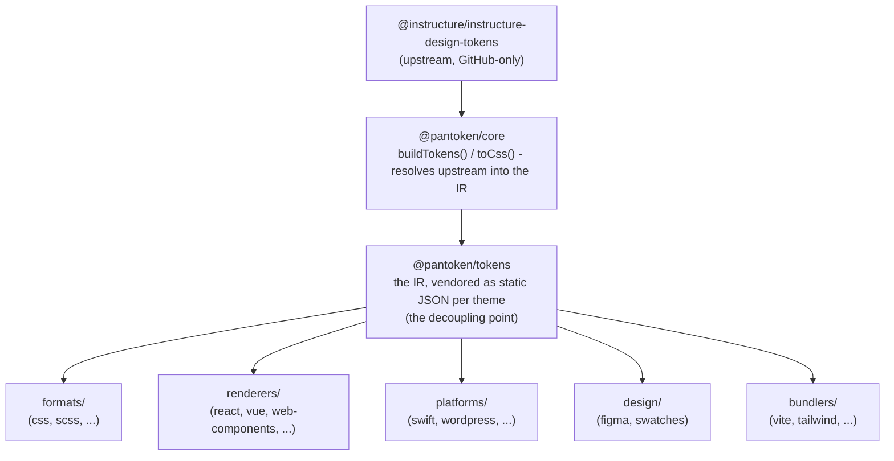

# Architektúra

pantokennek egy feladata van: egyszer feloldani az Instructure tervezési tokenjeit és ikonait, majd azt a modellt minden célhoz átalakítani. Az alábbi rétegek őrzik ezt az átalakítást és biztosítják, hogy a publikált csomagok mentesek maradjanak bármilyen csak GitHub-on elérhető upstreamtől.

## A rétegek

```mermaid
flowchart TD
  upstream["@instructure/instructure-design-tokens<br/>(upstream, GitHub-only)"]
  core["@pantoken/core<br/>buildTokens() / toCss() - resolves upstream into the IR"]
  tokens["@pantoken/tokens<br/>the IR, vendored as static JSON per theme<br/>(the decoupling point)"]

  formats["formats/<br/>(css, scss, ...)"]
  renderers["renderers/<br/>(react, vue, web-components, ...)"]
  platforms["platforms/<br/>(swift, wordpress, ...)"]
  design["design/<br/>(figma, swatches)"]
  bundlers["bundlers/<br/>(vite, tailwind, ...)"]

  upstream --> core --> tokens
  tokens --> formats
  tokens --> renderers
  tokens --> platforms
  tokens --> design
  tokens --> bundlers
```

- **`@pantoken/model`** tartja a típus-kontraktusokat, és semmi mást. Ez az igazság forrása a
  `Token` alakra és a plugin szerződésre, nulla függőséggel, így bármely csomag nyugodtan
  függhet tőle.
- **`@pantoken/core`** az egyetlen csomag, amely érinti az upstream forrást. Feloldja a tokeneket és
  ikonokat a kanonikus IR-re és rendereli a CSS-t.
- **`@pantoken/tokens`** a build időben statikus JSON-ként vendorolja azt az IR-t. Ez a decoupling pont:
  a downstream csomagok `@pantoken/tokens`-et olvassák, soha nem `@pantoken/core`-öt, így a `npm i pantoken`
  soha nem nyúl a csak GitHub-on lévő upstream után.
- **`@pantoken/utils`** hordozza a megosztott segédfüggvényeket — a `var(--x)` resolvert, a referencia-regexeket,
  esetszabály és színkonverziót, valamint az eltérés-ellenőrzéseket, amelyek biztosítják, hogy a generált kimenet hű maradjon az IR-hez.

## Miért vendoroljuk a tokeneket

Az upstream token csomag GitHubon él, nem az npm-en. Ha minden downstream csomag függne tőle,
`npm i pantoken` megbukna bárkinél, akinek nincs hozzáférése. Ehelyett `@pantoken/tokens` egyszer feloldja az
upstreamet build időben és az eredményt statikus JSON-be írja. A publikált csomagok ezt a JSON-t hordozzák, így tisztán
telepíthetők npm-ről, semver-re vannak rögzítve, és offline is működnek.

## Buckets

Minden downstream bucket az IR fogyasztásának egy módja:

- **formats/** — a tokeneket fájlokká alakítja (CSS, SCSS, Less, Stylus, DTCG).
- **renderers/** — keretrendszer- és eszközintegrációk (React, Vue, Svelte, MUI, Pendo és továbbiak).
- **bundlers/** — build-eszköz pluginek és presetek (Vite, Next, Tailwind, Panda, PostCSS, webpack).
- **platforms/** — natív és site-generator célok (Swift, Kotlin, Rust, WordPress, Drupal).
- **design/** — dizájneszközök payloadjai (Figma, színpaletták).
- **plugins/** — opcionális transzformációk, amelyek kiterjesztik a token vagy CSS kimenetet. Lásd: [Plugins](/guide/plugins).

## Generált kimenet

Minden csomag, amely fájlt generál, azt egy csomagonkénti `generated/` könyvtárba írja, amelyet a build reprodukál,
így semmi generált nincs becommitalva. Egy workspace feladat mindezt érvényesíti. Lásd [Generated output](/guide/generated-output).
