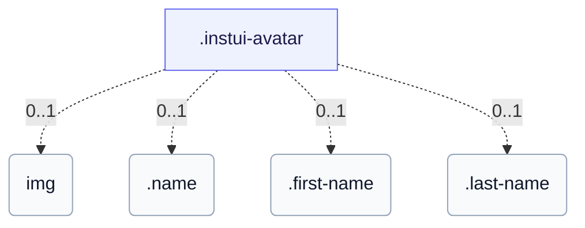

# CSS: avatar

`.instui-avatar` · <span class="instui-pill -color-success pantoken-doc-tag">կայուն</span> — Օգտագործողի ծանուցում, որը ցուցադրում է սկզբնատառեր կամ պատկեր, լռելյայն շրջանաձև:

Լռելյայն տարածքի գույն տիրույթները սկզբնատառերը թափանցիկ մակերեսի վրա՝ `-has-inverse-color` լրացնում է մակերեսը գույնով և դնում սկզբնատառերը գույնի վրա: `-color-ai` տարբերակը միշտ լրացվում է մանուշակ→ծովի գրադիենտով: Ամբողջ ցուցադրման անվան համար, դրեք այն բովանդակության մեջ (այնպես որ այն մնա մատչելիության ծառում) և ավելացրեք `data-initials="XX"` կոմպակտ տեսողական համար՝ իրական տեքստը այն է, ինչ էկրան ընթերցողը հայտարարում է: Առանց `data-initials`, գերազանցվածի բովանդակությունը պարզապես կոշկակցվում է (առանց էլիպսիսի)՝ խառնեք այն `.name`-ում՝ ճշգրիտ մեկ հաղորդիչ տառի կտրմամբ, կամ բաժանեք այն `.first-name`/`.last-name`-ի մեջ երկու կտրված տառերի համար (ցանկացած կեսը կարող է բաց թողնվել և մյուսը մնալ կենտրոնացած):

**Աղբյուր.** [avatar.css](https://github.com/thedannywahl/pantoken/blob/main/formats/components/src/components/avatar/avatar.css)

<!-- js-requirement -->
> [!TIP]
> **JS բարելավում** — Այս բաղադրիչի CSS-ը ցուցադրվում և աշխատում է ինքնուրույն՝ միացրեք այն `@pantoken/interactions`-ի հետ՝ ինտերակտիվ վարքածություն ավելացնելու համար: Տես [մոդիֆիկատորի աղյուսակը ստորեւ](#modifiers):


## Մուտքականություն

Տրամադրեք պատկերային ծանուցմանը իմաստալից `alt` (մարդկանց անունը), ոչ թե ընդհանուր «ծանուցում»՝ միայն սկզբնատառերի ծանուցումների համար, նախընտրել իրական անվան բովանդակություն (բաց տեքստ, տվյալներ-սկզբնատառեր, .անուն կամ .առաջին-անուն/.ազգանուն) նախ-հապավածված տառերի հատկացման վրա, որպեսզի օժանդակ տեխնոլոգիան հայտարարի իրական անունը:

## Օգտագործում

```css
@import "@pantoken/components/components.css";
@import "@pantoken/components/avatar.css";
```

## Օրինակներ

```html
<span class="instui-avatar --me-sm">LH</span>
<span class="instui-avatar -color-ai --me-sm">AI</span>
<span class="instui-avatar --me-sm" data-initials="NV">Dr. Nguyen Van Thoc</span>
<span class="instui-avatar"><span class="name">Miguel Sanchez</span></span>
<span class="instui-avatar"><span class="first-name">Miguel</span> <span class="last-name">Sanchez</span></span>
```

## Կառուցվածք

Ծանուցումը ցուցադրում է դրանցից մեկը. &lt;img&gt;, բաց/տվյալներ-սկզբնատառեր տեքստ, .անուն խմբավորում կամ .առաջին-անուն/.ազգանուն զույգ:

```text
.instui-avatar
  img (0..1)
  .name (0..1)
  .first-name (0..1)
  .last-name (0..1)
```



## Մոդիֆիկատորներ

| Մոդիֆիկատոր | Նկարագիր |
| --- | --- |
| `.-color-accent1` | <span class="instui-pill -color-danger pantoken-doc-tag">Հնացած</span> — use `.-color-blue`. |
| `.-color-accent2` | <span class="instui-pill -color-danger pantoken-doc-tag">Հնացած</span> — use `.-color-green`. |
| `.-color-accent3` | <span class="instui-pill -color-danger pantoken-doc-tag">Հնացած</span> — use `.-color-red`. |
| `.-color-accent4` | <span class="instui-pill -color-danger pantoken-doc-tag">Հնացած</span> — use `.-color-orange`. |
| `.-color-accent5` | <span class="instui-pill -color-danger pantoken-doc-tag">Հնացած</span> — use `.-color-ash`. |
| `.-color-accent6` | <span class="instui-pill -color-danger pantoken-doc-tag">Հնացած</span> — use `.-color-grey`. |
| `.-color-ai` | AI-ակցենտ տարածք գույն: |
| `.-color-ash` | Մոխրագույն տարածք գույն: |
| `.-color-blue` | Կապույտ տարածք գույն: |
| `.-color-green` | Կանաչ տարածք գույն: |
| `.-color-grey` | Մոխրագույն տարածք գույն: |
| `.-color-orange` | Նարინջիսფեր տարածք գույն: |
| `.-color-red` | Կարմիր տարածք գույն: |
| `.-has-inverse-color` | Օգտագործեք հակառակ (մութ հայտել) տեքստի գույն: |
| `.-shape-rectangle` | Քառակուսի (ուղղանկյուն) ձեւ փոխարենը շրջանի: |
| `.-show-border` | <span class="instui-pill -color-info pantoken-doc-tag">Alias</span> — maps to `.-show-border-always`. |
| `.-show-border-always` | Ստիպել սահմանի օղակը միացված լինել, նույնիսկ պատկերի կամ հակառակ լցման վրա: |
| `.-show-border-never` | Բացատրել սահմանի օղակը: |
| `.-size-2xl` | Երկու չափս ավելի մեծ: |
| `.-size-2xs` | Երկու չափս ավելի փոքր: |
| `.-size-large` | Մեծ. Երկար-ձեւ այլանունը `-size-lg`: |
| `.-size-lg` | Մեծ: |
| `.-size-md` | Միջին (լռելյայն): |
| `.-size-medium` | Միջին (լռելյայն). Երկար-ձեւ այլանունը `-size-md`: |
| `.-size-sm` | Փոքր: |
| `.-size-small` | Փոքր. Երկար-ձեւ այլանունը `-size-sm`: |
| `.-size-x-large` | Չափազանց մեծ. Երկար-ձեւ այլանունը `-size-xl`: |
| `.-size-x-small` | Չափազանց փոքր. Երկար-ձեւ այլանունը `-size-xs`: |
| `.-size-xl` | Չափազանց մեծ: |
| `.-size-xs` | Չափազանց փոքր: |
| `.-size-xx-large` | Երկու չափս ավելի մեծ. Երկար-ձեւ այլանունը `-size-2xl`: |
| `.-size-xx-small` | Երկու չափս ավելի փոքր. Երկար-ձեւ այլանունը `-size-2xs`: |

## Մասեր

| Մաս | Նկարագիր |
| --- | --- |
| `.first-name` | Կամընտիր (զուգակցեց .ազգանունի հետ). խմբավորել տվյալ անունը, կտրված դրա հաղորդման տառին: |
| `.last-name` | Ընտրովի (.first-name-ի հետ զուգակցված). փակցնում է ընտանիքի անունը, մեջբերված դրա առաջատար տառին: |
| `.name` | Ընտրովի. փակցել լիակի անունը, որպեսզի այն կտրել միայն մեկ առաջատար տառի հետ առանց դրամ-սկզբնական կամ JS: |

## Պսևդո-էլեմենտներ

| Պսևդո-էլեմենտ | Նկարագիր |
| --- | --- |
| `::before` | — |

## Ցուցիչներ սպառված

| Տոկեն | Տիպ | Արժեք |
| --- | --- | --- |
| `--instui-component-avatar-ai-bottom-gradient-color` | `<color>` | `#00828E` |
| `--instui-component-avatar-ai-top-gradient-color` | `<color>` | `#9E58BD` |
| `--instui-component-avatar-ash-background-color` | `<color>` | `light-dark(#273540, #1C222B)` |
| `--instui-component-avatar-ash-text-color` | `<color>` | `light-dark(#273540, #C7CACD)` |
| `--instui-component-avatar-background-color` | `<color>` | `light-dark(#ffffff, #10141A)` |
| `--instui-component-avatar-blue-background-color` | `<color>` | `#2B7ABC` |
| `--instui-component-avatar-blue-text-color` | `<color>` | `light-dark(#2871AF, #7FB4F1)` |
| `--instui-component-avatar-border-color` | `<color>` | `light-dark(#8D959F, #6A7883)` |
| `--instui-component-avatar-border-width-md` | `<length>` | `0.125rem` |
| `--instui-component-avatar-border-width-sm` | `<length>` | `0.0625rem` |
| `--instui-component-avatar-font-family` | `[ <font-family-name> \| <generic-font-family> ]#` | `Atkinson Hyperlegible Next, "Helvetica Neue", Helvetica, Arial, sans-serif` |
| `--instui-component-avatar-font-size-lg` | `<length>` | `1.25rem` |
| `--instui-component-avatar-font-size-md` | `<length>` | `1rem` |
| `--instui-component-avatar-font-size-sm` | `<length>` | `0.875rem` |
| `--instui-component-avatar-font-size-xl` | `<length>` | `1.75rem` |
| `--instui-component-avatar-font-size-xs` | `<length>` | `0.75rem` |
| `--instui-component-avatar-font-size2xl` | `<length>` | `2.5rem` |
| `--instui-component-avatar-font-size2xs` | `<length>` | `0.75rem` |
| `--instui-component-avatar-font-weight` | `<integer>` | `600` |
| `--instui-component-avatar-green-background-color` | `<color>` | `#03893D` |
| `--instui-component-avatar-green-text-color` | `<color>` | `light-dark(#037D37, #61C378)` |
| `--instui-component-avatar-grey-background-color` | `<color>` | `light-dark(#4A5B68, #576773)` |
| `--instui-component-avatar-grey-text-color` | `<color>` | `light-dark(#4A5B68, #F2F4F5)` |
| `--instui-component-avatar-orange-background-color` | `<color>` | `#CF4A00` |
| `--instui-component-avatar-orange-text-color` | `<color>` | `light-dark(#BB4200, #FF905A)` |
| `--instui-component-avatar-rectangle-radius` | `<length>` | `0.25rem` |
| `--instui-component-avatar-red-background-color` | `<color>` | `#E62429` |
| `--instui-component-avatar-red-text-color` | `<color>` | `light-dark(#CF1F24, #FA917F)` |
| `--instui-component-avatar-size-lg` | `<length>` | `3.5rem` |
| `--instui-component-avatar-size-md` | `<length>` | `3rem` |
| `--instui-component-avatar-size-sm` | `<length>` | `2.5rem` |
| `--instui-component-avatar-size-xl` | `<length>` | `4rem` |
| `--instui-component-avatar-size-xs` | `<length>` | `2rem` |
| `--instui-component-avatar-size2xl` | `<length>` | `5rem` |
| `--instui-component-avatar-size2xs` | `<length>` | `1.5rem` |
| `--instui-component-avatar-text-on-color` | `<color>` | `#ffffff` |

## Ավելին կապված

- [byline](/hy/api/css/byline.md) — Կարող է տեղակալել ավտար որպես իր առաջատար հերոս գործիչ:

